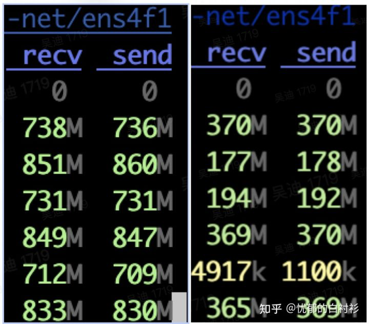

# wenet总体解析

## 发展历史

- GMM-HMM（上世纪90年代）
- 深度学习爆发初期： DNN，CTC（2006）
- RNN流行，Attention提出初期：RNN-T（2013）, DeepSpeech（2014）， DeepSpeech2 (2016)， LAS（2016）
- Attetion is all you need提出开始：Transformer（2017），Transformer-transducer（2020），Conformer（2020）


## 端到端识别基础

一般在传统HMM框架下，会先利用HMM-GMM模型，通过对齐的方式，得到帧级别的对应标注，再通过帧级别损失函数来优化神经网络模型。如下是HMM-DNN模型的训练过程：

1. 对于每个句子扩展为单音素序列，用前向后向EM训练，得到单音素的hmm-单高斯model1。
2. 用model1对句子做对齐，单高斯进行2倍分裂，更新模型，迭代这个对齐/分裂的过程n次，得到单音素的hmm-gmm模型model2。
3. 用model2对句子做对齐，将音素根据上下文扩展为三音素，使用单高斯学习每个音素的决策树，最后每个叶子结点对应一个单高斯，得到一个三音素-hmm-单高斯模型model3。
4. 类似于第2步，用model3不停迭代分裂高斯，得到三音素hmm-gmm的model4。
5. model4对句子做对齐，对齐数据用于帧级别NN训练。
...

基于神经网络的端到端建模：

1. 直接以目标单元作为建模对象，比如中文使用**字**，英文使用**字符**或者**BPE**。
2. 通过特殊的模型（目标函数），处理输入输出对齐未知的问题。

这类端到端模型包括：

1. 基于CTC（Connectionist Temporal Classification）目标函数
2. AED（Attention-based Encoder Decoder）
3. RNN-T（Recurrent Neural Network Transducer）

### CTC目标函数

传统语音识别通过HMM来约束输出和输入的对齐方式，时间上保持单调，CTC是一种特殊的HMM约束。CTC本质上对所有合法的输出和输入对齐方式进行了穷举，所谓合法，即对齐后的输出序列能够按CTC规则规约得到原标注序列，则为合法对齐。

使用CTC目标函数会引入一个blank的输出单元，CTC对输出序列的规约规则为：

- 对输出序列中连续的相同字符进行合并
- 移除输出序列中的blank字符

举例来说，假设输入帧数为5帧，原标注序列为“我看看”，3个字，但是网络需要输出5个单元才能达到输入和输出一一对应。在CTC模型中，*通过对原标注中的3个单元进行重复或者插入blank来扩展到5个单元*。以下是两个可能的序列：

```
我看-看看
我--看看
```

其中，“-”表示blank，上述两个例子中，第一个对齐输出序列“我看-看看”是合法对齐序列，在规约之后能够获得原标注序列；而第二个对齐序列“我--看看”在规约之后是“我看”，不能获得原标注序列，因此不是合法对齐序列。当然除了“我看-看看”，还有非常多的合法序列，比如：

```
我看看-看
我-看-看
我看--看
...
```

CTC目标函数的思想是：既然不知道到底哪个对齐关系是正确的，那就**最大化所有合法CTC对齐的概率之和**。因此对于该例子，目标就是最大化如下概率：

$$
P(我看看|X)=P(我看-看看|X)+P(我看看-看|X)+...+P(我看--看|X)
$$

求该目标函数的梯度，一种方式是穷举所有的有效CTC对齐，然后分别求梯度相加，但是这种方法的复杂度太高。由于CTC本身的结构特点，存在一种更为高效的动态规划算法，可以极大提升速度，参见：[Connectionist Temporal Classification: Labelling Unsegmented Sequence Data with Recurrent Neural Networks](http://www.cs.toronto.edu/~graves/icml_2006.pdf)，[Eesen中的CTC实现](http://placebokkk.github.io/asr/2020/01/13/asr-ctc-eesen.html)

解码时，模型对每一个输出帧都给出输出，这种解码方式称为`Frame同步`解码。如果某些帧输出为blank或者与前一帧是重复字符，则可以合并。由于穷举序列中blank所占比例较高，因此最终的模型倾向于输出尽可能少的非blank字符，解码序列中往往非blank字符只输出一个，这个称作CTC的*尖峰效应*。参见：

- [Sequence Modeling With CTC](https://distill.pub/2017/ctc/)
- [李宏毅老师2020春课程-语音识别-语音合成-语音分离](https://www.bilibili.com/video/BV1hZ4y1w7j1?p=4)


### Attention-based Encoder Decoder

AED（Attention-based Encoder Decoder），也称Seq2Seq框架，或者LAS（Listen, Attend and Spell）。模型中Encoder对输入序列（语音）进行编码，Decoder则是在目标序列（Decoder）上的自回归模型（输入之前的单元，预测下一个单元），在自回归计算中，通过Attention获取Encoder的编码信息，从而利用输入序列的信息。利用Attention学习输入输出间隐含的对齐适用于机器翻译这类任务，但对于语音识别或合成这类时序单调性任务，这种无约束反而会带来一些问题。


### AED的解码

解码时不对每一个输入帧都进行输出，而是根据整个输入序列信息和已输出信息进行下一次的输出，直到输出一个特殊结束字符，这种解码方法被称为`Label同步`解码。

CTC没有显式构建文本和语音之间的关系，RNN-T是一种显式建模了文本和语音之间关系的帧同步解码模型。标准AED中，编解码之间的Attention需要看到编码器的完整序列，因此无法进行流式识别，因此可以利用GMM-Attention、MoChA、MMA等单调递增的局部Attention方法进行改进。

### 联合建模

联合使用CTC loss和AED可以有效加速模型收敛，同时可以得到更好的识别效果，目前该方法已经成为端到端学习的标准方法。在解码时，同时使用CTC和AED的输出，可以提高识别率。WeNet采用了先使用CTC解码，再用AED对CTC的Nbest结果进行Rescoring，这样即结合了两种模型的效果，又可以应用于流式场景。

### 降采样/降帧率

输入序列越长，即帧的个数越多，网络计算量就越大。而在语音识别中，一定时间范围内的语音信号是相似的，多个连续帧对应的是同一个发音，另外，端到端语音识别使用建模单元一般是一个时间延续较长的单元（粗粒度），比如建模单元是一个中文汉字，假如一个汉字用时0.2s，0.2s对应20帧，如果将20帧的信息进行合并，比如合并为5帧，则可以线性的减少后续encoder网络的前向计算、CTC loss和AED计算cross attention时的开销。

可以用不同的神经网络来进行降采样，WeNet中使用的是2D-CNN。

### 流式语音识别

CTC的输出相互独立，虽然CTC解码是`帧同步`的，但是要想

如果希望支持低延迟的流式识别，Encoder中的计算对右侧的依赖不能太长；此外，CTC可以进行帧同步解码，但CTC输出之间相互独立，使得每一帧利用上下文信息的能力不足，而基于Transformer、Conformer的自回归模型建模能力更强，但标准的Fully self-attention会对依赖整个序列，不能进行流式计算。

因此WeNet采用了`基于chunk的attention`，将序列划分为多个固定大小的chunk，每个chunk内部的帧不会依赖于chunk右侧的帧。同时，*连续堆叠的convolution层会带来较大的右侧依赖*，WeNet则采用了`因果卷积`来避免convolution层的右侧依赖：chunk attention+因果卷积。

此外，WeNet采用了CTC Nbest+Attention Rescoring的解码策略，首先利用CTC解码器输出Nbest的解码结果，然后利用Attention解码器对Nbest进行打分，输出得分最高的结果。

## WeNet网络结构

```python
class ASRModel(torch.nn.Module):
    ...
    self.encoder = encoder  # 编码器，包括下采样SubSampling网络和Transformer/Conformer模块
    self.decoder = decoder  # 解码器，cross-attention+self-attention
    self.ctc = ctc  # CTC loss
    self.criterion_att = LabelSmoothingLoss(  # Attention-based Decoder Loss
        size=vocab_size,
        padding_idx=ignore_id,
        smoothing=lsm_weight,
        normalize_length=length_normalized_loss,
    )
```


`ASRModel`的初始化函数中定义了encoder、decoder、ctc和criterion_att：

- encoder是Shared Encoder，其中包括了Subsampling网络
- decoder是Attention-based Decoder网络
- ctc是ctc Decoder网络（也就是前向网络和softmax）和ctc loss
- criterion_att是attention-based decoder的自回归似然loss，实际是LabelSmoothing的loss。

`ASRModel`除了定义模型结构和实现前向计算之外，还有两个功能：

- 提供多种python的解码接口

    ```python
    recognize() # attention decoder
    attention_rescoring() # CTC + attention rescoring
    ctc_prefix_beam_search() # CTC prefix beamsearch
    ctc_greedy_search() # CTC greedy search, reference: https://zhuanlan.zhihu.com/p/391848454
    ```

- 提供runtime中需要使用的接口，这些接口均有`@torch.jit.export`注解，可以在C++中调用
    ```python
    subsampling_rate()
    right_context()
    sos_symbol()
    eos_symbol()
    forward_encoder_chunk()
    forward_attention_decoder()
    ctc_activation()
    ```
    
其中比较重要的是：

- `forward_attention_decoder`: Attention Decoder的序列前向计算，非自回归模型
- `ctc_activation()`: CTC Decoder forward计算
- `forward_encoder_chunk()`: 基于chunk的Encoder forward计算

### Encoder网络

WeNet编码器支持Transformer和Conformer两种网络结构，`BaseEncoder`定义了如下统一的前向过程：

```python
xs, pos_emb, masks = self.embed(xs, masks)
mask_pad = masks  # (B, 1, T/subsample_rate)
chunk_masks = add_optional_chunk_mask(xs, ...)
for layer in self.encoders:
    xs, chunk_masks, _ = layer(xs, chunk_masks, pos_emb, mask_pad)
if self.normalize_before:
    xs = self.after_norm(xs)
```

可以看到，Encoder由两部分组成：

- `self.embed`是Subsampling网络
- `self.encoders`是一组相同网络结构的堆叠

除了forward函数之外，Encoder还实现了两个方法：

- `forward_chunk_by_chunk`，python解码时，模拟流式解码模式，基于chunk前向计算。
- `forward_chunk`，单次基于chunk的前向计算，通过ASRModel导出为`forward_encoder_chunk()`供runtime解码使用。

### 编码器的SubSampling网络

一方面为了降低计算复杂度，另一方面端到端ASR建模颗粒度较大，因此需要降采样。

语音中有两种使用CNN的方式，一种是2D-Conv，一种是1D-Conv：

- 2D-Conv: 输入数据看作是深度(通道数）为1，高度为F（Fbank特征维度，idim），宽度为T（帧数）的一张图。
- 1D-Conv: 输入数据看作是深度(通道数）为F（Fbank特征维度)，高度为1，宽度为T（帧数）的一张图。

Kaldi中著名的TDNN就是1D-Conv，在WeNet中采用2D-Conv实现降采样。WeNet中提供了多个降采样网络，例如将帧率降低4倍的网络`Conv2dSubsampling4`：

```python
class Conv2dSubsampling4(BaseSubsampling):
    """Convolutional 2D subsampling (to 1/4 length).

    Args:
        idim (int): Input dimension.
        odim (int): Output dimension.
        dropout_rate (float): Dropout rate.

    """
    def __init__(self, idim: int, odim: int, dropout_rate: float,
                 pos_enc_class: torch.nn.Module):
        """Construct an Conv2dSubsampling4 object."""
        super().__init__()
        self.conv = torch.nn.Sequential(
            torch.nn.Conv2d(1, odim, 3, 2),
            torch.nn.ReLU(),
            torch.nn.Conv2d(odim, odim, 3, 2),
            torch.nn.ReLU(),
        )
        self.out = torch.nn.Sequential(
            torch.nn.Linear(odim * (((idim - 1) // 2 - 1) // 2), odim))
        self.pos_enc = pos_enc_class
        # The right context for every conv layer is computed by:
        # (kernel_size - 1) * frame_rate_of_this_layer
        self.subsampling_rate = 4
        # 6 = (3 - 1) * 1 + (3 - 1) * 2
        self.right_context = 6
```

这里利用Conv2D，将语音帧序列看做是一个时间轴为长，通道轴为宽，深度为1的图像，`Conv2dSubsampling4`通过两个`stride=2`的2d-CNN，将“图像”的长和宽都降为1/4。

```python
def forward(
        self,
        x: torch.Tensor,
        x_mask: torch.Tensor,
        offset: int = 0
) -> Tuple[torch.Tensor, torch.Tensor, torch.Tensor]:
    """Subsample x.

    Args:
        x (torch.Tensor): Input tensor (#batch, time, idim).
        x_mask (torch.Tensor): Input mask (#batch, 1, time).

    Returns:
        torch.Tensor: Subsampled tensor (#batch, time', odim),
            where time' = time // 4.
        torch.Tensor: Subsampled mask (#batch, 1, time'),
            where time' = time // 4.
        torch.Tensor: positional encoding

    """
    x = x.unsqueeze(1)  # (b, c=1, t, f)
    x = self.conv(x)
    b, c, t, f = x.size()
    x = self.out(x.transpose(1, 2).contiguous().view(b, t, c * f))
    x, pos_emb = self.pos_enc(x, offset)
    return x, pos_emb, x_mask[:, :, :-2:2][:, :, :-2:2]
```

注意：

- conv(x)中进行两次卷积，此时t维度**约等于**原来的1/4，因为没加padding，实际上是从长度T变为长度((T-1)/2-1)/2），注意经过卷积后深度不再是1。
- pos_enc(x, offset) 经过subsampling之后，帧数变少了，此时再计算Positional Embedding。
- x_mask是原始帧率下的记录batch各序列长度的mask，在计算attention以及ctc loss时均要使用，现在帧数降低了，x_mask也要跟着变化。


### 上下文依赖

注意到Conv2dSubsampling4中的这两个变量：

```python

self.subsampling_rate = 4
self.right_context = 6
```

这两个变量都在asr_model中进行了导出，在runtime时被使用。

在CTC或者WFST解码时，都是一帧一帧解码器，这里的帧指的是下采样（subsample）之后的帧，称之为`解码帧`，而模型输入的帧序列里面的帧（下采样之前的帧）称为`原始语音帧`。从上图可以看到：

- 第1个解码帧，需要依赖第1到第7个原始语音帧。
- 第2个解码帧，需要依赖第5到第11个原始语音帧。

那么上述两个变量

- `subsampling_rate`指的就是对于相邻两个解码帧，在原始帧上的间隔。计算方法：$(kernel\_size-1)\times frame\_rate\_of\_this\_layer$，其中，$frame\_rate\_of\_this\_layer$为一个下采样层的下采样倍率，上例中即为$(3-1)\times 2=4$。
- `right_context`指的是对于某个解码帧，其对应的第一个原始帧的右侧还需要额外依赖多少帧，才能获得这个解码帧的全部信息。计算方法：$\sum_{n=1}^{N}(kernel\_size-1)\times n$，其中，$N$为下采样层数，上例中即为$(3-1)\times 1+(3-1)\times 2=6$。

在runtime解码器中，每次会送入一组帧进行前向计算并解码，一组（chunk）帧是定义在**解码帧级别**的。在处理第一个chunk时，接受输入获得当前chunk需要的所有的context，之后每次根据chunk大小和subsampling_rate获取新需要的原始帧。比如，chunk_size=1，则第一个chunk需要1-7帧（也即第一个chunk需要一个解码帧对应的所有原始帧），第二个chunk只要新拿到8-11帧即可（也即之后的chunk只需要`subsampling_rate`个原始帧）。

```cpp

// runtime/core/decoder/asr_decoder.cc
// AsrModel::num_frames_for_chunk
    if (!start) {  // First batch
      int context = right_context_ + 1;  // Add current frame
      num_requried_frames = (chunk_size_ - 1) * subsampling_rate_ + context;
    } else {
      num_requried_frames = chunk_size_ * subsampling_rate_;
    }
```

由于第二帧及其之后的chunk只需要`subsampling_rate`个原始帧，因此需要缓存前一个chunk的`1+right_context-subsampling_rate`个原始帧：

```cpp

// runtime/core/decoder/asr_decoder.cc
void AsrModel::CacheFeature(
    const std::vector<std::vector<float>>& chunk_feats) {
  // Cache feature for next chunk
  // cached_feature_size为缓存大小
  const int cached_feature_size = 1 + right_context_ - subsampling_rate_;
  if (chunk_feats.size() >= cached_feature_size) {
    // cached_feature_存放缓存数据
    cached_feature_.resize(cached_feature_size);
    for (int i = 0; i < cached_feature_size; ++i) {
      cached_feature_[i] =
        chunk_feats[chunk_feats.size() - cached_feature_size + i];
    }
  }
}
```

### 编码器中的Encoders模块

对于编码器中的encoders模块，WeNet提供了Transformer和Conformer两种结构，均在wenet/transformer/encoder_layer.py中实现。

Transformer的self.encoders由一组TransformerEncoderLayer组成：

```python
class TransformerEncoder(BaseEncoder):
    """Transformer encoder module."""
    def __init__(
        self,
        input_size: int,
        output_size: int = 256,
        attention_heads: int = 4,
        linear_units: int = 2048,
        num_blocks: int = 6,
        dropout_rate: float = 0.1,
        positional_dropout_rate: float = 0.1,
        attention_dropout_rate: float = 0.0,
        input_layer: str = "conv2d",
        pos_enc_layer_type: str = "abs_pos",
        normalize_before: bool = True,
        concat_after: bool = False,
        static_chunk_size: int = 0,
        use_dynamic_chunk: bool = False,
        global_cmvn: torch.nn.Module = None,
        use_dynamic_left_chunk: bool = False,
    ):
        """ Construct TransformerEncoder

        See Encoder for the meaning of each parameter.
        """
        assert check_argument_types()
        super().__init__(input_size, output_size, attention_heads,
                         linear_units, num_blocks, dropout_rate,
                         positional_dropout_rate, attention_dropout_rate,
                         input_layer, pos_enc_layer_type, normalize_before,
                         concat_after, static_chunk_size, use_dynamic_chunk,
                         global_cmvn, use_dynamic_left_chunk)
        self.encoders = torch.nn.ModuleList([
            TransformerEncoderLayer(
                output_size,
                MultiHeadedAttention(attention_heads, output_size,
                                     attention_dropout_rate),
                PositionwiseFeedForward(output_size, linear_units,
                                        dropout_rate), dropout_rate,
                normalize_before, concat_after) for _ in range(num_blocks)
        ])
```

Conformer的self.encoders由一组ConformerEncoderLayer组成：

```python
self.encoders = torch.nn.ModuleList([
    ConformerEncoderLayer(
        output_size,
        encoder_selfattn_layer(*encoder_selfattn_layer_args),
        positionwise_layer(*positionwise_layer_args),
        positionwise_layer(
            *positionwise_layer_args) if macaron_style else None,
        convolution_layer(
            *convolution_layer_args) if use_cnn_module else None,
        dropout_rate,
        normalize_before,
        concat_after,
    ) for _ in range(num_blocks)
])
```

Conformer原始论文中conformer block的结构如图：


ConformerEncoderLayer涉及的主要模块有：

- encoder_selfattn_layer
- positionwise_layer
- convolution_layer

如果不考虑cache，使用`normalize_before=True`,`feed_forward_macaron=True`，则WeNet中的ConformerEncoderLayer的forward可以简化为：

```python
class ConformerEncoderLayer(nn.Module):
    def forward(
        self,
        x: torch.Tensor,
        mask: torch.Tensor,
        pos_emb: torch.Tensor,
        mask_pad: Optional[torch.Tensor] = None,
        output_cache: Optional[torch.Tensor] = None,
        cnn_cache: Optional[torch.Tensor] = None,
    ) -> Tuple[torch.Tensor, torch.Tensor, torch.Tensor]:
        """Compute encoded features.

        Args:
            x (torch.Tensor): (#batch, time, size)
            mask (torch.Tensor): Mask tensor for the input (#batch, time，time).
            pos_emb (torch.Tensor): positional encoding, must not be None
                for ConformerEncoderLayer.
            mask_pad (torch.Tensor): batch padding mask used for conv module.
                (#batch, 1，time)
            output_cache (torch.Tensor): Cache tensor of the output
                (#batch, time2, size), time2 < time in x.
            cnn_cache (torch.Tensor): Convolution cache in conformer layer
        Returns:
            torch.Tensor: Output tensor (#batch, time, size).
            torch.Tensor: Mask tensor (#batch, time).
        """

        x = self.norm_ff_macaron(x)
        x = self.feed_forward_macaron(x)
        x = residual + 0.5 * self.dropout(x)

        residual = x
        x = self.norm_mha(x)
        x_att = self.self_attn(x, x, x, pos_emb, mask)
        x = residual + self.dropout(x_att)

        residual = x
        x = self.norm_conv(x)
        x, new_cnn_cache = self.conv_module(x, mask_pad, cnn_cache)
        x = x + self.dropout(x)

        residual = x
        x = self.norm_ff(x)
        x = self.feed_forward(x)
        x = residual + 0.5 * self.dropout(x)

        x = self.norm_final(x)
```

可以看到，对于encoder_selfattn_layer，positionwise_layer，convolution_layer，都是前有Layernorm，后有Dropout，再搭配残差Residual。

#### encoder_selfattn_layer

具体实现位于wenet/transformer/attention.py

attention.py中提供了两种attention的实现，`MultiHeadedAttention`和`RelPositionMultiHeadedAttention`。`MultiHeadedAttention`用于Transformer，`RelPositionMultiHeadedAttention`用于Conformer。原始的Conformer论文中提到的self-attention是Relative Position Multi Headed Attention，这是transformer-xl中提出的一种改进attention，和标准attention的区别在于，其中**显式利用了相对位置信息**，参见：[Conformer ASR中的Relative Positional Embedding](https://zhuanlan.zhihu.com/p/344604604)。

#### positionwise_layer

具体实现位于wenet/transformer/positionwise_feed_forward.py

前向仿射变换，将$[B,T,H1]$变为$[B,T,H2]$，两个Linear，第一个后跟激活函数和Dropout，第二个直接输出。

#### convolution_layer

具体实现位于wenet/transformer/convolution.py

WeNet采用了因果卷积（Causal Convolution），即不看右侧上下文，*这样无论模型含有多少卷积层，对右侧的上下文均没有依赖*。


如上图左、中图所示，标准的卷积为了保证卷积后序列长度一致，需要在左右各pad长度为(kernel_size-1)//2的0.

```python
if causal: # 使用因果卷积
    padding = 0 # Conv1D函数设置的padding长度
    self.lorder = kernel_size - 1 # 因果卷积左侧手动padding的长度
else: # 使用标准卷积
    # kernel_size should be an odd number for none causal convolution
    assert (kernel_size - 1) % 2 == 0
    padding = (kernel_size - 1) // 2 # Conv1D函数设置的padding长度
    self.lorder = 0
```

如上右图所示，因果卷积的实现很简单，只要在左侧pad长度为`kernel_size-1`的0，就可以实现因果卷积：

```python
if self.lorder > 0:
    if cache is None:
        x = nn.functional.pad(x, (self.lorder, 0), 'constant', 0.0)
```

### Attention based Decoder网络

对于Attention based Decoder，WeNet提供了自回归Transformer和双向自回归Transformer结构，输入历史信息，输出当前识别结果，这种网络解码时只能依次产生输出，而不能一次产生整个输出序列。和Encoder中的attention层区别在于，Decoder除了self attention之外还要cross attention。

### CTC Loss

具体实现位于wenet/transformer/ctc.py

CTC Loss包含了`CTC decoder`和`CTC loss`两部分，CTC decoder仅仅对Encoder做一个前向线性变换，然后计算softmax：

```python
def forward(self, hs_pad: torch.Tensor, hlens: torch.Tensor,
            ys_pad: torch.Tensor, ys_lens: torch.Tensor) -> torch.Tensor:
    """Calculate CTC loss.

    Args:
        hs_pad: batch of padded hidden state sequences (B, Tmax, D)
        hlens: batch of lengths of hidden state sequences (B)
        ys_pad: batch of padded character id sequence tensor (B, Lmax)
        ys_lens: batch of lengths of character sequence (B)
    """
    # hs_pad: (B, L, NProj) -> ys_hat: (B, L, Nvocab)
    ys_hat = self.ctc_lo(F.dropout(hs_pad, p=self.dropout_rate))
    # ys_hat: (B, L, D) -> (L, B, D)
    ys_hat = ys_hat.transpose(0, 1)
    ys_hat = ys_hat.log_softmax(2)
    loss = self.ctc_loss(ys_hat, ys_pad, hlens, ys_lens)
    # Batch-size average
    loss = loss / ys_hat.size(1)
    return loss

def log_softmax(self, hs_pad: torch.Tensor) -> torch.Tensor:
    """log_softmax of frame activations

    Args:
        Tensor hs_pad: 3d tensor (B, Tmax, eprojs)
    Returns:
        torch.Tensor: log softmax applied 3d tensor (B, Tmax, odim)
    """
    return F.log_softmax(self.ctc_lo(hs_pad), dim=2)  # F.log_softmax equivalent to log(softmax(x))
```

而CTC loss的部分则直接使用的torch提供的函数`torch.nn.CTCLoss`：

```python
self.ctc_loss = torch.nn.CTCLoss(reduction=reduction_type)
```

### Attention-based Decoder Loss

具体实现位于wenet/transformer/label_smoothing_loss.py

Attention-based Decoder的Loss是在最大化自回归的概率，在每个位置计算模型输出概率和样本标注概率的交叉熵，这个过程采用teacher forcing的方式，而不采用scheduled sampling。每个位置上，样本标注概率是一个one-hot的表示，既真实的标注概率为1，其他概率为0。Smoothing Loss中，对于样本标注概率，由原来的：

$$
p_i=\left\{\begin{matrix}
1,\quad if\ i==y & \\ 
0,\quad if \ i\neq y & 
\end{matrix}\right.
$$

变为：

$$
p_i=\left\{\begin{matrix}
1-\epsilon,\quad if\ i==y & \\ 
\frac{\epsilon}{K-1},\quad if \ i\neq y & 
\end{matrix}\right.
$$

上式中，$K$表示类别数，$\epsilon$表示极小的超参数。

### 整体前向过程

```python
def forward(
    self,
    speech: torch.Tensor,
    speech_lengths: torch.Tensor,
    text: torch.Tensor,
    text_lengths: torch.Tensor,
) -> Tuple[Optional[torch.Tensor], Optional[torch.Tensor],
            Optional[torch.Tensor]]:
    """Frontend + Encoder + Decoder + Calc loss

    Args:
        speech: (Batch, Length, ...)
        speech_lengths: (Batch, )
        text: (Batch, Length)
        text_lengths: (Batch,)
    """
    assert text_lengths.dim() == 1, text_lengths.shape
    # Check that batch_size is unified
    assert (speech.shape[0] == speech_lengths.shape[0] == text.shape[0] ==
            text_lengths.shape[0]), (speech.shape, speech_lengths.shape,
                                        text.shape, text_lengths.shape)
    # 1. Encoder
    encoder_out, encoder_mask = self.encoder(speech, speech_lengths)
    encoder_out_lens = encoder_mask.squeeze(1).sum(1)

    # 2a. Attention-decoder branch
    if self.ctc_weight != 1.0:
        loss_att, acc_att = self._calc_att_loss(encoder_out, encoder_mask,
                                                text, text_lengths)
    else:
        loss_att = None

    # 2b. CTC branch
    if self.ctc_weight != 0.0:
        loss_ctc = self.ctc(encoder_out, encoder_out_lens, text,
                            text_lengths)  # CTCLoss(Log_probs,Targets,Input_lengths,Target_lengths)
    else:
        loss_ctc = None

    if loss_ctc is None:
        loss = loss_att
    elif loss_att is None:
        loss = loss_ctc
    else:
        loss = self.ctc_weight * loss_ctc + (1 - self.ctc_weight) * loss_att
    return loss, loss_att, loss_ctc
```

## WeNet的mask

mask是一个0、1值组成的掩码张量，WeNet里mask的语义为：mask中值为1的部分是需要考虑的，0的部分不考虑。WeNet的mask大致可以分为两类：

- 序列mask，[Batch,Length]，每个[Length,]中值为1的位置代表了本序列需要考虑的部分。
- Attention mask，[Batch,L1,L2]，每个[L1,L2]用于约束L1中哪些位置只能对L2中哪些位置进行attention操作。

### Batch Padding

不定长序列填充到等长tensor。WeNet中，输入的padding叫做`frame batch padding`，标注的padding叫`label batch padding`。

#### Attention Loss

利用一个特殊数值padding_idx将原先不等长的目标序列填充到等长序列，在计算Attention Loss时，对于值为padding_idx的目标，不参与loss计算。具体实现位于wenet/transformer/label_smoothing_loss.py

```python
ignore = target == self.padding_idx  # target: (batch,seqlen) -> (batch*seqlen,), thus, ignore: (batch)
total = len(target) - ignore.sum().item()
target = target.masked_fill(ignore, 0)  # avoid -1 index
true_dist.scatter_(1, target.unsqueeze(1), self.confidence)
kl = self.criterion(torch.log_softmax(x, dim=1), true_dist)  # KLDivLoss(input,target)
denom = total if self.normalize_length else batch_size
return kl.masked_fill(ignore.unsqueeze(1), 0).sum() / denom
```

#### CTC Loss

torch.nn.CTCLoss接口支持直接指定batch内各个预测序列的长度`hlens`和目标序列的长度`ys_lens`。

```python
self.ctc_loss = torch.nn.CTCLoss(reduction=reduction_type)
# CTCLoss(Log_probs,Targets,Input_lengths,Target_lengths)
loss_ctc = self.ctc(encoder_out, encoder_out_lens, text, text_lengths)
```

`hlens`是encoder输出的batch中各序列真实长度，除去padding部分的长度，可以通过encoder_mask得到：

```python
# wenet/transformer/asr_model.py
encoder_out_lens = encoder_mask.squeeze(1).sum(1)
```

`ys_lens`是batch中各标注序列的真实长度，由DataLoader返回的target_lengths得到：

```python
## wenet/utils/executor.py
for batch_idx, batch in enumerate(data_loader):
    key, feats, target, feats_lengths, target_lengths = batch
```

### 自回归

Attention Decoder是自回归的，每个token只能看到**自己以及左侧的word**，因此其中的attention实现时，每个位置只能和当前位置以及左侧位置进行操作，为了实现该操作，需要引入一个mask。

### Chunk-based Model

因为full attention的每一帧都要依赖右侧所有帧，所以无法应用于流式解码中，因此WeNet采用chunk-based attention，将帧分为等大小的chunk，每个chunk只在chunk内部进行attention操作， 另外，也允许和左侧的一定长度的帧进行attention，但*这种固定chunk大小的训练模式，要求解码时必须采用同样大小的帧*。WeNet引入了一种*dynamic chunk training*算法，在训练时可以动态为每个batch生成不同大小的 chunk，这样，*在解码时，chunk大小可以任意指定*，大的chunk可以获得高识别率，小的chunk可以获得低延时，从而用户仅需训练单一模型，根据具体场景在解码时选择合适的chunk大小，而无需重新训练模型。

### 编码器中的mask

具体实现位于wenet/transformer/encoder.py

```python
masks = ~make_pad_mask(xs_lens, T).unsqueeze(1)  # (B, 1, T)
if self.global_cmvn is not None:
    xs = self.global_cmvn(xs)
xs, pos_emb, masks = self.embed(xs, masks)
mask_pad = masks  # (B, 1, T/subsample_rate)
chunk_masks = add_optional_chunk_mask(xs, masks,
                                        self.use_dynamic_chunk,
                                        self.use_dynamic_left_chunk,
                                        decoding_chunk_size,
                                        self.static_chunk_size,
                                        num_decoding_left_chunks)
for layer in self.encoders:
    xs, chunk_masks, _ = layer(xs, chunk_masks, pos_emb, mask_pad)
```

- `self.embed`会对原始语音帧填充掩蔽矩阵（frame padding mask）进行降采样得到解码帧填充掩蔽矩阵（subsample frame padding mask）。
- `mask_pad`会在Conformer中的卷积网络模块中使用。

    ```python
    if mask_pad is not None:
        x.masked_fill_(~mask_pad, 0.0)

    if self.lorder > 0:
        if cache is None:
            x = nn.functional.pad(x, (self.lorder, 0), 'constant', 0.0)
        else:
            assert cache.size(0) == x.size(0)
            assert cache.size(1) == x.size(1)
            x = torch.cat((cache, x), dim=2)
        assert (x.size(2) > self.lorder)
        new_cache = x[:, :, -self.lorder:]
    else:
        # It's better we just return None if no cache is requried,
        # However, for JIT export, here we just fake one tensor instead of
        # None.
        new_cache = torch.tensor([0.0], dtype=x.dtype, device=x.device)

    # GLU mechanism
    x = self.pointwise_conv1(x)  # (batch, 2*channel, dim)
    x = nn.functional.glu(x, dim=1)  # (batch, channel, dim)

    # 1D Depthwise Conv
    x = self.depthwise_conv(x)
    if self.use_layer_norm:
        x = x.transpose(1, 2)
    x = self.activation(self.norm(x))
    if self.use_layer_norm:
        x = x.transpose(1, 2)
    x = self.pointwise_conv2(x)
    # mask batch padding
    if mask_pad is not None:
        x.masked_fill_(~mask_pad, 0.0)
    ```

- `add_optional_chunk_mask`会在解码帧填充掩蔽矩阵（subsample frame padding mask）的基础上增加`chunk mask`，会在Conformer中的self attention使用。

#### 下采样网络（Subsampling）中的mask

subsampling网络中的卷积运算时本身不使用frame padding mask，但是会对frame padding mask降采样得到subsample frame padding mask，后续在进行encoder相关计算时会使用这个subsample frame padding mask。比如在4倍降采样的网络里，使用了两个stride=2的卷积，对shape=(B, 1, L) 的mask进行了`mask[:, :, :-2:2][:, :, :-2:2]`的操作，新的mask的shape为(B, 1, L/4)。但是目前WeNet的实现存在小问题，最后几个解码帧（降采样帧）如果其卷积野中有padding的帧，则该降采样帧输入无效帧，不应该参与后续计算，但是按照目前mask的实现仍会被使用。举个例子，训练时，下采样倍率（subsample rate）为4，一个解码帧需要7个原始帧。假设某个样本的倒数4个原始帧都是padding的，*最后一个解码帧依赖于这些填充的原始帧，因此不应该使用*，其mask计算过程如下：

```
1 1 1 1 1 1 1 0 0 0 0  # 原始语音帧
1   1   1   1   0      # mask[:, :, :-2:2]
1       1              # mask[:, :, :-2:2][:, :, :-2:2]
```

注意到，计算获得的subsample frame padding mask，仍然会使用最后一个信息不全的解码帧。

假设某个样本倒数5个原始语音帧均是填充的，其mask计算过程如下：

```
1 1 1 1 1 1 0 0 0 0 0  # 原始语音帧
1   1   1   1   0      # mask[:, :, :-2:2]
1       1              # mask[:, :, :-2:2][:, :, :-2:2]
```

此时计算获得的subsample frame padding mask表示最后两个解码帧均会用到，但是倒数第二个、第一个的解码帧均有填充的原始帧，信息不全，*因此不应该使用*。但是实验表明，这影响不大。

#### Conformer中卷积网络模块的mask


考虑上图中多层卷积的情况，假设kernel大小为3。 由于batch paddings的存在，在训练时，绿色单元依赖于红色单元，而*红色单元不是0值*。 然而在解码时，因为一个batch只有一个样本，不需要padding，也就没有batch padding存在，绿色单元依赖的红色单元位置的值*总是由*conv paddings产生的，这个值*总是*0值，所以如果不进行任何处理，存在训练和解码不一致的问题。因此，代码里利用subsample frame padding，将每一层的*batch padding部分的值变为0*。

```python
# wenet/transformer/convolution.py
if mask_pad is not None:
    x.masked_fill_(~mask_pad, 0.0)
```

如果使用因果卷积，由于其结构特点，每个点均不依赖右侧的点，就不需要这个mask。

#### MultiHeadAttention的mask

- 用于self-attention时，每个样本的mask是一个长和高一样大小的方阵。
- 用于cross-attention时，mask纵轴从上到下为文本序列,横轴从左到右为帧序列，[batch_size, L, T]。

计算attention的权重时使用mask的方式：先将不需要计算的位置的score设为负无穷而不是0，然后计算softmax得到位置权重，此时不需要计算的位置是极小值，然后再把不需要参与attention计算位置的权重系数设为0.

```python
# wenet/transformer/attention.py
def forward_attention ():
    ...
    mask = mask.unsqueeze(1).eq(0)  # (batch, 1, *, time2)
    scores = scores.masked_fill(mask, -float('inf'))
    attn = torch.softmax(scores, dim=-1).masked_fill(mask, 0.0)  # (batch, head, time1, time2)
```

`mask.unsqueeze(1)`是为了增加一个head维度。此时:

- 当用于decoder cross-attention时， mask的shape为(batch, 1, 1, Tmax)， scores的shape为(batch, head, Lmax, Tmax)，第1、第2维会进行broadcast
- 当用于decoder self-attention时， mask的shape为(batch, 1, Lmax, Lmax)，scores的shape为(batch, head, Lmax, Lmax)，第1维会进行broadcast
- 当用于encoder self-attention时， mask的shape为(batch, 1, Tmax, Tmax)，scores的shape为(batch, head, Tmax, Tmax)，第1维会进行broadcast

第1维会进行broadcast就是说无论哪个head，对于填充位置都要进行mask。

#### Chunk-based Attention

为了实现流式解码，编码器中使用了基于chunk的attention，并*允许各个batch使用不同的chunk大小*。

基于chunk的attention，本质上是**限制attention的作用范围，可以通过attention mask来实现**。


- `subsequent_chunk_mask`用于创建一个固定大小chunk的mask。

    ```python
  def subsequent_chunk_mask(
        size: int,
        chunk_size: int,
        num_left_chunks: int = -1,
        device: torch.device = torch.device("cpu"),
    ) -> torch.Tensor:
    ```

- `add_optional_chunk_mask`则用于创建动态大小的chunk的mask。

    ```python
    def add_optional_chunk_mask(xs: torch.Tensor, masks: torch.Tensor,
                                use_dynamic_chunk: bool,
                                use_dynamic_left_chunk: bool,
                                decoding_chunk_size: int, static_chunk_size: int,
                                num_decoding_left_chunks: int):
    ```
    如上图所示，其中，
    - `use_dynamic_chunk=True`，各的batch使用随机的chunk mask，
        - 如果`use_dynamic_left_chunk=True`， 各的batch均采用随机的的left chunk长度的信息。
        - 如果`use_dynamic_left_chunk=False`， 各的batch均采用开头到当前chunk的信息。
    - `use_dynamic_chunk=False`，
        - `static_chunk_size <= 0`，采用full-attention。
        - `static_chunk_size > 0`，采用固定的chunk mask。
        
### 解码器中的mask

解码器中涉及到两种Attention：

```python
# wenet/transformer/decoder_layer.py
def __init__(...):
    ...
    self.self_attn(tgt_q, tgt, tgt, tgt_q_mask)  # self-attention
    self.src_attn(x, memory, memory, memory_mask)  # cross-attention
    ...
```

#### self-attention

self attention中要考虑自回归和label batch padding带来的影响。

```python
# wenet/transformer/decoder.py
tgt = ys_in_pad
maxlen = tgt.size(1)
# tgt_mask: (B, 1, L)
tgt_mask = ~make_pad_mask(ys_in_lens, maxlen).unsqueeze(1)
tgt_mask = tgt_mask.to(tgt.device)
# m: (1, L, L)
m = subsequent_mask(tgt_mask.size(-1),
                    device=tgt_mask.device).unsqueeze(0)
# tgt_mask: (B, L, L)
tgt_mask = tgt_mask & m
```

上述代码中，

- `~make_pad_mask()`函数产生的`tgt_mask`是标签填充掩蔽矩阵（label padding mask），每个token不允许对padding部分进行attention操作。
- `subsequent_mask()`函数产生的`m`是解码器自回归的mask，每个token只对自己以及左侧的token进行attention操作。
- 最终的`tgt_mask = tgt_mask & m`表示在自回归mask和label padding mask同时作用，也就是每个token仅对除了padding部分之外的，自己及其左侧token进行attention。


不过，由于decoder本身是自回归的，自回归掩码保证了对于非padding的位置，均不会去计算自己右侧的位置；并且对于padding位置，在loss中会处理，不参与最后的loss计算，因此，其实并不需要label padding mask，也就是上述代码中最终的tgt_mask。

#### cross-attention

编解码器输出进行cross-attention，由于编码器的一些输出是padding，因此需要利用解码帧填充掩蔽矩阵（subsample frame padding mask）指示编码器输出的填充数据位置。


#### 整体结构

解码器的每一层均需要计算如上两个attention，解码器内部的self attention需要掩蔽padding和右侧数据，编码器输出需要掩蔽解码帧padding数据，两者利用mask抛除填充的无效数据之后，进行cross-attention。


#### 其它

在进行解码时，还用到了`mask_finished_scores()`和`mask_finished_preds()`。

## WeNet中的cache

标准的forward是整个序列进行计算，但是在流式推断时，需要chunk级别的forward，因此需要引入cache的概念，即**当前chunk在进行前向计算时，需要拿到上次前向的一些结果作为输入**。对于流式推断，输入是一个一个chunk的到来，**对第i个chunk，当计算第k层网络的输出时，由于网络结构存在对左侧上下文的依赖，需要依赖第k-1层网络里，在第i个chunk之前的一些chunks的输出。 **如果对于当前到来chunk，将其和依赖的chunk序列（比如10层self-attention层，每层依赖左侧4个chunk，则累积起来需要依赖左侧40个chunk）拼起来作为网络输入进行前向，其计算量会比较大。 对于那些已经计算过的chunk，可以将那些在计算下一个chunk的输出时，把需要的中间量保存下来，从而减少重复计算，这种方式就叫cache。另外，WeNet的网络结构在设计时，由于因果卷积和self-attention的左侧上下文都使用有限长度，因此无论序列多长，每次cache的大小是不变的（不增长）。

WeNet**仅仅编码器部分涉及chunk计算时的cache**。 对于CTC解码器，由于是线性层，因此不需要cache；而对于AED的解码器，是在计算完整个编码器输出之后，才进行rescoring，因此不涉及chunk。


### Runtime流式解码

`ASRModel`中的`forward_encoder_chunk()`通过JIT导出，以用于C++ runtime，内部使用`BaseEncoder`中的`forward_chunk()`：

```python
@torch.jit.export
def forward_encoder_chunk(...):
    return self.encoder.forward_chunk(xs, offset, required_cache_size,
                                        subsampling_cache,
                                        elayers_output_cache,
                                        conformer_cnn_cache)
```

### Python流式解码

`ASRModel`中进行Python解码的`recognize()`函数如下：

```python
# wenet/transformer/asr_model.py
def recognize(
    self,
    speech: torch.Tensor,
    speech_lengths: torch.Tensor,
    beam_size: int = 10,
    decoding_chunk_size: int = -1,
    num_decoding_left_chunks: int = -1,
    simulate_streaming: bool = False,
) -> torch.Tensor:
    """ Apply beam search on attention decoder

    Args:
        speech (torch.Tensor): (batch, max_len, feat_dim)
        speech_length (torch.Tensor): (batch, )
        beam_size (int): beam size for beam search
        decoding_chunk_size (int): decoding chunk for dynamic chunk
            trained model.
            <0: for decoding, use full chunk.
            >0: for decoding, use fixed chunk size as set.
            0: used for training, it's prohibited here
        simulate_streaming (bool): whether do encoder forward in a
            streaming fashion

    Returns:
        torch.Tensor: decoding result, (batch, max_result_len)
    """
    ...
```

如果设置`simulate_streaming`为True，就会模拟runtime流式解码的过程，将数据分成chunk，依次进行前向计算，该方法的结果，和送入整个序列通过mask进行流式模拟的结果应该是一致的：

```
recognize() -> _forward_encoder() -> BaseEncoder.forward_chunk_by_chunk() -> BaseEncoder.forward_chunk()
```

可以看到，最终调用的还是`BaseEncoder`中的`forward_chunk()`函数。

### BaseEncoder.forward_chunk()分析

在chunk流式计算时，需要特别注意三个方面的缓存：

- 下采样（subsampling）中的卷积。但是subsampling内部不进行cache，一是实现比较复杂，二是subsampling的计算量不大。
- Transformer/Conformer编码器中每一层的输出。
- Conformer中的卷积。

`forward_chunk()`是对**单个chunk进行前向计算的核心函数**：

```python
# wenet/transformer/encoder.py
def forward_chunk(
    self,
    xs: torch.Tensor,
    offset: int,
    required_cache_size: int,
    subsampling_cache: Optional[torch.Tensor] = None,
    elayers_output_cache: Optional[List[torch.Tensor]] = None,
    conformer_cnn_cache: Optional[List[torch.Tensor]] = None,
) -> Tuple[torch.Tensor, torch.Tensor, List[torch.Tensor],
            List[torch.Tensor]]:
    """ Forward just one chunk

    Args:
        xs (torch.Tensor): chunk input
        offset (int): current offset in encoder output time stamp
        required_cache_size (int): cache size required for next chunk
            compuation
            >=0: actual cache size
            <0: means all history cache is required
        subsampling_cache (Optional[torch.Tensor]): subsampling cache
        elayers_output_cache (Optional[List[torch.Tensor]]):
            transformer/conformer encoder layers output cache
        conformer_cnn_cache (Optional[List[torch.Tensor]]): conformer
            cnn cache

    Returns:
        torch.Tensor: output of current input xs
        torch.Tensor: subsampling cache required for next chunk computation
        List[torch.Tensor]: encoder layers output cache required for next
            chunk computation
        List[torch.Tensor]: conformer cnn cache

    """
    ...
```

上述代码中，`xs`是当前chunk输入。由于单个chunk的前向计算，需要之前chunk计算得到的信息，因此这里需要传入相关的三个cache信息：

- `subsampling_cache`: [torch.Tensor]，subsampling输出的cache，也就是第一个Conformer block的输入。
- `elayers_output_cache`: List[torch.Tensor]，第1个到最后一个Conformer block的输出的cache，也就是第2个Conformer block的输入和CTC层的输入。
- `conformer_cnn_cache`: List[torch.Tensor]，Conformer block里的卷积层左侧依赖的输入cache。

#### cache的大小

- `subsampling_cache`和`elayers_output_cache`的大小是由self-attention对左侧的依赖长度`required_cache_size`决定。`decoding_chunk_size`表示解码帧级别的chunk大小，`num_decoding_left_chunks`是self-attention依赖的左侧chunk数目，`required_cache_size`表示self-attention依赖的左侧解码帧总数，因此满足：

    ```
    required_cache_size = decoding_chunk_size * num_decoding_left_chunks
    ```
    
- `conformer_cnn_cache`的大小和`required_cache_size`无关，只由因果卷积的左侧上下文`lorder`参数决定，`lorder`就是实现因果卷积的左侧填充数：

```python
if causal:
    padding = 0
    self.lorder = kernel_size - 1
```

函数返回了四个值，包括当前chunk输入对应的输出，以及更新后的三个cache。


#### offset

当按chunk进行输入时，不能直接得到chunk在序列中的位置，因此需要传入offset给出该chunk在整个序列里的偏移，用于计算positional encoding：

```python
# wenet/transformer/encoder.py
def forward_chunk(...):
    ...
    xs, pos_emb, _ = self.embed(xs, tmp_masks, offset)
    ...
```

#### subsampling_cache

subsampling输出的cache，即第一个Conformer block的输入。

```python
def forward_chunk(
    self,
    xs: torch.Tensor,
    offset: int,
    required_cache_size: int,
    subsampling_cache: Optional[torch.Tensor] = None,
    elayers_output_cache: Optional[List[torch.Tensor]] = None,
    conformer_cnn_cache: Optional[List[torch.Tensor]] = None,
):
    ...
    if subsampling_cache is not None:
        cache_size = subsampling_cache.size(1)
        # xs是第一个conformer block的输入
        xs = torch.cat((subsampling_cache, xs), dim=1)
    else:
        cache_size = 0
    pos_emb = self.embed.position_encoding(offset - cache_size, xs.size(1))
    if required_cache_size < 0:
        next_cache_start = 0
    elif required_cache_size == 0:
        next_cache_start = xs.size(1)
    else:
        next_cache_start = max(xs.size(1) - required_cache_size, 0)
    # 更新subsampling_cache
    r_subsampling_cache = xs[:, next_cache_start:, :]
```

#### elayers_output_cache

第1个到最后一个Conformer block的输出的cache，也就是第2个Conformer block的输入和CTC层的输入。

```python
for i, layer in enumerate(self.encoders):
    attn_cache = elayers_output_cache[i]
    cnn_cache = conformer_cnn_cache[i]
    # layer(...)对应ConformerEncoderLayer.forward(...)
    xs, _, new_cnn_cache = layer(xs,
        masks,
        pos_emb,
        output_cache=attn_cache,
        cnn_cache=cnn_cache)
    # 更新elayers_output_cache
    r_elayers_output_cache.append(xs[:, next_cache_start:, :])
```

注意，此处的xs不是当前的chunk，而是当前chunk+cache输入，所以其长度不是chunk_size，而是`chunk_size + required_cache_size`：

```python
# wenet/transformer/encoder.py
# BaseEncoder.forward_chunk()
# 第一个conformer block输入的xs
xs = torch.cat((subsampling_cache, xs), dim=1)

# wenet/transformer/encoder_layer.py
# ConformerEncoderLayer.forward()
# 之后的conformer block输入的xs
if output_cache is not None:
    x = torch.cat([output_cache, x], dim=1)
```

此外，上述代码中的`layer(...)`对应着wenet/transformer/encoder_layer.py中的ConformerEncoderLayer.forward()，具体的计算过程：

```python
# 计算feedforwad/res/norm(包含当前chunk和左侧num_decoding_left_chunks个chunk)

# 使用cache时，只要计算当前chunk的x_q的self-attentionattention和residual

chunk = x.size(1) - output_cache.size(1)
x_q = x[:, -chunk:, :]

# 只选择当前chunk对应的部分做residual计算
residual = residual[:, -chunk:, :]

# 选取当前chunk对应的mask，
mask = mask[:, -chunk:, :]

# 使用当前chunk的x_q去和其依赖的x做attention
x = residual + self.dropout(self.self_attn(x_q, x, x, mask))

# 仅计算当前chunk的conv
x, new_cnn_cache = self.conv_module(x, mask_pad, cnn_cache)

# 仅计算当前chunk的feedforwad/res/norm
x = self.norm2(x)
x = residual + self.dropout(self.feed_forward(x))

# 可以看到通过cache节省了x[:, :-chunk, :]部分的attention/conv以及之后的feedforwad/res/norm计算

# chunk的输出和cache拼在一起，作为网络的最终输出。
x = torch.cat([output_cache, x], dim=1)
```

如上述代码所示，通过cache节省了x[:, :-chunk, :]部分的attention/conv以及之后的feedforwad/res/norm计算。

#### conformer_cnn_cache

Conformer Block中的卷积层左侧依赖的输入cache。conformer_cnn_cache大小为`lorder`，即因果卷积左侧依赖，`lorder`就是实现因果卷积的左侧填充数。

```python
# wenet/transformer/encoder_layer.py
# ConformerEncoderLayer.forward()
# conformer_cnn_cache通过ConvolutionModule.forward()返回的新cache来更新
# self.conv_module(...)参数中的cnn_cache为上一个chunk输出的new_cache
x, new_cnn_cache = self.conv_module(x, mask_pad, cnn_cache)


# new_cnn_cache的计算过程来自：wenet/transformer/convolution.py
# ConvolutionModule.forward()
if self.lorder > 0:
    if cache is None:
        x = nn.functional.pad(x, (self.lorder, 0), 'constant', 0.0)
    else:
        x = torch.cat((cache, x), dim=2)
    # 更新 conformer_cnn_cache
    new_cache = x[:, :, -self.lorder:]
```

## WeNet损失函数

模型训练时同时使用CTC损失和交叉熵（Cross-Entropy，CE）损失。为了避免过拟合，提高模型模型的泛化能力，在WeNet中使用Label Smoothing代替交叉熵损失。

编码器输出特征进入CTC解码器得到CTC损失，进入Attention解码器获得Label Smoothing损失，并利用`ctc_weight`进行加权求得最终的损失。

```python

// wenet/wenet/transformer/asr_model.py
loss = self.ctc_weight * loss_ctc + (1 - self.ctc_weight) * loss_att
```

## WeNet多机并行训练

### 业界现有方案

目前基于PyTorch的主流分布式训练方案主要有PyTorch原生的DDP（DistributedDataParallel）和horovod两种。

### DistributedDataParallel

#### Python全局解释器锁(Global Interpreter Lock，GIL)

Python的每个线程获取GIL，然后执行代码直到sleep或者是python虚拟机将其挂起，最后释放GIL，*只有拿到GIL的线程才可以运行*。Python GIL的存在使得一个python进程只能利用一个CPU核心，不适用于神经网络训练等计算密集型的任务。*使用多进程，才能更有效率地利用多核的计算资源*。
    
#### DP（DataParallel）

DP（DataParallel）是PyTorch早期的数据并行方案，是一种基于Parameter Server的算法，*应用于单机多卡的训练*。这一方案在存在比较严重的内存和通信流量负载不均衡的问题，其中用于同步各节点信息的主GPU节点的内存一般会比其他GPU节点占用的内存更多。但是真正限制DP的是Parameter Server会使多卡训练时主GPU节点需求的通信带宽远远高于其他GPU节点，导致主节点的通信带宽成为系统的瓶颈。此外其采用了单进程多线程的方式进行训练，性能会受到python GIL的影响。
    
#### DDP为什么会比DP要快？

DDP方案和DP都是数据并行方案，但是DDP采用了Ring-AllReduce数据交换算法，从而提高了通讯效率。该方法每个节点不再全部向主节进行通信，而是只与相邻的节点进行通信，因此每个GPU节点上的流量通信压力相同。此外DDP通过多进程（DDP支持为每个GPU使用一个独立进程）的方式也避免了Python GIL（Global Interpreter Lock）的限制，从而可以进一步提高训练速度。

#### DDP线性加速比

### DDP中的概念

Pytorch中DDP的初始化接口如下：

```
torch.distributed.init_process_group(backend, init_method=None, 
    timeout=datetime.timedelta(seconds=1800), world_size=- 1, 
    rank=- 1, store=None, group_name='', pg_options=None)
```

其中，

- backend。用来指定多进程间的通信后端，包括NCCL，Gloo，MPI。其中NCCL是官方最推荐的，因此通常我们直接使用NCCL即可。
- init_method。用来表示在启动多进程训练时，各进程的握手方式，主要包括三种方式，即file（共享文件）、tcp（套接字）和env（环境变量），多机训练主要使用file和tcp的方式。通过file的握手方式需要多机之间装有NFS（Network File System），在指定了各进程均可访问的共享文件路径后，各台机器上的不同进程通过该共享文件完成握手，例如 file:///export/nfs/ddp_init。tcp的方式需要给定各机器上不同进程均可访问的网络地址和端口号来完成各进程的握手，例如tcp://127.0.0.1:23456。
- group。默认值即可。
- world size。表示全局并行的进程数，DDP模式下，*最优的方案是每个进程一个卡*，因此通常情况下world size实际为总的GPU数量或者总的进程数。
- rank。表示当前进程或GPU的序号，用于进程间通讯。从0开始排序，范围是0~world size-1。注意：rank=0表示该进程是master进程，通常用来存储模型日志等。

此外程序中还可能出现node_rank以及local_rank的概念：

- node_rank。表示当前机器的序号，同样也是从0开始排序，假设一共使用了N台机器，则node_rank的范围是0～N-1。
- local_rank。表示当前机器上的进程或GPU的序号，从0开始排序，假设当前机器可使用GPU数量是N，则local_rank范围是0～N-1。

### DDP的工作流程

Pytorch DDP的主要工作流程：

1. 启动各进程。
2. 各进程通过指定的init method完成握手，以便进行进程之间的通信。
3. 主节点载入或随机初始化模型，并且将参数和Buffer（Buffer是会被持久化保存的数据等，如BatchNorm中的mean和variance）等模型状态信息分发至各GPU节点，此时每个GPU节点拿到的模型状态是相同的。
4. 通过sampler，**每个GPU拿到了属于自己的那份数据**，并进行前向运算，并且计算出loss。
5. 每个GPU进行backward()后向运算求出梯度（**此时每个GPU上的梯度是不同的**），之后各GPU通过AllReduce算法对梯度进行同步，使得每个GPU都能拿到全部GPU上的梯度的和（**这时每个GPU上的梯度是相同的**）。
6. 各GPU根据同步之后的梯度来更新模型参数，更新之后各个GPU上的模型参数是相同的。
7. 重复执行4~6，直至训练完毕。

### WeNet分布式多机训练实现

首先多机分布式训练通常需要分布式存储系统的支持，如S3、HDFS和NFS。由于PyTorch官方未像TensorFlow一样提供S3和HDFS的接口，因此可以使用NFS作为分布式存储。WeNet首先进行进程初始化，用于完成各进程握手的`init_process_group()`函数，需要传递的变量有backend，init_method，world_size和rank等。注意：在使用多机多卡训练时，**先启动的机器节点上的进程会在此等待，直到所有进程都执行到这里**，此时总的进程数与world_size相同，才会继续执行。*所以当world_size值和实际的总进程数不一致时，会产生Bug：先启动的进程会一直等待，直至超时退出*。

```python
# wenet/bin/train.py
dist.init_process_group(args.dist_backend,
                        init_method=args.init_method,
                        world_size=args.world_size,
                        rank=args.rank)
...    
train_data_loader = DataLoader(train_dataset,
                                batch_size=None,
                                pin_memory=args.pin_memory,
                                num_workers=args.num_workers,
                                prefetch_factor=args.prefetch)  
```

之后通过DistributedDataParall将模型的状态信息从master进程节点传到其他进程节点，使所有进程上的模型状态一致。

```python
# wenet/bin/train.py
# cuda model is required for nn.parallel.DistributedDataParallel
model.cuda()
model = torch.nn.parallel.DistributedDataParallel(
    model, find_unused_parameters=True)
```

之后的流程便和正常的训练一致，但是需要额外注意，即`Gradient Accumulation`梯度累积机制，这个机制指每隔若干个batch step进行一次参数的更新，从而可以去模拟更大的batch size，使训练更加稳定。具体实现如下：

```python
# wenet/utils/executors.py

loss, loss_att, loss_ctc = model(
    feats, feats_lengths, target, target_lengths)
...
loss.backward()
...
if batch_idx % accum_grad == 0:
    if rank == 0 and writer is not None:
        writer.add_scalar('train_loss', loss, self.step)
    # Use mixed precision training
    if use_amp:
        scaler.unscale_(optimizer)
        grad_norm = clip_grad_norm_(model.parameters(), clip)
        # Must invoke scaler.update() if unscale_() is used in
        # the iteration to avoid the following error:
        #   RuntimeError: unscale_() has already been called
        #   on this optimizer since the last update().
        # We don't check grad here since that if the gradient
        # has inf/nan values, scaler.step will skip
        # optimizer.step().
        scaler.step(optimizer)
        scaler.update()
    else:
        grad_norm = clip_grad_norm_(model.parameters(), clip)
        if torch.isfinite(grad_norm):
            optimizer.step()
    optimizer.zero_grad()
    scheduler.step()
    self.step += 1
```

但是如上的实现存在一个性能问题。如上文所述，梯度的AllReduce操作是在`backward()`时进行，因此*每个batch step都会进行各GPU进程之间梯度同步的操作*。由于Gradient Accumulation中每n个step才更新一次网络参数，因此其中n-1次`backward()`时进行的梯度同步结果不会被使用。而这些无用的梯度同步会增加分布式多机多卡训练时各机器节点的网络带宽压力。PyTorch最新的版本中支持的no_sync()上下文管理可以解决这个问题，如下：

```python
# wenet/utils/executors.py

# Disable gradient synchronizations across DDP processes.
# Within this context, gradients will be accumulated on module
# variables, which will later be synchronized.
if is_distributed and batch_idx % accum_grad != 0:
    context = model.no_sync
# Used for single gpu training and DDP gradient synchronization
# processes.
else:
    context = nullcontext
    
# 如果在model.no_sync()上下文中，不会同步各个节点间的梯度
with context():
    # autocast context
    # The more details about amp can be found in
    # https://pytorch.org/docs/stable/notes/amp_examples.html
    with torch.cuda.amp.autocast(scaler is not None):
        loss, loss_att, loss_ctc = model(
            feats, feats_lengths, target, target_lengths)
        loss = loss / accum_grad
    if use_amp:
        scaler.scale(loss).backward()
    else:
        loss.backward()
```

累计梯度时使用no_sync上下文，这时`backward()`将不再进行梯度的同步。

### WeNet分布式使用实践

首先需要确定总共使用的机器数num_nodes，如果是单机训练，则设置num_nodes=1，node_rank=0即可。如果使用多机训练模式，则需要先指定机器节点的数量num_nodes，然后**在每个机器节点启动脚本中指定该节点的node_rank**。例如一共使用了两台机器，则设置num_nodes=2，首先在第一个节点启动`run.sh`脚本并设置node_rank=0，其次在第二个节点启动`run.sh`脚本并设置node_rank=1。

```shell
# wenet/examples/aishell/s0/run.sh

# The num of machines(nodes) for multi-machine training, 1 is for one machine.
# NFS is required if num_nodes > 1.
num_nodes=1
# The rank of each node or machine, which ranges from 0 to `num_nodes - 1`.
# You should set the node_rank=0 on the first machine, set the node_rank=1
# on the second machine, and so on.
node_rank=0
```

每台机器在启动`run.sh`脚本后，将会在其所在的主机上启动包含的GPU数量相同的进程，并计算各GPU或进程的rank，从而完成多机多卡的分布式训练。

```shell
# wenet/examples/aishell/s0/run.sh  

num_gpus=$(echo $CUDA_VISIBLE_DEVICES | awk -F "," '{print NF}')
...
# train.py rewrite $train_config to $dir/train.yaml with model input
# and output dimension, and $dir/train.yaml will be used for inference
# and export.
for ((i = 0; i < $num_gpus; ++i)); do
{
gpu_id=$(echo $CUDA_VISIBLE_DEVICES | cut -d',' -f$[$i+1])
# Rank of each gpu/process used for knowing whether it is
# the master of a worker.
rank=`expr $node_rank \* $num_gpus + $i`
python wenet/bin/train.py --gpu $gpu_id \
    --config $train_config \
    --data_type $data_type \
    --symbol_table $dict \
    --train_data data/$train_set/data.list \
    --cv_data data/dev/data.list \
    ${checkpoint:+--checkpoint $checkpoint} \
    --model_dir $dir \
    --ddp.init_method $init_method \
    --ddp.world_size $world_size \
    --ddp.rank $rank \
    --ddp.dist_backend $dist_backend \
    --num_workers 1 \
    $cmvn_opts \
    --pin_memory
} &
done
wait
```

### WeNet实验结果

Reference：[WeNet更新：支持多机并行训练](https://zhuanlan.zhihu.com/p/355527000)

#### no_sync上下文

通过监控各节点的网络流量情况来验证no_sync上下文是否生效。如下是采用累计梯度为4，同一机器节点上网卡的流量情况。左侧为未使用no_sync上下文，右图为使用了no_sync上下文。



可以看到，no_sync上下文极大的降低了网络流量，减小了对网络带宽的需求压力。

#### 网络带宽对多机训练加速比的影响

如上所述，虽然DDP采用的AllReduce的梯度同步方案，各GPU通信时处于平等的状态，平衡了各节点的通信流量，但是**DDP仍然需要较好的网络带宽，才能达到更好的多机线性加速**，各机器节点之间通信的网络带宽会成为系统的瓶颈。当网络带宽过小时，在进行梯度同步时，由于带宽过小会导致延迟大，梯度同步通信时出现等待的现象。下表记录了WeNet使用了两台机器一共16块GPU，累计梯度为4的情况下网络带宽对训练速度的影响，使用的语料为AISHELL-1。

|      训练配置       | 每个epoch训练时间 |
| ------------------ | --------------- |
| 单机8块GPU训练       | 6分50秒          |
| 多机16块GPU&千兆网卡 | 22分             |
| 多机16块GPU&万兆网卡 | 3分48秒          |

可以看到*当使用千兆网时，两台机器16卡训练的速度甚至比单机8卡还要慢很多*，改成万兆网卡之后便可得到不错的加速。由此可见，**DDP也需要较好的网络带宽的支持，防止在做梯度更新时，网卡的带宽成为系统的瓶颈**。

#### no_sync上下文的影响

上下文对每个epoch的训练时间影响如下。

|      训练配置       | no_sync上下文 | 每个epoch训练时间 |
| ------------------ | ------------ | --------------- |
| 单机8块GPU训练       | 采用          | 6分50秒          |
| 多机16块GPU&千兆网卡 | 不采用        | 22分             |
| 多机16块GPU&千兆网卡 | 采用          | 8分10秒          |
| 多机16块GPU&万兆网卡 | 不采用        | 3分48秒          |
| 多机16块GPU&万兆网卡 | 采用          | 3分35秒          |

通过对比我们可以发现，不管是千兆网还是万兆网，使用no_sync上下文都比未使用no_sync上下文更快了些。**万兆网卡+梯度no_sync上下文后几乎接近较为完美的线性加速比**，并且从数据上看，万兆网卡是决定性因素。

#### 多机多卡的模型效果对比

单机训练与多机训练最终模型的CER的对比如下。

|         解码方式         | 单机4卡 | 多机16卡 |
| ---------------------- | ------ | ------- |
| attention decoder      | 5.18   | 4.90    |
| ctc greedy search      | 4.94   | 5.07    |
| ctc prefix beam serach | 4.94   | 5.06    |
| attention rescoring    | 4.61   | 4.65    |

通过对比可以看到，**多机训练的识别性能与单机训练的识别性能基本一致**。在模型效果几乎不变的情况下，WeNet多机训练近乎达到了完美的线性加速。参见wenet/examples/aishell/s0/README.md

#### 基于NFS多机训练

NFS是一种便于数据共享的服务，但并不适用于多机分布式高性能计算。最主要的原因是在进行多机训练时，从client节点会不断的访问存放数据的server节点，此时**server节点的网络和磁盘带宽会成为系统的瓶颈**。这里有一个小trick可以缓解这个问题：**就是将要访问的数据的存储分散至多个server节点上**，这样同一时刻，所有进程想要访问的数据会向不同的NFS的server节点访问，这样极大的减小了单一server节点时的网络和磁盘带宽问题。

### 总结

1. 万兆网卡，是保证多机训练线性加速的关键。
2. no_sync与acc_grad的使用可以极大降低多机训练时的流量，减小系统对带宽的需求，可以得到更好的加速比。
3. 基于NFS的多机存储方案，server点的带宽会成为系统瓶颈，为此可以将文件分散至不同节点上，负载均衡各节点网络流量。

**网络带宽对于分布式训练来说至关重要**。除上述的方法，还可以使用amp或apex等软件包提供的**混合精度训练**，这样在梯度同步时，使用fp16来进行同步，相较于现在fp32可减少一倍的网络流量。


