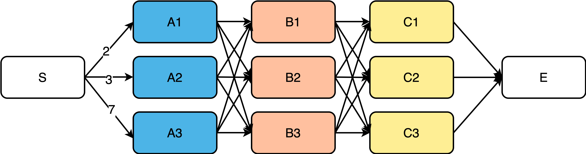
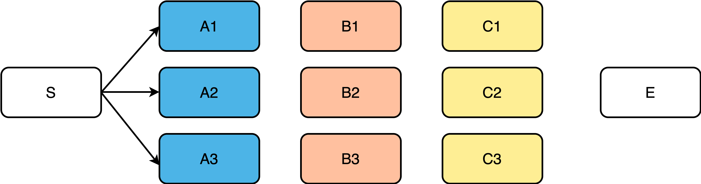
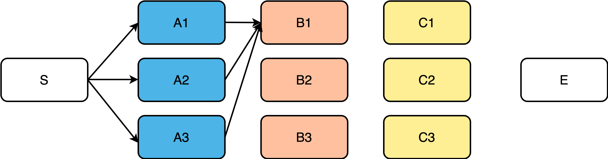
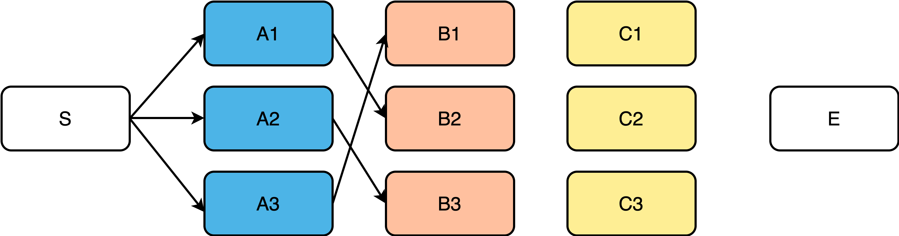
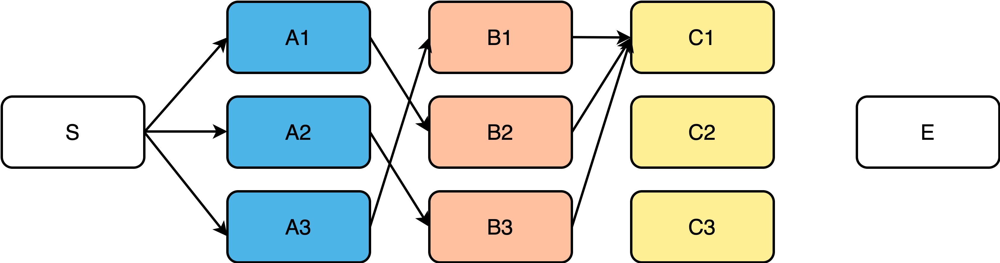
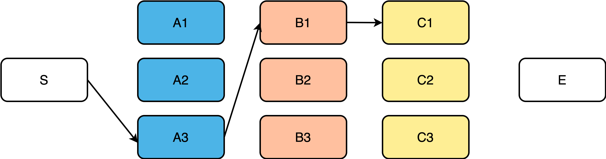
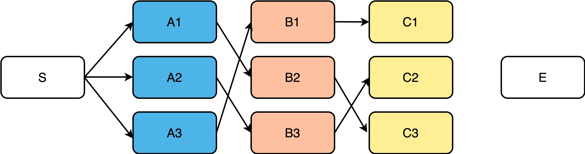
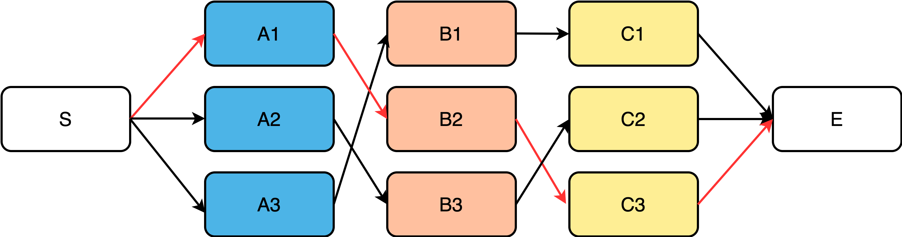

# wenet的ctc_alignment

## 强制对齐

强制对齐（Force alignment）在语音识别、语音合成等任务中应用广泛，同时也是字幕时间轴、口语评测等任务的核心算法。强制对齐和语音识别都需要一个已经训练好的声学模型和输入语音，而强制对齐还需要语音对应的正确标注文本。强制对齐仅输出语音帧和文本之间的对应关系，比如语音有9帧，对应的正确标注文本为“cat”，则强制对齐的一个可能输出为`[c,c,c,blank,a,a,t,t,blank]`。

WeNet由于使用了Joint CTC&AED结果，因此可以利用CTC解码器来完成强制对齐。强制对齐的单元与声学模型的建模单元有关，比如WeNet中文模型中采用了字级别的建模，因此强制对齐也是得到字级别的对齐结果，而如果需要音素级别的强制对齐功能，则需要另外训练一个音素级别的模型。

## 对齐

语音识别是需要将音频序列转换到文本序列，而音频序列长度一般大于文本序列长度，如果能知道每一帧音频对应的文本，就可以将语音识别转换为音频帧级别上的分类任务。为了得到这种对应关系，常常需要对文本序列进行扩展。对这类序列建模任务的扩展方法包括：对输入序列的单元进行复制，以及插入占位符blank两种方法。HMM采用了复制的方式，CTC两者同时使用，RNN-T则只使用插入占位符blank的方法，如图所示。


在使用CTC目标训练时，本质是考虑所有可能的CTC对齐，并把每一种对齐情况下的分类损失加起来作为目标函数。在实际实现时，并不会真的穷举所有对齐，而是利用一种高效算法进行计算。

对于对齐任务来说，目标是找到一条概率最大的CTC对齐，最简单的方法是使用训练好的模型对所有可能的对齐路径进行打分，选择一条概率最高的CTC对齐路径即可。但是这种穷举算法的时间复杂度是指数级别的，此时可以使用维特比算法降低寻找最优路径的复杂度。

## 维特比算法



如上图所示，假如边上有值表示长度，需要从S和E之间寻找一条最短的路径，除了穷举之外，更好的方法是，利用维特比（Viterbi）算法搜索最优路径。

为了寻找S到E之间的最短路径，可以从左向右一列一列推算，起点是S，从S到A列的路径有3条：S->A1、S->A2、S->A3，如下图所示。



至目前为止S->A1、S->A2、S->A3中的任何一段均可能是全局最短路径的一部分。继续向右到B列，首先分析B1：



如上图，经过B1的所有路径只有3条：

- S->A1->B1
- S->A2->B1
- S->A3->B1

以上3条路径中，各节点距离加起来比较一下，就可以知道哪一条是最短路径，假设S->A3->B1是最短路径，那么**经过B1的所有路径中S->A3->B1是最短的，其它两条路径都绝对不是目标答案，可以大胆删除**。假如全局最短路径真的经过了B1，那么全局最短路径上B1之前一定是A3，而绝对不是A1或A2，否则就与“经过B1的所有路径中S->A3->B1是最短的”相矛盾。及时删除不可能的答案是维特比算法的重点，也是维特比算法能够降低复杂度的原因。此时经过B1的所有备选路径就只剩下一条路径了，如下图所示：


以此类推，经过B2、B3的所有备选路径各自也只剩下一条：



此时，S->A3->B1、S->A1->B2、S->A2->B3均有可能是全局最短路径的一部分，继续向后迭代，类似于B列，经过C1节点的路径有：



假设此时经过C1节点的最短路径是S->A3->B1->C1，则及时将其余两条路径删除，如下图所示：



以此类推，可求得经过C2、C3节点的最短路径，如下图：



此时仍然无法确定哪一条是全局最短，继续向后迭代，到达E列，到达E节点的路径此时只有3条：


E节点已是终点，此时比较这3条路径就可以知道哪一条是全局最短路径了，如下图：



相比于穷举所有路径，维特比算法每到达一个步骤都及时删除不可能答案，从而大大降低时间复杂度。维特比算法可以概况为以下三点：

1. 如果最优路径经过某点，则从起点到该点的子路径一定是从起点到该点的所有路径中最优的。
2. 假设第$t$时刻有$k$个状态可供选择，从开始到$t$时刻的$k$个状态有$k$条最短路径，而最终的最短路径必然经过其中一条。
3. 根据以上性质，在计算第$t+1$时刻的最短路径时，只需要考虑从开始到当前的$k$个状态值的最短路径和当前状态值到第$t+1$时刻的最短路径即可。如求$t=3$时的最短路径，等于求$t=2$时，从起点到当前时刻的所有状态结点的最短路径加上$t=2$到$t=3$的各节点最短路径。

维特比算法用于求解多步骤，每个步骤多选择的最优选择问题。对于每一步的所有可能选择，维特比算法都保存前序步骤到当前步骤的若干最优路径以及当前代价下前一步骤上的选择，依次计算完所有步骤后，通过回溯不断寻找前一步骤上的选择，从而找到完整的最优选择路径。

## CTC维特比算法

由于CTC引入了占位符blank，因此相比普通的维特比算法，CTC维特比算法求解状态跳转有所不同。定义`状态`为模型在每个时刻的输出token，比如blank或标注序列中的字符。

### 初始化

在初始化中，由于CTC引入了blank，因此第一时刻的初始状态可能是blank，也可能是标注序列的第一个token。

### 递推

根据CTC规则，已知当前$t$时刻的状态$s$，推导该状态可以由上一时刻的哪些状态跳转而来。

#### 规则

1. 如果$t$时刻的状态$s$为blank，则状态$s$可由$t-1$时刻的$s$或$s-1$（两个可能状态）跳转而来。
2. 如果$t$时刻的状态$s$为非blank，且状态$s$与$s-2$不同，则状态$s$可由$t-1$时刻的$s$或$s-1$或$s-2$（三个可能状态）跳转而来。
3. 如果$t$时刻的状态$s$为非blank，且状态$s$与$s-2$相同，则状态$s$可由$t-1$时刻的$s$或$s-1$（两个可能状态）跳转而来，而不可能由$s-2$跳转而来，因为此时$s$和$s-2$相同，如果由$s-2$跳转到$s$，按照CTC规则，这两个状态应该合并。与此同时，情况3和情况1的上一时刻可能状态相同，因此代码中可以合并。

#### 举例

假设CTC字符串如下：

`<blank1> s <blank2> e1 <blank3> e2 <blank4>`

其中，`<blank>`表示若干个blank字符，为叙述方便数字后缀用于区分不同位置，`e1/e2`均表示`e`，数字后缀同样用于区分不同位置，因此该CTC字符串对应的规整串为`see`。

根据CTC规则：

1. `<blank2>`只可能从`<blank2>`或者`s`跳转而来。
2. `e1`可能从`e1`或者`<blank2>`或者`s`跳转而来。
3. `e2`只可能从`e2`或者`<blank3>`跳转而来，而不可能从`e1`跳转而来，否则`e1 e2`按照CTC规则最后将被合并为`e1`。

### 终止

在CTC维特比算法中，终止状态可以是blank，也可以是标注序列的最后一个token。比较两个终止状态组成的路径，可以获得最优路径上的终止状态。

HMM中采用的维特比算法只能将标注序列的最后一个token作为终止状态。

### 最优路径回溯

在最优路径上，每个时刻的状态均保存对应的上一时刻状态，从而能够获得完整的最优选择路径。

## WeNet中CTC alignment的实现

### 初始化

1. 向标注序列每两个token之间插入blank，比如标注序列为“c a t”，则插入blank之后为”ϵ c ϵ a ϵ t ϵ“。
2. `ctc_probs`表示CTC解码器输出的概率分布，大小为`[vocab_size,]`。
3. `log_alpha[t,s]`表示$t$时刻跳转到状态$s$所有可能路径中的最高分。
4. `state_path[t,s]`表示$t$时刻状态$s$由前一时刻哪个状态跳转而来，由于维特比算法最后的回溯。

```python

# wenet/wenet/utils/ctc_util.py
# 标注序列每两个token之间插入blank
y_insert_blank = insert_blank(y, blank_id)

# ctc_probs[t,s]：CTC解码器输出的概率分布，[vocab_size,]
# log_alpha[t,s]：t时刻跳转到状态s所有可能路径的最高分
log_alpha = torch.zeros((ctc_probs.size(0), len(y_insert_blank)))
log_alpha = log_alpha - float('inf')  # log of zero
# t时刻状态s由前一时刻哪个状态跳转而来
state_path = (torch.zeros(
	(ctc_probs.size(0), len(y_insert_blank)), dtype=torch.int16) - 1
)  # state path
```

5. 初始化$t0$时刻的blank和标注序列第一个token的概率。

```python

# 初始化开始状态
log_alpha[0, 0] = ctc_probs[0][y_insert_blank[0]]
log_alpha[0, 1] = ctc_probs[0][y_insert_blank[1]]
```

### 递推

根据CTC规则，对当前$t$时刻的状态$s$，找到其由上一时刻的哪些状态跳转而来：

- 两个可能状态：分支1
- 三个可能状态：分支2

这些状态由`prev_state`记录下来，跳转至这些状态对应路径的最高得分由`candidates`记录。

然后计算得分，`log_alpha[t,s]`记录选取的最高得分，`state_path[t,s]`记录选取的前一时刻状态。

```python

for t in range(1, ctc_probs.size(0)):
	for s in range(len(y_insert_blank)):
		# 只能由上一时刻的相同状态、前一状态跳转而来的情况
		if y_insert_blank[s] == blank_id or s < 2 or y_insert_blank[
				s] == y_insert_blank[s - 2]:
			# 跳转至前一时刻状态们的候选路径得分
			candidates = torch.tensor(
				[log_alpha[t - 1, s], log_alpha[t - 1, s - 1]])
			# 候选的前一时刻状态
			prev_state = [s, s - 1]
		else:  # 可由上一时刻的相同状态、前一状态、前前状态跳转而来的情况
			# 跳转至前一时刻状态们的候选路径得分
			candidates = torch.tensor([
				log_alpha[t - 1, s],
				log_alpha[t - 1, s - 1],
				log_alpha[t - 1, s - 2],
			])
			# 候选的前一时刻状态
			prev_state = [s, s - 1, s - 2]
		# 记录可能跳转至s的路径最高得分
		log_alpha[t, s] = torch.max(candidates) + ctc_probs[t][y_insert_blank[s]]
		# 剪枝，及时抛弃不可能路径
		# 只保留最可能跳转到当前状态的前一时刻状态, 用于回溯
		state_path[t, s] = prev_state[torch.argmax(candidates)]
```

### 终止

终止字符可以为blank或标注序列的最后一个token，比较最终时刻跳转至blank所有路径的最高分`log_alpha[-1, len(y_insert_blank) - 1]`，最终时刻跳转至标注序列最后一个token的最高分`log_alpha[-1, len(y_insert_blank) - 2]`，两者较高分对应的状态即为终止状态。`state_seq[t,0]`记录最优路径上的token id。

```python

# CTC中由于引入了blank，因此“最优终点”有可能是blank，也有可能是标注序列的最后一个token
# 终点阶段的比较，此时比较这2条路径就可以知道哪一条是全局最优路径了

# state_seq用于记录最优路径上的token id
state_seq = -1 * torch.ones((ctc_probs.size(0), 1), dtype=torch.int16)

candidates = torch.tensor([
    log_alpha[-1, len(y_insert_blank) - 1],
    log_alpha[-1, len(y_insert_blank) - 2]
])
prev_state = [len(y_insert_blank) - 1, len(y_insert_blank) - 2]
state_seq[-1] = prev_state[torch.argmax(candidates)]
```

### 回溯

通过上一步确定的最后时刻状态，不断回溯找到前一时刻的状态，直至找到第一时刻，结束。

```python

for t in range(ctc_probs.size(0) - 2, -1, -1):
    state_seq[t] = state_path[t + 1, state_seq[t + 1, 0]]
```

### 输出

```python

# 假设语音有9帧，则output_alignment的一个可能结果是[c,c,c,blank,a,a,t,t,blank]
output_alignment = []
for t in range(0, ctc_probs.size(0)):
    output_alignment.append(y_insert_blank[state_seq[t, 0]])
```

## 小结

1. CTC可帮助模型学习语音和label之间的alignment。
2. CTC可以做到帧同步解码，因此非常适合做流式模型。
3. CTC输出是相互独立的，相对于Seq2Seq建模能力较差，一般需要外挂语言模型才能得到较好的效果。

> [如何通俗地讲解 viterbi 算法？](https://www.zhihu.com/question/20136144)
> [李宏毅NLP(自然语言处理)-P6](https://www.bilibili.com/video/BV1hM4y157xX?p=6)
> [WeNet更新：支持 CTC alignment](https://mp.weixin.qq.com/s/4aGehNN7PpIvCh03qTT5oA)