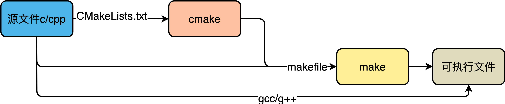

# c或cpp软件编译

## 整体流程

1. **编辑器**编写源代码，如`*.c/*.cpp`文件。
2. **编译器**编译代码，生成目标文件，如`*.o`文件。
3. **链接器**链接目标代码，生成可执行文件，如`*.exe`文件。

如果项目较大，步骤2和3就非常麻烦，因此就产生类似批处理的程序，批处理编译和链接源文件，这就是make/makefile/cmake/CMakeLists.txt/configure等工具或文件。

- `make`是一个批处理工具，根据`makefile`文件进行编译和链接。`makefile`文件内就包含了`gcc/g++`等编译命令。
- `makefile`文件本身比较复杂，并且无法跨平台。因此产生了`cmake`利用`CMakeLists.txt`跨平台产生`makefile`。
- `CMakeLists.txt`无法自动生成，是最终需要手动编写的脚本。

当然，如果对`makefile`语法熟悉，当然可以手动编写`makefile`文件；如果项目较小，可以不编写`makefile/CMakeLists.txt`，手动使用`gcc/g++`进行编译和链接。



## makefile

### c/cpp编译和链接

一个示例代码`hello.c`如下：

```c

// hello.c
#include <stdio.h>

int main() {
  printf("Hello!");
  return 0;
}
```

生成hello可执行文件所需要的命令为：`gcc -v -o hello hello.c`

该过程可分解为4个步骤：预处理、编译、汇编、链接。大部分情况下，一般来说，无论是C还是C++，首先要把源文件编译成中间代码文件，在Windows下也就是`*.obj`文件，UNIX下是`*.o`文件，即Object File，这个动作叫做编译（compile），一般来说每个源文件都对应一个Object File。然后再把大量的Object File组合成执行文件，也就是打包，这个动作叫作链接（link），可以链接成可执行文件，或者动态库`*.so/*.dll`，或者静态库`*.a/*.lib`。

在编译时，编译器只检查程序语法和函数、变量是否被`声明`，如果函数未声明，编译器会给出警告，但可以生成Object File。在链接时，链接器会在所有的Object File中寻找函数`实现`，如果找不到，就会报链接错误，在VC下，这种错误一般是`Link 2001错误`，也就是说链接器未找到函数的实现，需要指定函数的Object File。


### makefile规则

makefile大致是先处理一些环境变量或参数，然后从某一个位置开始执行命令集。

```shell

target ... : prerequisites ...
    command
    ...
    ...
```

- target：可以是一个Object File（目标文件），也可以是一个执行文件，还可以是一个标签（label）。
- prerequisites：生成该target所依赖的文件或target。
- command：该target要执行的命令（任意的shell命令）。

也就是说，target这一个或多个的目标文件依赖于prerequisites中的文件，其生成规则定义在command中。

大多数的make都支持“makefile”和“Makefile”这两种默认文件名。如果要指定特定的Makefile，你可以使用make的`-f`和`--file`参数，如：`make -f Make.Linux`或`make --file Make.AIX`。

### 示例


上述示例中，定义了**2个参数**，**3个target**。makefile可以有多个target，target之间可以独立，也可以相互依赖或关联，但只能从某一个开始执行，默认情况下从第一个target执行。上例中，target0由2个子target组成。类似于C语言，`变量`类似于宏参数的定义，`找target并执行`类似于找main函数并执行命令。在Makefile中的命令，必须要以`Tab`键开始。

> [快速的理解MakeFile+读懂一个MakeFile](https://zhuanlan.zhihu.com/p/350297509)
> [how-to-write-makefile](https://seisman.github.io/how-to-write-makefile)

## CMake

一个利用CMake构建项目的典型流程：

1. 编写CMake的配置文件`CMakeLists.txt`。
2. 执行命令`cmake <PATH>`或者`ccmake <PATH>`，其中`<PATH>`为`CMakeLists.txt`所在的目录。相比`cmake`，`ccmake`提供了一个交互式界面。
3. 使用`make`命令进行构建。

在开发过程中经常需要使用外部项目，`*.cmake`文件是外部包的配置文件，内容与`CMakeLists.txt`类似，以提供关于包最基本的信息，便于利用CMake构建项目。

> [What is the use of .cmake files in install function of CMakeLists.txt?](https://stackoverflow.com/questions/62875805/what-is-the-use-of-cmake-files-in-install-function-of-cmakelists-txt)
> [How to create a ProjectConfig.cmake file](https://gitlab.kitware.com/cmake/community/-/wikis/doc/tutorials/How-to-create-a-ProjectConfig.cmake-file)
> [youtube/Deep CMake for Library Authors - Craig Scott - CppCon 2019](https://www.youtube.com/watch?v=m0DwB4OvDXk&t=919s)
set执行详解

### 语法速查

#### 指定cmake最小版本

```shell

cmake_minimum_required(VERSION 3.4.1)
```

在有些情况下，如果`CMakeLists.txt`文件中使用了一些高版本`cmake`特有的一些命令的时候，就需要加上这样一行，提醒用户升级到该版本之后再执行`cmake`。

#### 设置项目名称

```shell

project(demo)
```

上例中，引入两个变量`demo_BINARY_DIR`和`demo_SOURCE_DIR`，同时，cmake自动定义了两个等价的变量`PROJECT_BINARY_DIR`和`PROJECT_SOURCE_DIR`。

#### 设置编译类型

```shell

add_executable(demo demo.cpp) # 生成可执行文件
add_library(common STATIC util.cpp) # 生成静态库
add_library(common SHARED util.cpp) # 生成动态库或共享库
```

上例中，`demo`为自定义项目名称。`add_library`默认生成静态库，通过上例中命令生成的文件名字如下：

- 在Linux下分别是：`demo/libcommon.a/libcommon.so`
- 在Windows下分别是：`demo.exe/common.lib/common.dll`

#### 指定编译包含的源文件

1. 明确指出包含哪些源文件

```shell

add_library(demo demo.cpp test.cpp util.cpp)
```

2. 搜索所有cpp文件

```shell

aux_source_directory(. SRC_LIST) # 搜索当前目录下的所有.cpp文件
add_library(demo ${SRC_LIST})
```

上例中，`aux_source_directory(<dir> <VAR>)`表示搜索目录`<dir>`下所有的源代码文件，并将文件列表存储到变量`<VAR>`中。

3. 自定义搜索规则

```shell

file(GLOB SRC_LIST "*.cpp" "protocol/*.cpp")
add_library(demo ${SRC_LIST})
# 或者
file(GLOB SRC_LIST "*.cpp")
file(GLOB SRC_PROTOCOL_LIST "protocol/*.cpp")
add_library(demo ${SRC_LIST} ${SRC_PROTOCOL_LIST})
# 或者
aux_source_directory(. SRC_LIST)
aux_source_directory(protocol SRC_PROTOCOL_LIST)
add_library(demo ${SRC_LIST} ${SRC_PROTOCOL_LIST})
```

#### 查找指定的包

```shell

find_package (glog 0.3.5 REQUIRED)
```

在实际开发中，经常需要用到第三方开源库，这些开源库有可能通过`apt-get install`方式安装到系统目录下，也有可能自己下载源码并编译安装到指定目录下。在使用时，需要根据实际需求寻找到指定版本库的*头文件包含路径、链接库路径*等。CMake提供了`find_package()`命令查找这些依赖包。`find_package()`有两种工作模式，分别是：

- Module模式。默认搜索模式。
- Config模式。当Module模式失败，或者`find_package()`中指定了`CONFIG/NO_MODULE`等关键字时启用。

当执行`find_package(XXX)`时，CMake搜索流程图为：


1. 命令签名

```shell

find_package(<package> [version] [EXACT] [QUIET] [MODULE]
             [REQUIRED] [[COMPONENTS] [components...]]
             [OPTIONAL_COMPONENTS components...]
             [NO_POLICY_SCOPE])
```

- `package`：必填参数。需要查找的包名，注意大小写。
- `version`和`EXACT`：可选参数。`version`指定版本，如果设置就必须找到该包与`version`指定版本号的兼容版本；如果同时指定了`EXACT`，则表示必须完全匹配而不是兼容版本就可以。
- `QUIET`：可选参数。查找失败则输出报错信息，但如果指定`REQUIRED`则总是输出。
- `MODULE`：可选参数。必须MODULE模式查找。
- `REQUIRED`：可选参数。表示一定要找到包，找不到立即停止。
- `COMPONENTS components`：可选参数。查找的包中必须包含组件（components），否则立即停止。

2. 两种搜索模式的搜索原理

- Module模式查找`Find<PackageName>.cmake`配置文件。查找路径有2个：
	- `CMAKE_MODULE_PATH`。该变量默认为空，可通过`set`命令赋值。
	- `CMAKE_ROOT`下的Modules目录，`CMAKE_ROOT`为CMake安装目录。比如`/usr/share/cmake-3.10/Modules`。

- Config模式查找`PackageName>Config.cmake`或`<lower-case-package-name>-config.cmake`配置文件。查找路径有3个：
	- `<PackageName>_DIR`。该变量默认为空，可通过`set`命令赋值，该路径为`<PackageName>Config.cmake`或`<lower-case-package-name>-config.cmake`文件**所在目录**。
	- `CMAKE_PREFIX_PATH/CMAKE_FRAMEWORK_PATH/CMAKE_APPBUNDLE_PATH`的CMake变量或*环境变量*。默认为空。
	- `PATH`环境变量。CMake会遍历`PATH`环境变量中的每个路径，如果路径以bin或者sbin结尾，则自动回退到上一级，以便得到根目录。在根目录中，CMake查找是否存在`<PackageName>Config.cmake`或`<lower-case-package-name>-config.cmake`配置文件，如果没有，则会继续检查或者匹配一些路径，参见[“轻松搞定CMake”系列之find_package用法详解](https://blog.csdn.net/zhanghm1995/article/details/105466372)。

3. 查找失败的解决方法

- 如果明确知道要查找的库`<PackageName>Config.cmake`或`<lower-case-package-name>-config.cmake`文件所在路径，直接`set`设置变量`<PackageName>_DIR`。比如：
	```

	# OpenCV
	set(OpenCV_DIR "~/opencv3_4_4/opencv/build")
	# Caffe
	set(Caffe_DIR ~/caffe/build)
	```

- 如果有多个包的配置文件需要查找，可以将配置文件统一存放到如`cmake`的目录下，然后利用`set`设置变量`CMAKE_PREFIX_PATH`指向这个`cmake`目录路径。注意：每个包的配置文件需要单独放置到命名为包名的目录下（文件夹名不区分大小写），否则会找不到。

补充动态库`*.so`和静态库`*.a`的区别，动态库即使编译完成，也是和其它动态库是分离的，因此每次用都要把所有涉及的动态库全部添加进来；静态库在编译时就和程序结合在一起了。

> [“轻松搞定CMake”系列之find_package用法详解](https://blog.csdn.net/zhanghm1995/article/details/105466372)
> [CMake之find_package](https://www.jianshu.com/p/46e9b8a6cb6a)

#### 查找指定的库文件

```shell

find_library(log-lib log)
```

`find_library(<VAR> <name> <path>)`查找到指定的预编译库，并将该路径存储在变量中。类似的命令还有`find_file()、find_path()、find_program()、find_package()`。

#### 载入CMake预定义模块

```shell

include(FetchContent)
include(ExternalProject)
```

`include`用来载入`CMakeLists.txt`文件，也用于载入预定义的CMake模块。

```shell

include(file1 [OPTIONAL])
include(module [OPTIONAL])
```

上述`OPTIONAL`参数的作用是文件不存在也不会产生错误。可以指定载入一个文件或模块，如果载入模块，那么将在`CMAKE_MODULE_PATH`中搜索这个模块并载入。载入的内容将在处理到 `include`语句时直接执行。

#### 设置包含的目录

```shell

include_directories(
    ${CMAKE_CURRENT_SOURCE_DIR}
    ${CMAKE_CURRENT_BINARY_DIR}
    ${CMAKE_CURRENT_SOURCE_DIR}/include
)
```

#### 设置需要链接的库

下例中，`demo`均为自定义项目名。

1. 指定链接动态库或静态库

```shell

target_link_libraries(demo libface.a) # 链接libface.a
target_link_libraries(demo libface.so) # 链接libface.so
```

2. 指定全路径

```shell

target_link_libraries(demo ${CMAKE_CURRENT_SOURCE_DIR}/libs/libface.a)
target_link_libraries(demo ${CMAKE_CURRENT_SOURCE_DIR}/libs/libface.so)
```

3. 指定链接多个库

```shell

target_link_libraries(demo
    ${CMAKE_CURRENT_SOURCE_DIR}/libs/libface.a
    boost_system.a
    boost_thread
    pthread)
```

也就是，cmake链接库的方法为：

```shell

target_link_libraries(<目标库> <目标库需要链接的库路径>)
```

在Windows下，CMake会根据链接库目录，搜索`*.lib`文件。在Linux下会搜索`*.so`或`*.a`文件，如果两者都存在，则优先连接动态库`*.so`文件。

#### cmake中的变量

1. 一般变量

```shell

set(TEST "Local Var" ON)
set(TEST "Parent scope Var" ON PARENT_SCOPE)
```

类似于C++局部变量，仅在所在作用域（当前CMakeLists.txt）有效，除非后面使用`PARENT_SCOPE`。

```shell

set(<variable> <value>... [PARENT_SCOPE]) #设置普通变量
```

2. 缓存变量

```shell

# 若是第一次运行，将给TEST赋值为ON
# 若不是，则不会修改。注意，这里即使手动改成ON->OFF，也不会修改Cache里面的值，除非手动删除CMakeCache.txt
set(TEST "Cache Var" ON CACHE BOOL) 
# 通过添加FORCE，可以强制刷新Cache的值，避免上述”奇怪“的现象
set(TEST "Local Var" ON CACHE BOOL FORCE)
```

类似于C++全局变量，在cmake整个运行期间有效。

```shell

set(<variable> <value>... CACHE <type> <docstring> [FORCE]) #设置缓存变量
```

3. 环境变量

使用`$ENV{NAME}`可以调用系统的环境变量。

```shell

set(ENV{name} value)
set(ENV{<variable>} [<value>]) #设置环境变量
```

> [Cmake命令之set介绍](https://www.jianshu.com/p/c2c71d5a09e9)

#### 设置变量

下例中，`SRC_LIST`均为自定义变量名，`demo`均为自定义项目名。

1. `set`直接设置变量的值

```shell

set(SRC_LIST main.cpp test.cpp)
add_executable(demo ${SRC_LIST})
```

2. `set`追加变量的值

```shell

set(SRC_LIST main.cpp)
set(SRC_LIST ${SRC_LIST} test.cpp)
add_executable(demo ${SRC_LIST})
```

#### 用户传参控制变量的值

`option()`指令。如：

```shell

option(USE_LIB "Whether use lib to link matrix_test" ON)
```

使用时，通过命令行传入值：

```shell

# 可以使用set()进行赋值；也可以通过命令行传参方式使用，-D显式声明
>>> cmake .. -D USE_LIB=OFF 
```

#### 常见内置变量

| 变量                                  | 含义                                                                                                     |
| ------------------------------------- | -------------------------------------------------------------------------------------------------------- |
| CMAKE_INSTALL_PREFIX                  | 指定安装目录，一般作为`cmake`命令行参数                                                                  |
| CMAKE_SOURCE_DIR                      | `CMakeLists.txt`所在目录                                                                                 |
| CMAKE_CURRENT_SOURCE_DIR              | 当前正在处理`CMakeLists.txt`所在目录                                                                     |
| PROJECT_SOURCE_DIR                    | 代码根目录                                                                                               |
| PROJECT_BINARY_DIR                    | 执行`cmake`命令所在目录，一般是创建build目录并且进入该目录，执行`cmake`命令                              |
| CMAKE_INCLUDE_PATH                    | 头文件所在目录                                                                                           |
| CMAKE_LIBRARY_PATH                    | lib库所在目录                                                                                            |
| CMAKE_BUIlD_TYPE                      | 编译类型，例如Debug、Release。例如`-DCMAKE_BUIlD_TYPE=Debug`                                             |
| CMAKE_C_COMPILER / CMAKE_CXX_COMPILER | 指定C/C++编译器路径，例如：`set(CMAKE_C_COMPILER "/usr/local/gcc")`或`-DCMAKE_C_COMPILER=/usr/local/gcc` |
| CMAKE_C_FLAGS / CMAKE_CXX_FLAGS       | 传递FLAGS给C/C++编译器，两个变量分别指定C/C++编译的选项，例如：`set(CMAKE_CXX_FLAGS "-g")`               |
| CMAKE_CXX_FLAGS_DEBUG                 | 除了CMAKE_CXX_FLAGS外，在Debug配置下，额外的参数                                                         |
| CMAKE_CXX_FLAGS_RELEASE               | 除了CMAKE_CXX_FLAGS外，在Release配置下，额外的参数默认参数，参数默认值为`-O3 -NDEBUG`                    |
| CMAKE_VERBOSE_MAKEFILE                | `set(CMAKE_VERBOSE_MAKEFILE ON)`：开启详情打印                                                           |

上述变量均为`CMakeLists.txt`文件中可通过`set`配置的内置变量，如果通过`cmake`执行时临时加上的变量设置，则需要加上`-D`前缀。比如，指定目标文件的安装路径时，可以在`CMakeLists.txt`内设置`CMAKE_INSTALL_PREFIX`变量：

```shell

# CMakeLists.txt
# 该语句需要放在project()语句后面
set(CMAKE_INSTALL_PREFIX <your install path>)
```

同样可以在执行`cmake`时临时设置：

```shell

cmake -DCMAKE_INSTALL_PREFIX=/your install path ..
```

在指定目标文件安装位置的场景下，执行`cmake`时临时设置则是推荐方式。

此外，补充常见的C++编译选项：

```shell

set(CMAKE_CXX_COMPILER "clang++" )              # 显示指定使用的C++编译器
set(CMAKE_CXX_FLAGS "-std=c++11")               # c++11
set(CMAKE_CXX_FLAGS "-g")                       # 调试信息
set(CMAKE_CXX_FLAGS "-Wall")                    # 开启所有警告
set(CMAKE_CXX_FLAGS_DEBUG "-O0" )               # 调试包不优化
set(CMAKE_CXX_FLAGS_RELEASE "-O2 -DNDEBUG " )   # release包优化
```

#### 打印

可以通过`message()`指令打印出变量的值，类似`print()`函数。

```shell

message("Configuration: ${USE_LIB}")
```

> [Cmake 语法与实战入门](https://zhuanlan.zhihu.com/p/267803605)
> [CMake基本常识](https://blog.csdn.net/xxb249/article/details/90697855)
> [CMake-official_help](https://cmake.org/cmake/help/latest/)
> [cmake：指定目标文件的安装位置](https://zhuanlan.zhihu.com/p/337586453)
> [WeNet CmakeList.txt实战解读](https://blog.csdn.net/weixin_39289876/article/details/123182385)