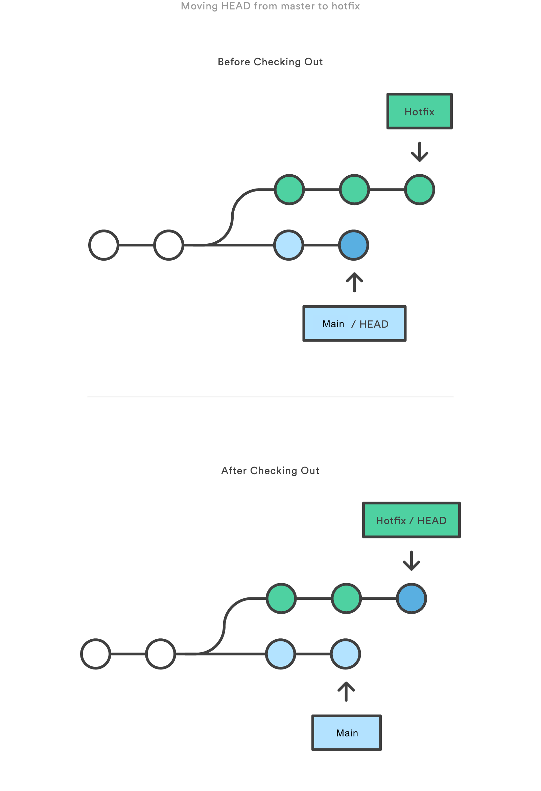

# git常用回退操作

## 概述


如上图所示，一个Git仓库由三部分组成，分别为工作区（Working Directory）、暂存区（Staged Snapshot）和本地仓库提交（Commit History）。

`git reset`、`git revert`和`git checkout`均可以实现版本回退，但三者之间略有差异，且是否传入文件路径也会改变命令功能和应用范围。

```shell

# commit-level，功能：切换分支
git checkout hotfix
# file-level，功能：将指定文件回退到指定版本，并放到工作区
git checkout hotfix foo.py
```

因此，根据`git reset`、`git revert`和`git checkout`后面是否传入文件路径，将对应命令的适用范围划分为Commit-level和File-level。

| 命令           | 范围         | 适用场景                                             |
| -------------- | ------------ | ---------------------------------------------------- |
| `git reset`    | Commit-level | 在私有分支上删除提交（commit），或者丢弃未提交的修改 |
| `git reset`    | File-level   | 将仓库中的指定文件移回暂存区                         |
| `git checkout` | Commit-level | 切换分支，或者查看旧版本                             |
| `git checkout` | File-level   | 删除工作区的修改                                     |
| `git revert`   | Commit-level | 在公共分支上撤销修改                                 |
| `git revert`   | File-level   | (N/A)                                                     |

`git checkout`和`git reset`通常用于**撤销本地或私有分支上的修改**，因为`checkout`和`reset`会修改仓库历史记录，在推送到远程共享仓库时可能会发生冲突。而`git revert`能够安全地**撤销远程共享仓库的修改**，因为`revert`在撤销修改时会创建新提交，不会修改之前的仓库历史记录。

## Commit Level操作

### reset

在commit-level上，`git revert`可以从当前分支上移除提交（commit）。

```shell

git checkout hotfix
git reset HEAD~2
```

以上命令将`hotfix`分支向后移动两次提交：


如上图所示，执行完`git reset`之后，在`hotfix`分支上的最后两个提交将成为孤立提交（orphaned commits），在Git下一次执行垃圾回收时将会被删除，因此`git reset`的典型应用场景是撤销尚未和其他人共享的修改。

除了会移动仓库中当前分支的`HEAD`指针，通过`git reset`的以下选项还可以指定对暂存区和工作区的更新：

- `--soft`：暂存区和工作区不变。
- `--mixed`：默认，更新暂存区以匹配指定的提交（commit），工作区不变。
- `--hard`：更新暂存区和工作区以匹配指定的提交（commit）。

### checkout

`git checkout`用于将仓库状态更新到历史记录中的特定版本，当`git checkout`后接分支名时，将会切换分支。

```shell

git checkout hotfix
```

以上命令会将`HEAD`指针移动到`hotfix`分支上，并更新工作区以匹配`hotfix`分支的当前状态。由于该操作有可能会覆盖本地修改，因此Git会强制要求`git commit`或`git stash`以防丢失。



类似地，`git checkout`后接ref可以将工作区更新到特定版本：

```shell

# 工作区更新到两次提交之前的状态
git checkout HEAD~2
```

实际上`git checkout`后面无论是分支名还是ref，Git都是将`HEAD`移动到特定提交上，然后将工作区更新到特定提交的状态。


`git checkout`和`git reset`的主要区别在于，`checout`只会修改`HEAD`指针并更新工作区，不会修改提交（commit）历史，所有的commit都不会被删除；`reset`不但会修改`HEAD`指针，还会修改提交（commit）历史，通过不同参数控制工作区、暂存区和仓库的更新。

如上图所示，`git checkout`可以很方便地查看旧版本。但此时没有分支指针（branch reference）指向`HEAD`，如果向`HEAD`后添加新的提交（commit）并切换到其它分支，将会导致再也无法找回它们。因此在向悬空的`HEAD`之后添加新的提交之前，应先创建一个新分支。

### revert

`git revert`通过添加新的提交（commit）来撤销提交。这是撤销修改最安全的方式，因为`revert`不会重写提交历史记录。

```shell

git checkout hotfix
git revert HEAD~2
```

以上命令将查找倒数第二个提交的修改，并创建新的提交以撤销这些修改：


不同于`git reset`，`git revert`不会修改之前的提交历史，因此`git revert`适用于撤销公共分支上的修改，而`git reset`适用于撤销私有分支上的修改。类似于`git checkout`，`git revert`可能会覆盖工作区的文件，因此在执行`revert`之前，Git会强制要求`git commit`或`git stash`以防丢失。

## File Level操作

`git reset`和`git checkout`可接受可选的文件路径作为参数，这将会改变这些命令的功能和作用范围。

### reset

当指定文件路径时，`git reset`会更新暂存区以匹配指定的提交。

```shell

git reset HEAD~2 foo.py
```

上述命令将会获取倒数第二个提交中的`foo.py`，并放回到暂存区：


`git reset`通常会撤回到`HEAD`指向的提交，对于file-level版本的`git reset`，不存在`--soft`、`--mixed`和`--hard`选项，应用`git reset`将始终更新暂存区，始终不更新工作区，相当于只有`--mixed`选项。

### checkout

当指定文件路径时，`git checkout`会直接更新工作区以匹配指定的提交。

```shell

git checkout HEAD~2 foo.py
```

上述命令将会获取倒数第二个提交中的`foo.py`，并放回到工作区：


不同于commit-level版本的`git checkout`，该命令作用于文件时不会移动`HEAD`指针，因此也不会切换分支。

`git checkout`作用于文件时，同样可以用来查看旧版本，只是作用范围限制为指定文件。如果一个文件`checkout`之后又进行了提交，该操作的效果类似于`revert`，不同之处在于`git checkout`会撤销对该文件的所有后续修改，而`git revert`仅会撤销该文件指定提交的修改。

`git checkout`也通常应用于`HEAD`指针，比如`git checkout HEAD foo.py`将会抛弃`foo.py`所有未暂存的修改，这有点类似于`git reset HEAD --hard`，但前者的作用域仅限于指定文件。

> [git checkout/git reset/git revert/git restore常用回退操作](https://blog.csdn.net/albertsh/article/details/104719370)
> [Resetting, Checking Out & Reverting](https://www.atlassian.com/zh/git/tutorials/resetting-checking-out-and-reverting)
> [git的撤销操作：reset、checkout和revert](https://segmentfault.com/a/1190000009126517)