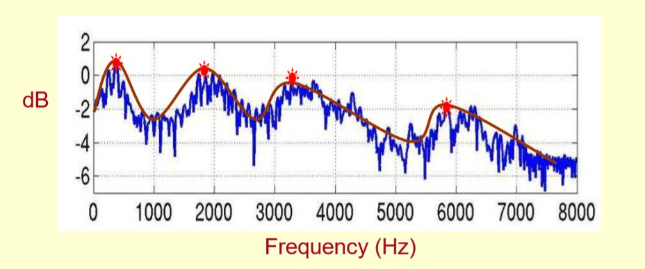

# 语音基本概念

声波通过空气传播，被麦克风接收，通过 `采样`、 `量化`、`编码`转换为离散的数字信号，即波形文件。音量、音高和音色是声音的基本属性。

## 语音常见特征

### 能量

音频的能量通常指的是时域上每帧的能量，幅度的平方。在简单的语音活动检测（Voice Activity Detection，VAD）中，直接利用能量特征：能量大的音频片段是语音，能量小的音频片段是非语音（包括噪音、静音段等）。这种VAD的局限性比较大，正确率也不高，对噪音非常敏感。

### 短时能量

短时能量体现的是信号在不同时刻的强弱程度。设第n帧语音信号的短时能量用 $E_n$ 表示，则其计算公式为：

$$
E_n=\sum_{m=0}^{M-1}x_n^2(m)
$$

上式中， $M$ 为帧长， $x_n(m)$ 为该帧中的样本点。

### 声强和声强级

单位时间内通过垂直于声波传播方向的单位面积的平均声能，称作声强，声强用I表示，单位为“瓦/平米”（$W/m^2$）。实验研究表明，人对声音的强弱感觉并不是与声强成正比，而是与其对数成正比，所以一般声强用声强级（Sound Intensity Level，SIL）来表示：

$$
SIL=10{\rm log}(\frac{I}{I'})
$$

其中，I为声强，$I'=10e^{-12}w/m^2$称为基本声强，声强级的常用单位是分贝(dB)。

### 响度

与声强不同，响度是一种主观心理量，是人类主观感觉到的声音强弱程度，又称音量。*响度与声压级（Sound Pressure Level，SPL）、频率和发音时长有关*，一般来说，声音频率一定时，声压越强，响度也越大。相同的声压，频率不同时，响度也可能不同。响度的常用单位是`宋（sone）`。

响度若用对数值表示，即为响度级，响度级的常用单位为`方（phon）`。定义1000Hz纯音产生相同响度时，对应声压级的数值。0 dB声压级1000Hz纯音的响度级定义为0 phon，n dB声压级1000Hz纯音的响度级就是n phon，一个60 phon 的纯音，和一个1000 Hz、60 dB 声压级（Sound Pressure Level，SPL）的纯音，有着相同的响度。其它频率的声压级与响度的对应关系可以从如下图等响度曲线查出。

上图的等响曲线中，横坐标为频率，纵坐标为*声压级*，在同一条曲线上所有频率和声压的组合，都拥有相同的响度。最下面的曲线表示人类能够听到的最小声音响度，即听阈。参见：[Loudness](https://en.wikipedia.org/wiki/Loudness)

值得注意的是，听阈上的声音如果频率和声强都不变、时长增加，它的响度也可能随之增大。在具体的语种中，可以改变音高、音长和声强等，从而改变某些音节或语音成分的响度，即轻重音。不同的语言中，改变响度时所侧重的要素不同。比如汉语普通话中响度较小的轻声，主要是靠缩短音长来实现的；英语中的重音则依靠提高音高，来提高响度。参见：[响度](https://zh.wikipedia.org/wiki/%E9%9F%BF%E5%BA%A6)

### 过零率

过零率体现的是信号过零点的次数，体现的是频率特性。

$$
Z_n=\sum_{n=0}^{N-1}\sum_{m=0}^{M-1}|{\rm sgn}(x_n(m))-{\rm sgn}(x_n(m-1))|
$$

其中，$N$ 表示帧数， $M$ 表示每一帧中的样本点个数， ${\rm sgn()}$ 为符号函数，即

$$
{\rm sgn}=\left\{\begin{matrix}
    & 1,x \geq 0 \\ 
    & -1,x<0
   \end{matrix}\right.
$$

### 共振峰

声门处的准周期激励进入声道时会引起共振特性，产生一组共振频率，这一组共振频率称为共振峰频率或简称共振峰。共振峰包含在语音的频谱包络中，频谱包络的局部极大值就是共振峰。频率最低的共振峰称为第一共振峰，记作$f_1$，频率更高的共振峰称为第二共振峰$f_2$、第三共振峰$f_3$......以此类推。实践中一个元音用三个共振峰表示，复杂的辅音或鼻音，要用五个共振峰。参见：[不同元音辅音在声音频谱的表现是什么样子？](https://www.zhihu.com/question/27126800/answer/35376174)，[什么是共振峰？](https://www.zhihu.com/question/24190826/answer/280149476)

### 基频和基音周期

基音周期反映了声门相邻两次开闭之间的时间间隔，基频（fundamental frequency，f0/F0）则是基音周期的倒数，对应着声带振动的频率，代表声音的音高，声带振动越快，基频越高。它是语音激励源的一个重要特征，比如可以通过基频区分性别。一般来说，成年男性基频在100 $\sim$ 250Hz左右，成年女性基频在150 $\sim$ 350Hz左右，女声的音高一般比男声稍高。

如下图所示，蓝色箭头指向的明亮横线对应频率就是基频，决定音高；而绿框中的明亮横线统称为谐波。谐波是基频对应的整数次频率成分，由声带发声带动空气共振形成的，对应着声音三要素的音色。谐波的位置，相邻的距离共同形成了音色特征。谐波之间距离近听起来则偏厚粗，之间距离远听起来偏清澈。在男声变女声的时候，除了基频的移动，还需要调整谐波间的包络，距离等，否则将会丢失音色信息。

人类可感知声音的频率大致在20-20000Hz之间，人类对于基频的感知遵循对数律，也就是说，人们会感觉100Hz到200Hz的差距，与200Hz到400Hz的差距相同。因此，音高常常用基频的对数来表示。在音乐上，把相差一倍的两个基频的差距称为一个八度（octave）；把一个八度12等分，每一份称为一个半音（semitone）；把一个半音再100等分，每一份称为一个音分（cent）。

基频是语音的重要特征，在包括语音合成的语音处理中有着广泛的应用，比如语音转换（Voice Conversion，VC）和语音合成中基频是一个强特征。基频的提取可以分为时域法和频域法。时域法以波形为输入，基本原理是寻找波形的最小正周期；频域法则会先对信号进行傅里叶变换，得到频谱，频谱在基频的整倍数处有尖峰，频域法的基本原理就是求出这些尖峰频率的最大公约数。但是考虑到基频并非每一帧都有，因此在提取基频前后，都需要判断有无基频，称之为清浊音判断（Unvoiced/Voiced Decision，U/V Decision）。语音的基频往往随着时间变化，在提取基频之前往往要进行分帧，逐帧提取的基频常常含有错误，其中常见的错误就是倍频错误和半频错误，也就是提取出来的基频是真实基频的两倍或者一半，因此基频提取后要进行平滑操作。常见的基频提取算法有基于信号处理时域法的YIN，基于信号处理频域法的SWIPE，基于机器学习时域法的CREPE和基于机器学习频域法的SPICE。常用的基频提取工具有[pyWORLD](https://github.com/JeremyCCHsu/Python-Wrapper-for-World-Vocoder)，[Parselmouth](https://github.com/YannickJadoul/Parselmouth)，[CREPE](https://github.com/marl/crepe)，[YIN](https://github.com/patriceguyot/Yin)等。参见[基频提取算法综述](https://zhuanlan.zhihu.com/p/269107205)。

> A. de Cheveigné and H. Kawahara, "YIN, a fundamental frequency estimator for speech and music", Journal of the Acoustical Society of America, 2002.

> A. Camacho and J. G. Harris, "A sawtooth waveform inspired pitch estimator for speech and music", Journal of the Acoustical Society of America, 2008.

> J. W. Kim, et al., "CREPE: A convolutional representation for pitch estimation", ICASSP, 2018.

> B. Gfeller, et al., "SPICE: Self-supervised pitch estimation", IEEE Transactions on Audio, Speech and Language Processing, 2020.

### 音高

音高（pitch）是由声音的基频决定的，音高和基频常常混用。可以这样认为，音高（pitch）是稀疏离散化的基频（F0）。由规律振动产生的声音一般都会有基频，比如语音中的元音和浊辅音；也有些声音没有基频，比如人类通过口腔挤压气流的清辅音。在汉语中，元音有a/e/i/o/u，浊辅音有y/w/v，其余音素比如b/p/q/x等均为清辅音，在发音时，可以通过触摸喉咙感受和判断发音所属音素的种类。

### MFCC和语谱图

对语音进行分析和处理时，部分信息在时域上难以分析，因此往往会提取频谱特征。在语音合成中，通常将频谱作为中间声学特征：首先将文本转换为频谱，再将频谱转换为波形；在语音识别中，则将频谱或者MFCC作为中间声学特征。语音通过预加重、分帧、加窗、傅里叶变换之后，取功率谱的幅度平方，进行梅尔滤波取对数之后，就得到了梅尔频谱（或称FilterBank/FBank），如果再进行离散余弦变换，就能够获得MFCC，下一章将进行详述。语音通常是一个短时平稳信号，在进行傅里叶变换之前，一般要进行分帧，取音频的一个小片段进行短时傅里叶变换（STFT）。STFT的结果是一个复数，包括幅度和相位信息，将该复数中的频率作为横轴，幅度作为纵轴，如下图所示，就组成了频谱图，将频谱图中的尖峰点连接起来，就形成了频谱包络。注意到，频谱图反映一个语音帧的频域情况，没有时间信息。因此，将每个帧对应的频谱图连接起来，以时间作为横轴，频率作为纵轴，颜色深浅表示幅度，如下图的红图所示，就组成了语谱图。语谱图实际上是一个三维图，横轴时间，纵轴频率，颜色深浅表示幅度大小，一般来说，颜色越深，表示幅度值越大。

## 音频格式

1.  `*.wav`: 波形无损压缩格式，是语音合成中音频语料的常用格式，主要的三个参数：采样率，量化位数和通道数。一般来说，合成语音的采样率采用16kHz、22050Hz、24kHz，对于歌唱合成等高质量合成场景采样率可达到48kHz；量化位数采用16bit；通道数采用1.

2. `*.flac`: Free Lossless Audio Codec，无损音频压缩编码。

3. `*.mp3`: Moving Picture Experts Group Audio Player III，有损压缩。

4. `*.wma`: Window Media Audio，有损压缩。

5. `*.avi`: Audio Video Interleaved，avi文件将音频和视频包含在一个文件容器中，允许音视频同步播放。

## 数字信号处理

### 模数转换

模拟信号到数字信号的转换（Analog to Digital Converter，ADC）称为模数转换。

奈奎斯特采样定理：要从抽样信号中无失真地恢复原信号，抽样频率应大于2倍信号最高频率。抽样频率小于2倍频谱最高频率时，信号的频谱有混叠。抽样频率大于2倍频谱最高频率时，信号的频谱无混叠。如果对语音模拟信号进行采样率为16000Hz的采样，得到的离散信号中包含的最大频率为8000Hz。

### 频谱泄露

音频处理中，经常需要利用傅里叶变换将时域信号转换到频域，而一次快速傅里叶变换（FFT）只能处理有限长的时域信号，但语音信号通常是长的，所以需要将原始语音截断成一帧一帧长度的数据块。这个过程叫`信号截断`，也叫`分帧`。分完帧后再对每帧做FFT，得到对应的频域信号。FFT是离散傅里叶变换（DFT）的快速计算方式，而做DFT有一个先验条件：分帧得到的数据块必须是整数周期的信号，也即是每次截断得到的信号要求是周期主值序列。

但做分帧时，很难满足`周期截断`，因此就会导致`频谱泄露`。要解决非周期截断导致的频谱泄露是比较困难的，可以通过`加窗`尽可能减少频谱泄露带来的影响。窗类型可以分为汉宁窗、汉明窗、平顶窗等。虽然加窗能够减少频谱泄露，但加窗衰减了每帧信号的能量，特别是边界处的能量，这时加一个合成窗，且overlap-add，便可以补回能量。参见：[频谱泄露和加窗](https://zhuanlan.zhihu.com/p/339692933)。

### 频率分辨率

频率分辨率是指将两个相邻谱峰分开的能力，在实际应用中是指分辨两个不同频率信号的最小间隔。

## 其它概念

1. 波形（waveform）： 声音是由声源振动产生的波。

2. 信道：通信的通道Channel，是信号传输的媒介。

3. 声道：声音在录制和播放时，在不同空间位置采集或回放相互独立的音频信号，因此声道数也就是声音录制时的音源数量或回放时相应的扬声器数量。

4. 采样率：单位时间内从连续信号中提取并组成离散信号的采样个数，音频常用单位kHz。

5. 采样位数/采样深度：数字信号的二进制位数，与每次采样的可能值个数有关，音频常用单位bit。常见的音频格式，比如`16kHz，16bit`中16kHz指的是采样率，16bit表示采样位深。

6. 信噪比（SNR）：和声压级类似，单位仍采用分贝，数值越高，表示声音越干净，噪音比例越小。

7. LPC。线性预测系数。LPC的基本思想是，当前时刻的信号可以用若干历史时刻信号的线性组合来估计，通过使实际语音的采样值和线性预测的采样值之间达到均方差最小，即可得到一组线性预测系数。求解LPC系数可以采用自相关法、协方差法、格型法等快速算法。

    ???+ note "语音信号的数字表示可以分为两类：`波形表示`和`参数表示`，波形表示仅通过采样和量化保存模拟信号的波形；而参数表示将语音信号表示为某种语音产生模型的输出，是对数字化语音进行分析和处理之后得到的。"

    ???+ note "利用同态处理方法，对语音信号求离散傅里叶变换之后取对数，再求反变换就可以得到倒谱系数。其中，LPC倒谱（LPCCEP）是建立在LPC谱上的，而梅尔倒谱系数（Mel Frequency Cepstrum Coefficient，MFCC）则是基于梅尔频谱的。"

8. LPCC。LPCC特征假定信号存在一种线性预测的结构，这对于周期特性的浊音描述比较准确，而对于辅音则相当于强加了一种错误的结构。MFCC相邻帧特征近乎独立，所以能够比较好地描述辅音，但忽略了信号可能的内在结构，如相邻帧之间的关联，经验表明MFCC更好用，并且经常会加入差分特征以减弱其独立性。

    ???+ note "线性预测倒谱系数（LPCC）是根据声管模型建立的特征参数，是对声道响应的特征表征。梅尔频谱倒谱系数（MFCC）是基于人类听觉机理提取出的特征参数，是对人耳听觉的特征表征。"

    对于一段1秒的波形，假设采样率16kHz，采样位深16bit，则包含样本点$1\times 16000=16000$ 个，所占容量 $1\times 16000\times 16 /8=32000$字节（B）。