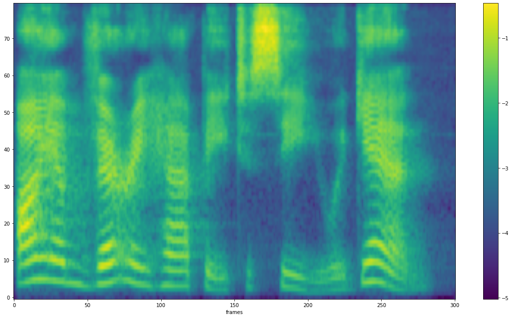

# 语音特征提取

原始信号是不定长的时序信号，不适合作为机器学习的输入。因此一般需要将原始波形转换为特定的特征向量表示，该过程称为语音特征提取。

## 预处理

包括预加重、分帧和加窗。

### 预加重

语音经过说话人的口唇辐射发出，受到唇端辐射抑制，高频能量明显降低。一般来说，当语音信号的频率提高两倍时，其功率谱的幅度下降约6dB，即语音信号的高频部分受到的抑制影响较大。在进行语音信号的分析和处理时，可采用预加重（pre-emphasis）的方法补偿语音信号高频部分的振幅，在傅里叶变换操作中避免数值问题，本质是施加高通滤波器。假设输入信号第
$n$ 个采样点为 $x[n]$ ，则预加重公式如下：

$$
x'[n]=x[n]-a\times x[n-1]
$$

其中， $a$ 是预加重系数，一般取 $a=0.97$ 或 $a=0.95$ 。

### 分帧

语音信号是非平稳信号，考虑到发浊音时声带有规律振动，即基音频率在短时范围内时相对固定的，因此可以认为语音信号具有短时平稳特性，一般认为10ms~50ms的语音信号片段是一个准稳态过程。短时分析采用分帧方式，一般每帧帧长为20ms或50ms。假设语音采样率为16kHz，帧长为20ms，则一帧有 $16000\times 0.02=320$ 个样本点。

相邻两帧之间的基音有可能发生变化，如两个音节之间，或者声母向韵母过渡。为确保声学特征参数的平滑性，一般采用重叠取帧的方式，即相邻帧之间存在重叠部分。一般来说，帧长和帧移的比例为 $1:4$ 或 $1:5$ 。

### 加窗

分帧相当于对语音信号加矩形窗，矩形窗在时域上对信号进行截断，在边界处存在多个旁瓣，会发生频谱泄露。为了减少频谱泄露，通常对分帧之后的信号进行其它形式的加窗操作。常用的窗函数有：汉明（Hamming）窗、汉宁（Hanning）窗和布莱克曼（Blackman）窗等。

汉明窗的窗函数为：

$$
W_{ham}[n]=0.54-0.46\mathop{cos}(\frac{2\pi n}{N}-1)
$$

其中， $0\leq n\leq N-1$ ，$N$ 是窗的长度。

汉宁窗的窗函数为：

$$
W_{han}[n]=0.5[1-\mathop{cos}(\frac{2\pi n}{N}-1)]
$$

其中， $0\leq n\leq N-1$ ， $N$ 是窗的长度。

## 短时傅里叶变换

人类听觉系统与频谱分析紧密相关，对语音信号进行频谱分析，是认识和处理语音信号的重要方法。声音从频率上可以分为纯音和复合音，纯音只包含一种频率的声音（基音），而没有倍音。复合音是除了基音之外，还包含多种倍音的声音。大部分语音都是复合音，涉及多个频率段，可以通过傅里叶变换进行频谱分析。

每个频率的信号可以用正弦波表示，采用正弦函数建模。基于欧拉公式，可以将正弦函数对应到统一的指数形式：

$$
e^{jwn}=\mathop{cos}(wn)+j\mathop{sin}(wn)
$$

正弦函数具有正交性，即任意两个不同频率的正弦波乘积，在两者的公共周期内积分等于零。正交性用复指数运算表示如下：

$$
\int_{-\infty}^{+\infty}e^{j\alpha t}e^{-j\beta t}dt=0,\quad if\ \alpha\neq \beta
$$

基于正弦函数的正交性，通过相关处理可以从语音信号分离出对应不同频率的正弦信号。对于离散采样的语音信号，可以采用离散傅里叶变换（DFT）。DFT的第
$k$ 个点计算如下：

$$
X[k]=\sum_{n=0}^{N-1} x[n]e^{-\frac{j2\pi kn}{K}},\quad k=0,1,...,K-1
$$

其中， $x[n]$ 是时域波形第 $n$ 个采样点值， $X[k]$ 是第 $k$ 个傅里叶频谱值， $N$ 是采样点序列的点数， $K$ 是频谱系数的点数，且 $K\geq N$ 。利用DFT获得的频谱值通常是复数形式，这是因为上式中，

$$
e^{-\frac{j2\pi kn}{K}}=\mathop{cos}(\frac{2\pi kn}{K})-j\mathop{sin}(\frac{2\pi kn}{K})
$$

则

$$
X[k]=X_{real}[k]-jX_{imag}[k]
$$

其中，

$$
X_{real}[k]=\sum_{n=0}^{N-1}x[n]\mathop{cos}(\frac{2\pi kn}{K})
$$

$$
X_{imag}[k]=\sum_{n=0}^{N-1}x[n]\mathop{sin}(\frac{2\pi kn}{K})
$$

$N$ 个采样点序列组成的时域信号经过DFT之后，对应 $K$ 个频率点。经DFT变换得到信号的频谱表示，其频谱幅值和相位随着频率变化而变化。

在语音信号处理中主要关注信号的频谱幅值，也称为振幅频谱/振幅谱：

$$
X_{magnitude}[k]=\sqrt{X_{real}[k]^2+X_{imag}[k]^2}
$$

能量频谱/能量谱是振幅频谱的平方：

$$
X_{power}[k]=X_{real}[k]^2+X_{imag}[k]^2
$$

各种声源发出的声音大多由许多不同强度、不同频率的声音组成复合音，在复合音中，不同频率成分与能量分布的关系称为声音的频谱，利用频谱图表示各频率成分与能量分布之间的关系，频谱图横轴是频率（Hz），纵轴是幅度（dB）。

通过对频域信号进行逆傅里叶变换（IDFT），可以恢复时域信号：

$$
x[n]=\frac{1}{K}\sum_{k=0}^{K-1}X[k]e^{\frac{j2\pi kn}{N}},\quad n=0,1,...,N-1
$$

离散傅里叶变换（DFT）的计算复杂度为 $O(N^2)$，可以采用快速傅里叶变换（FFT），简化计算复杂度，在 $O(N\mathop{log}_2 N)$ 的时间内计算出DFT。在实际应用中，对语音信号进行分帧加窗处理，将其分割成一帧帧的离散序列，可视为短时傅里叶变换（STFT）：

$$
X[k,l]=\sum_{n=0}^{N-1} x_l[n]e^{-\frac{j2\pi nk}{K}}=\sum_{n=0}^{N-1} w[n]x[n+lL]e^{-\frac{j2\pi nk}{K}}
$$

其中， $K$ 是DFT后的频率点个数， $k$ 是频率索引， $0\leq k< K$。$X[k,l]$ 建立起索引为 $lL$ 的时域信号，与索引为 $k$ 的频域信号之间的关系。

## 听觉特性

### 梅尔滤波

人类对不同频率的语音有不同的感知能力：

1. 1kHz以下，人耳感知与频率成线性关系。

2. 1kHz以上，人耳感知与频率成对数关系。

因此，人耳对低频信号比高频信号更为敏感。因此根据人耳的特性提出了一种mel刻度，即定义1个mel刻度相当于人对1kHz音频感知程度的千分之一，mel刻度表达的是，从线性频率到"感知频率"的转换关系：

$$
mel(f)=2595\mathop{lg}(1+\frac{f}{700})
$$

```python
from matplotlib import pyplot as plt
import numpy as np

x = np.linspace(0, 5000, 50000)
y = 2595*np.log10(1+x/700)
x0 = 1000
y0 = 2595*np.log10(1+x0/700)
plt.plot(x, y)
plt.scatter(x0, y0)
plt.plot([x0, x0], [0, y0], 'k--')
plt.plot([0, x0], [x0, y0], 'k--')
plt.xlabel('f (Hz)')
plt.ylabel('Mel(f)')
plt.title('relationship between linear and mel scale')
plt.xlim(0, x[-1])
plt.ylim(0, y[-1])
plt.savefig('mel_vs_f.png')
plt.show()
```


人们根据一系列心理声学实验得到了类似耳蜗作用的滤波器组，用于模拟人耳不同频段声音的感知能力，也就是多个三角滤波器组成的mel频率滤波器组。每个滤波器带宽不等，线性频率小于1000Hz的部分为线性间隔，而线性频率大于1000Hz的部分为对数间隔。同样地，将梅尔频率转换到线性频率的公式为：

$$
f_{mel}^{-1}=700\cdot (10^{\frac{f_{mel}}{2595}}-1)
$$

### Bark滤波

声音的响度，反映人对不同频率成分声强/声音强弱的主观感受。响度与声强、频率的关系可以用`等响度轮廓曲线`表示。

人耳对响度的感知有一个范围，当声音低于某个响度时，人耳是无法感知到的，这个响度值称为听觉阈值，或称听阈。在实际环境中，但一个较强信号（掩蔽音）存在时，听阈就不等于安静时的阈值，而是有所提高。这意味着，邻近频率的两个声音信号，弱响度的声音信号会被强响度的声音信号所掩蔽（Mask），这就是`频域掩蔽`。

根据听觉频域分辨率和频域掩蔽的特点，定义能够引起听觉主观变化的频率带宽为一个`临界频带`。一个临界频带的宽度被称为一个Bark，Bark频率 $Z(f)$ 和线性频率 $f$ 的对应关系定义如下：

$$
Z(f)=6\mathop{ln}(\frac{f}{600}+((\frac{f}{600})^2+1)^{\frac{1}{2}})
$$

其中，线性频率 $f$ 的单位为Hz，临界频带 $Z(f)$ 的单位为Bark。

## 倒谱分析

语音信号的产生模型包括发生源（Source）和滤波器（Filter）。人在发声时，肺部空气受到挤压形成气流，气流通过声门（声带）振动产生声门源激励 $e[n]$ 。对于浊音，激励 $e[n]$ 是以基音周期重复的单位冲激；对于清音， $e[n]$ 是平稳白噪声。该激励信号 $e[n]$ 经过咽喉、口腔形成声道的共振和调制，特别是舌头能够改变声道的容积，从而改变发音，形成不同频率的声音。气流、声门可以等效为一个激励源，声道等效为一个时变滤波器，语音信号 $x[n]$ 可以被看成激励信号 $e[n]$ 与时变滤波器的单位响应 $v[n]$ 的卷积：

$$
x[n]=e[n]*v[n]
$$

已知语音信号 $x[n]$ ，待求出上式中参与卷积的各个信号分量，也就是解卷积处理。除了线性预测方法外，还可以采用`倒谱分析`实现解卷积处理。倒谱分析，又称为`同态滤波`，采用时频变换，得到对数功率谱，再进行逆变换，分析出倒谱域的倒谱系数。

同态滤波的处理过程如下：

1. 傅里叶变换。将时域的卷积信号转换为频域的乘积信号：

    $$
    {\rm DFT}(x[n])=X[z]=E[z]V[z]
    $$

2. 对数运算。将乘积信号转换为加性信号：

    $$
    {\rm log} X[z]={\rm log}E[z]+{\rm log}V[z]=\hat{E}[z]+\hat{V}[z]=\hat{X}[z]
    $$

3.  傅里叶反变换。得到时域的语音信号`倒谱`。

    $$
    Z^{-1}(\hat{X}[z])=Z^{-1}(\hat{E}[z]+\hat{V}[z])=\hat{e}[n]+\hat{v}[z]\approx \hat{x}[n]
    $$

在实际应用中，考虑到离散余弦变换（DCT）具有最优的去相关性能，能够将信号能量集中到极少数的变换系数上，特别是能够将大多数的自然信号（包括声音和图像）的能量都集中在离散余弦变换后的低频部分。一般采用DCT反变换代替傅里叶反变换，上式可以改写成：

$$
\hat{c}[m]=\sum_{k=1}^N{\rm log}X[k]{\rm cos}(\frac{\pi (k-0.5)m}{N}),\quad m=1,2,...,M
$$

其中，$X[k]$是DFT变换系数， $N$ 是DFT系数的个数， $M$ 是DCT变换的个数。

此时， $\hat{x}[n]$ 是复倒谱信号，可采用逆运算，恢复出语音信号，但DCT不可逆，从倒谱信号 $\hat{c}[m]$ 不可还原出语音 $x[n]$ 。

## 常见的声学特征

在语音合成中，常用的声学特征有梅尔频谱（Mel-Spectrogram）/滤波器组（Filter-bank，Fank），梅尔频率倒谱系数（Mel-Frequency Cepstral Coefficient，MFCC）等。


接下来重点介绍FBank和MFCC的计算过程。

### FBank

FBank的特征提取过程如下：

1. 将信号进行预加重、分帧、加窗，然后进行短时傅里叶变换（STFT）获得对应的`频谱`。

2. 求频谱的平方，即`能量谱`。进行梅尔滤波，即将每个滤波频带内的能量进行叠加，第 $k$ 个滤波器输出功率谱为 $X[k]$ 。

3. 将每个滤波器的输出取对数，得到相应频带的对数功率谱。

    $$
    Y_{\rm FBank}[k]={\rm log}X[k]
    $$

FBank特征本质上是对数功率谱，包括低频和高频信息。相比于语谱图，FBank经过了梅尔滤波，依据人耳听觉特性进行了压缩，抑制了一部分人耳无法感知的冗余信息。

### MFCC

MFCC和FBank唯一的不同就在于，获得FBank特征之后，再经过反离散余弦变换，就得到 $L$ 个MFCC系数。在实际操作中，得到的 $L$ 个MFCC特征值可以作为`静态特征`，再对这些静态特征做一阶和二阶差分，得到相应的静态特征。

## 具体操作

### 利用librosa读取音频

```python
from matplotlib import pyplot as plt
import numpy as np
import librosa

# 利用librosa读取音频
input_wav_path = r'test.wav'
y, sr = librosa.load(input_wav_path)
y_num = np.arange(len(y))

# 截取前0.3s的音频
sample_signal = y[0:int(sr*0.3)]
sample_num = np.arange(len(sample_signal))

plt.figure(figsize=(11, 7), dpi=500)
plt.subplot(211)
plt.plot(y_num/sr, y, color='black')
plt.plot(sample_num/sr, sample_signal, color='blue')
plt.xlabel('Time (sec)')
plt.ylabel('Amplitude')
plt.title('Waveform')

plt.subplot(212)
plt.plot(sample_num/sr, sample_signal, color='blue')
plt.xlabel('Time (sec)')
plt.ylabel('Amplitude')
plt.title('0~0.3s waveform')
plt.tight_layout()
plt.savefig('waveform.png', dpi=500)
plt.show()
```


音频有不同的编码类型，librosa默认采取浮点格式读取，即读取的样本点均是 $[-1,-1]$ 之间的浮点值。更详细的文档参见[SoX](http://sox.sourceforge.net/sox.html)的`Input & Output File Format Options`部分。

|选项  | 描述                                 |常见可选项                                         |
|:------:|:----------------------------------|:------------------------------------------------|
|  b     | 每个编码样本所占的数据位数（位深）     |8/16/32                                           |
|  c     | 音频文件包含的通道数                 |1 / 2                                               |
|  e     | 音频文件的编码类型                   |signed-integer/unsigned-integer/floating-point   |
|  r     | 音频文件的采样率                     |16k/16000/22050                                  |
|  t     | 音频文件的文件类型                   |raw/mp3                                           |


### 提取梅尔频谱

```python
sample_rate = 16000
preemphasis = 0.97
n_fft = 1024
frame_length = 0.05  # ms
frame_shift = 0.01  # ms
fmin = 0
fmax = sample_rate/2
eps = 1e-10
n_mel = 80
win_length = int(sample_rate*frame_length)
hop_length = int(sample_rate*frame_shift)
mel_basis = librosa.filters.mel(
    sample_rate, n_fft, n_mel, fmin=fmin, fmax=fmax)


def get_spectrogram(input_wav_path):
    y, sr = librosa.load(input_wav_path)
    y = np.append(y[0], y[1:]-preemphasis*y[:-1])
    linear = librosa.stft(
        y=y, n_fft=n_fft, hop_length=hop_length, win_length=win_length)
    mag = np.abs(linear)
    mel = np.dot(mel_basis, mag)
    mel = np.log10(np.maximum(eps, mel))
    mel = mel.T.astype(np.float32)  # (T,n_mels)
    return mel

# plt.switch_backend('agg')


def plot_spectrogram(spectrogram, file_path):
    spectrogram = spectrogram.T
    fig = plt.figure(figsize=(16, 9))
    plt.imshow(spectrogram, aspect='auto', origin='lower')
    plt.colorbar()
    plt.xlabel('frames')
    plt.tight_layout()
    plt.savefig(file_path, dpi=500)
    plt.show()


mel_spec = get_spectrogram(input_wav_path)
plot_spectrogram(mel_spec, 'mel_spectrogram.png')
```



### 提取MFCC

```python
from scipy.fftpack import dct

num_ceps = 12  # MFCC阶数，可选值2~13
mfcc = dct(mel_spec, type=2, axis=1, norm='ortho')[:, 1 : (num_ceps + 1)]
plot_spectrogram(mfcc, 'mfcc.png')
# 将正弦同态滤波（sinusoidal liftering）应用于MFCC以去强调更高的MFCC，其已被证明可以改善噪声信号中的语音识别。
# reference: https://haythamfayek.com/2016/04/21/speech-processing-for-machine-learning.html
(nframes, ncoeff) = mfcc.shape
cep_lifter = 22
n = np.arange(ncoeff)
lift = 1 + (cep_lifter / 2) * np.sin(np.pi * n / cep_lifter)
mfcc *= lift
plot_spectrogram(mfcc, 'mfcc_lift.png')
```


在语音合成中，类似于深度学习其它领域，输入数据要进行均值方差归一化，使得数据量纲一致并遵循一定分布，避免模型梯度爆炸，降低学习难度：

```python
frame_num = mel_spec.shape[0]
cep_sum = np.sum(mel_spec, axis=0)
cep_squ_sum = np.sum(np.square(mel_spec), axis=0)
cep_mean = cep_sum/frame_num
cep_std = cep_squ_sum/frame_num-np.square(cep_mean)
```