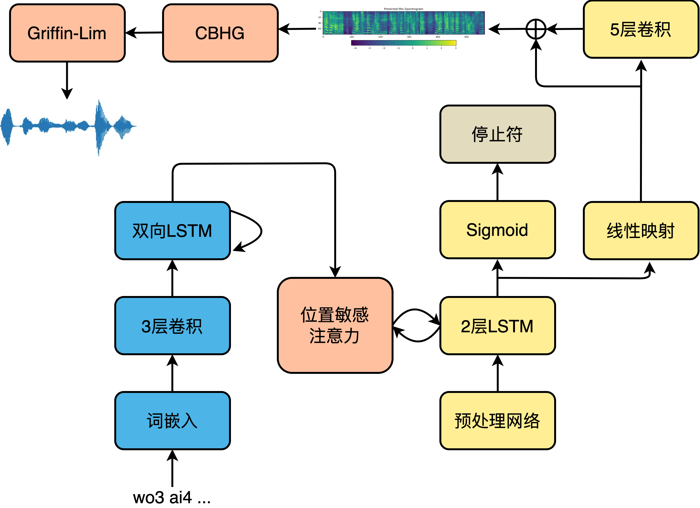
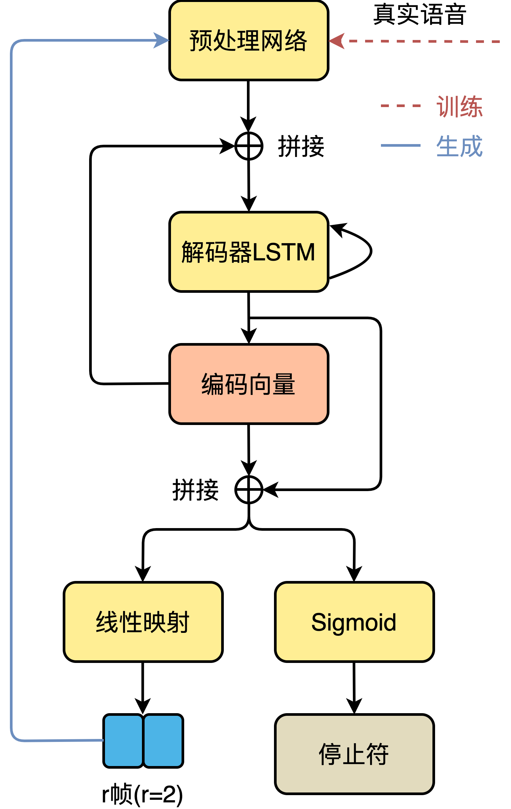

# 声学模型

现代工业级神经网络语音合成系统主要包括三个部分：文本前端、声学模型和声码器，文本输入到文本前端中，将文本转换为音素、韵律边界等文本特征。文本特征输入到声学模型，转换为对应的声学特征。声学特征输入到声码器，重建为原始波形。


主要采用的声学模型包括Tacotron系列、FastSpeech系列等，目前同样出现了一些完全端到端的语音合成模型，也即是直接由字符/音素映射为波形。

## Tacotron

### Tacotron-2简介

以最常使用的Tacotron-2声学模型为例。原始论文参见：

1. [Tacotron: Towards End-to-End Speech Synthesis](https://arxiv.org/abs/1703.10135)

2. [Natural TTS Synthesis by Conditioning WaveNet on Mel Spectrogram
    Predictions](https://arxiv.org/abs/1712.05884)

此外，谷歌在语音合成领域，特别是端到端语音合成领域做出了开创性的共享，该组会将最新的论文汇总在[Tacotron(/täkōˌträn/): An end-to-end speech synthesis system by Google](https://google.github.io/tacotron/).



### 声学特征建模网络

Tacotron-2的声学模型部分采用典型的序列到序列结构。编码器是3个卷积层和一个双向LSTM层组成的模块，卷积层给予了模型类似于N-gram感知上下文的能力，并且对不发音字符更加鲁棒。经词嵌入的注音序列首先进入卷积层提取上下文信息，然后送入双向LSTM生成编码器隐状态。编码器隐状态生成后，就会被送入注意力机制，以生成编码向量。我们利用了一种被称为位置敏感注意力（Location Sensitive Attention，LSA），该注意力机制的对齐函数为：

$$
score(s_{i-1},h_j)=v_a^T{\rm tanh}(Ws_{i-1}+Vh_j+Uf_{i,j}+b)
$$

其中， $v_a,W,V,U$为待训练参数， $b$ 是偏置值， $s_{i-1}$ 为上一时间步 $i-1$ 的解码器隐状态， $h_j$ 为当前时间步 $j$ 的编码器隐状态， $f_{i,j}$ 为上一个解码步的注意力权重 $\alpha_{i-1}$ 经卷积获得的位置特征，如下式：

$$
f_{i,j}=F*\alpha_{i-1}
$$

其中， $\alpha_{i-1}$ 是经过softmax的注意力权重的累加和。位置敏感注意力机制不但综合了内容方面的信息，而且关注了位置特征。解码过程从输入上一解码步或者真实音频的频谱进入解码器预处理网络开始，到线性映射输出该时间步上的频谱帧结束，模型的解码过程如下图所示。



频谱生成网络的解码器将预处理网络的输出和注意力机制的编码向量做拼接，然后整体送入LSTM中，LSTM的输出用来计算新的编码向量，最后新计算出来的编码向量与LSTM输出做拼接，送入映射层以计算输出。输出有两种形式，一种是频谱帧，另一种是停止符的概率，后者是一个简单二分类问题，决定解码过程是否结束。为了能够有效加速计算，减小内存占用，引入缩减因子r（Reduction Factor），即每一个时间步允许解码器预测r个频谱帧进行输出。解码完成后，送入后处理网络处理以生成最终的梅尔频谱，如下式所示。

$$
s_{final}=s_i+s_i'
$$

其中， $s_i$ 是解码器输出， $s_{final}$ 表示最终输出的梅尔频谱， $s_i'$ 是后处理网络的输出，解码器的输出经过后处理网络之后获得 $s_i'$ 。

在Tacotron-2原始论文中，直接将梅尔频谱送入声码器WaveNet生成最终的时域波形。但是WaveNet计算复杂度过高，几乎无法实际使用，因此可以使用其它声码器，比如Griffin-Lim、HiFiGAN等。

### 损失函数

Tacotron2的损失函数主要包括以下4个方面：

1. 进入后处理网络前后的平方损失。

    $$
    {\rm MelLoss}=\frac{1}{n}\sum_{i=1}^n(y_{real,i}^{mel}-y_{before,i}^{mel})^2+\frac{1}{n}\sum_{i=1}^n(y_{real,i}^{mel}-y_{after,i}^{mel})^2
    $$

    其中， $y_{real,i}^{mel}$ 表示从音频中提取的真实频谱，$y_{before,i}^{mel},y_{after,i}^{mel}$
    分别为进入后处理网络前、后的解码器输出， $n$ 为每批的样本数。

2. 从CBHG模块中输出线性谱的平方损失。

    $$
    {\rm LinearLoss}=\frac{1}{n}\sum_{i=1}^{n}(y_{real,i}^{linear}-y_{i}^{linear})^2
    $$

    其中， $y_{real,i}^{linear}$ 是从真实语音中计算获得的线性谱，$y_{i}^{linear}$ 是从CBHG模块输出的线性谱。

3. 停止符交叉熵

    $$
    {\rm StopTokenLoss}=-[y\cdot {\rm log}(p)+(1-y)\cdot {\rm log}(1-p)]
    $$

    其中， $y$ 为停止符真实概率分布， $p$ 是解码器线性映射输出的预测分布。

4. L2正则化

    $$
    {\rm RegulationLoss}=\frac{1}{K}\sum_{k=1}^K w_k^2
    $$

    其中， $K$ 为参数总数， $w_k$ 为模型中的参数，这里排除偏置值、RNN以及线性映射中的参数。最终的损失函数为上述4个部分的损失之和，如下式：
    
    $$
    {\rm Loss}={\rm MelLoss}+{\rm LinearLoss}+{\rm StopTokenLoss}+{\rm RegulationLoss}
    $$

## FastSpeech

FastSpeech是基于Transformer显式时长建模的声学模型，由微软和浙大提出。原始论文参见：

1. [FastSpeech: Fast, Robust and Controllable Text to Speech](https://arxiv.org/abs/1905.09263)

2. [FastSpeech 2: Fast and High-Quality End-to-End Text to Speech](https://arxiv.org/abs/2006.04558)

相对应地，微软在语音合成领域的论文常常发布在[Microsoft-Speech Research](https://speechresearch.github.io/)。


### 模型结构

FastSpeech 2和上代FastSpeech的编解码器均是采用FFT（feed-forward Transformer，前馈Transformer）块。编解码器的输入首先进行位置编码，之后进入FFT块。FFT块主要包括多头注意力模块和位置前馈网络，位置前馈网络可以由若干层Conv1d、LayerNorm和Dropout组成。

论文中提到语音合成是典型的一对多问题，同样的文本可以合成无数种语音。上一代FastSpeech主要通过目标侧使用教师模型的合成频谱而非真实频谱，以简化数据偏差，减少语音中的多样性，从而降低训练难度；向模型提供额外的时长信息两个途径解决一对多的问题。在语音中，音素时长自不必说，直接影响发音长度和整体韵律；音调则是影响情感和韵律的另一个特征；能量则影响频谱的幅度，直接影响音频的音量。在FastSpeech 2中对这三个最重要的语音属性单独建模，从而缓解一对多带来的模型学习目标不确定的问题。

在对时长、基频和能量单独建模时，所使用的网络结构实际是相似的，在论文中称这种语音属性建模网络为变量适配器（Variance Adaptor）。时长预测的输出也作为基频和能量预测的输入。最后，基频预测和能量预测的输出，以及依靠时长信息展开的编码器输入元素加起来，作为下游网络的输入。变量适配器主要是由2层卷积和1层线性映射层组成，每层卷积后加ReLU激活、LayerNorm和Dropout。代码摘抄自[FastSpeech2](https://github.com/ming024/FastSpeech2)，添加了一些注释。

```python
class VariancePredictor(nn.Module):
    """ Duration, Pitch and Energy Predictor """
    def __init__(self):
        super(VariancePredictor, self).__init__()

        self.input_size = hp.encoder_hidden
        self.filter_size = hp.variance_predictor_filter_size
        self.kernel = hp.variance_predictor_kernel_size
        self.conv_output_size = hp.variance_predictor_filter_size
        self.dropout = hp.variance_predictor_dropout

        self.conv_layer = nn.Sequential(OrderedDict([
            ("conv1d_1", Conv(self.input_size,
                            self.filter_size,
                            kernel_size=self.kernel,
                            padding=(self.kernel-1)//2)),
            ("relu_1", nn.ReLU()),
            ("layer_norm_1", nn.LayerNorm(self.filter_size)),
            ("dropout_1", nn.Dropout(self.dropout)),
            ("conv1d_2", Conv(self.filter_size,
                            self.filter_size,
                            kernel_size=self.kernel,
                            padding=1)),
            ("relu_2", nn.ReLU()),
            ("layer_norm_2", nn.LayerNorm(self.filter_size)),
            ("dropout_2", nn.Dropout(self.dropout))
        ]))

        self.linear_layer = nn.Linear(self.conv_output_size, 1)

    def forward(self, encoder_output, mask):
        '''
        :param encoder_output: Output of encoder. [batch_size,seq_len,encoder_hidden]
        :param mask: Mask for encoder. [batch_size,seq_len]
        '''
        out = self.conv_layer(encoder_output)
        out = self.linear_layer(out)
        out = out.squeeze(-1)

        if mask is not None:
            out = out.masked_fill(mask, 0.)

        return out
```

利用该变量适配器对时长、基频和能量进行建模。

```python
class VarianceAdaptor(nn.Module):
    """ Variance Adaptor """

    def __init__(self):
        super(VarianceAdaptor, self).__init__()
        self.duration_predictor = VariancePredictor()
        self.length_regulator = LengthRegulator()
        self.pitch_predictor = VariancePredictor()
        self.energy_predictor = VariancePredictor()

        self.pitch_bins = nn.Parameter(torch.exp(torch.linspace(
            np.log(hp.f0_min), np.log(hp.f0_max), hp.n_bins-1)), requires_grad=False)
        self.energy_bins = nn.Parameter(torch.linspace(
            hp.energy_min, hp.energy_max, hp.n_bins-1), requires_grad=False)
        self.pitch_embedding = nn.Embedding(hp.n_bins, hp.encoder_hidden)
        self.energy_embedding = nn.Embedding(hp.n_bins, hp.encoder_hidden)

    def forward(self, x, src_mask, mel_mask=None, duration_target=None, pitch_target=None, energy_target=None, max_len=None, d_control=1.0, p_control=1.0, e_control=1.0):
        '''
        :param x: Output of encoder. [batch_size,seq_len,encoder_hidden]
        :param src_mask: Mask of encoder, can get src_mask form input_lengths. [batch_size,seq_len]
        :param duration_target, pitch_target, energy_target: Ground-truth when training, None when synthesis. [batch_size,seq_len]
        '''
        log_duration_prediction = self.duration_predictor(x, src_mask)
        if duration_target is not None:
            x, mel_len = self.length_regulator(x, duration_target, max_len)
        else:
            duration_rounded = torch.clamp(
                (torch.round(torch.exp(log_duration_prediction)-hp.log_offset)*d_control), min=0)
            x, mel_len = self.length_regulator(x, duration_rounded, max_len)
            mel_mask = utils.get_mask_from_lengths(mel_len)

        pitch_prediction = self.pitch_predictor(x, mel_mask)
        if pitch_target is not None:
            pitch_embedding = self.pitch_embedding(
                torch.bucketize(pitch_target, self.pitch_bins))
        else:
            pitch_prediction = pitch_prediction*p_control
            pitch_embedding = self.pitch_embedding(
                torch.bucketize(pitch_prediction, self.pitch_bins))

        energy_prediction = self.energy_predictor(x, mel_mask)
        if energy_target is not None:
            energy_embedding = self.energy_embedding(
                torch.bucketize(energy_target, self.energy_bins))
        else:
            energy_prediction = energy_prediction*e_control
            energy_embedding = self.energy_embedding(
                torch.bucketize(energy_prediction, self.energy_bins))

        x = x + pitch_embedding + energy_embedding

        return x, log_duration_prediction, pitch_prediction, energy_prediction, mel_len, mel_mask
```

同样是通过长度调节器（Length Regulator），利用时长信息将编码器输出长度扩展到频谱长度。具体实现就是根据duration的具体值，直接上采样。一个音素时长为2，就将编码器输出复制2份，给3就直接复制3份，拼接之后作为最终的输出。实现代码：

```python
class LengthRegulator(nn.Module):
    """ Length Regulator """

    def __init__(self):
        super(LengthRegulator, self).__init__()

    def LR(self, x, duration, max_len):
        '''
        :param x: Output of encoder. [batch_size,phoneme_seq_len,encoder_hidden]
        :param duration: Duration for phonemes. [batch_size,phoneme_seq_len]
        :param max_len: Max length for mel-frames. scaler

        Return:
        output: Expanded output of encoder. [batch_size,mel_len,encoder_hidden]
        '''
        output = list()
        mel_len = list()
        for batch, expand_target in zip(x, duration):
            # batch: [seq_len,encoder_hidden]
            # expand_target: [seq_len]
            expanded = self.expand(batch, expand_target)
            output.append(expanded)
            mel_len.append(expanded.shape[0])

        if max_len is not None:
            output = utils.pad(output, max_len)
        else:
            output = utils.pad(output)

        return output, torch.LongTensor(mel_len).to(device)

    def expand(self, batch, predicted):
        out = list()

        for i, vec in enumerate(batch):
            # expand_size: scaler
            expand_size = predicted[i].item()
            # Passing -1 as the size for a dimension means not changing the size of that dimension.
            out.append(vec.expand(int(expand_size), -1))
        out = torch.cat(out, 0)

        return out

    def forward(self, x, duration, max_len):
        output, mel_len = self.LR(x, duration, max_len)
        return output, mel_len
```

对于音高和能量的预测，模块的主干网络相似，但使用方法有所不同。以音高为例，能量的使用方式相似。首先对预测出的实数域音高值进行分桶，映射为一定范围内的自然数集，然后做嵌入。

```python
pitch_prediction = self.pitch_predictor(x, mel_mask)
if pitch_target is not None:
    pitch_embedding = self.pitch_embedding(
        torch.bucketize(pitch_target, self.pitch_bins))
else:
    pitch_prediction = pitch_prediction*p_control
    pitch_embedding = self.pitch_embedding(
        torch.bucketize(pitch_prediction, self.pitch_bins))
```

这里用到了Pytorch中一个不是特别常见的函数[torch.bucketize](https://pytorch.org/docs/master/generated/torch.bucketize.html)。这是Pytorch中的分桶函数，boundaries确定了各个桶的边界，是一个单调递增向量，用于划分input，并返回input所属桶的索引，桶索引从0开始。

能量嵌入向量的计算方法与之类似。至此，获得了展开之后的编码器输出x，基频嵌入向量`pitch_embedding`和能量嵌入向量`energy_embedding`之后，元素加获得最终编解码器的输入。

### 损失函数

FastSpeech 2的目标函数由PostNet前后的频谱均方差，时长、音高和能量的均方差组成。时长映射到指数域（时长预测器输出的数值 $x$ 作为指数，最终的预测时长为 $e^x$ ），音高映射到对数域（音高预测器输出的数值 $x$ 做对数，作为最终的音高 ${\rm log} x$ ），而能量直接采用能量预测器的输出值。整体的损失函数为：

$$
{\rm Loss}={\rm Loss}_{mel}+{\rm Loss}_{mel}^{post}+{\rm Loss}_{duration}+{\rm Loss}_{pitch}+{\rm Loss}_{energy}
$$

频谱的损失函数形式采用均方差（MSE），时长、基频和能量采用平均绝对误差（MAE），具体的实现如下：

```python
log_d_target.requires_grad = False
p_target.requires_grad = False
e_target.requires_grad = False
mel_target.requires_grad = False

log_d_predicted = log_d_predicted.masked_select(src_mask)
log_d_target = log_d_target.masked_select(src_mask)
p_predicted = p_predicted.masked_select(mel_mask)
p_target = p_target.masked_select(mel_mask)
e_predicted = e_predicted.masked_select(mel_mask)
e_target = e_target.masked_select(mel_mask)

mel = mel.masked_select(mel_mask.unsqueeze(-1))
mel_postnet = mel_postnet.masked_select(mel_mask.unsqueeze(-1))
mel_target = mel_target.masked_select(mel_mask.unsqueeze(-1))

mel_loss = self.mse_loss(mel, mel_target)
mel_postnet_loss = self.mse_loss(mel_postnet, mel_target)

d_loss = self.mae_loss(log_d_predicted, log_d_target)
p_loss = self.mae_loss(p_predicted, p_target)
e_loss = self.mae_loss(e_predicted, e_target)

total_loss = mel_loss + mel_postnet_loss + d_loss + p_loss + e_loss
```

### 小结

FastSpeech系列的声学模型将Transformer引入语音合成领域，并且显式建模语音中的重要特征，比如时长、音高和能量等。实际上，微软首次在[Neural Speech Synthesis with Transformer Network](https://arxiv.org/abs/1809.08895)将Transformer作为主干网络，实现语音合成的声学模型，这一思想同样被[FastPitch: Parallel Text-to-speech with Pitch Prediction](https://arxiv.org/abs/2006.06873)采用，相关的开源代码：[as-ideas/TransformerTTS](https://github.com/as-ideas/TransformerTTS)。

## VITS

VITS（Variational Inference with adversarial learning for end-to-end Text-to-Speech）是一种结合变分推理（variational inference）、标准化流（normalizing flows）和对抗训练的高表现力语音合成模型。和Tacotron和FastSpeech不同，Tacotron / FastSpeech实际是将字符或音素映射为中间声学表征，比如梅尔频谱，然后通过声码器将梅尔频谱还原为波形，而VITS则直接将字符或音素映射为波形，不需要额外的声码器重建波形，真正的端到端语音合成模型。VITS通过隐变量而非之前的频谱串联语音合成中的声学模型和声码器，在隐变量上进行建模并利用随机时长预测器，提高了合成语音的多样性，输入同样的文本，能够合成不同声调和韵律的语音。VITS合成音质较高，并且可以借鉴之前的FastSpeech，单独对音高等特征进行建模，以进一步提升合成语音的质量，是一种非常有潜力的语音合成模型。

### 模型整体结构


VITS包括三个部分：

1. 后验编码器。如上图（a）的左下部分所示，在训练时输入线性谱，输出隐变量 $z$ ，推断时隐变量 $z$ 则由 $f_\theta$ 产生。VITS的后验编码器采用WaveGlow和Glow-TTS中的非因果WaveNet残差模块。应用于多人模型时，将说话人嵌入向量添加进残差模块，`仅用于训练`。这里的隐变量 $z$ 可以理解为Tacotron / FastSpeech中的梅尔频谱。

2. 解码器。如上图（a）左上部分所示，解码器从提取的隐变量 $z$ 中生成语音波形，这个解码器实际就是声码器HiFi-GAN V1的生成器。应用于多人模型时，在说话人嵌入向量之后添加一个线性层，拼接到 $f_\theta$ 的输出隐变量 $z$ 。

3. 先验编码器。如上图（a）右侧部分所示，先验编码器结构比较复杂，作用类似于Tacotron / FastSpeech的声学模型，只不过VITS是将音素映射为中间表示 $z$ ，而不是将音素映射为频谱。包括文本编码器和提升先验分布复杂度的标准化流 $f_\theta$ 。应用于多人模型时，向标准化流的残差模块中添加说话人嵌入向量。

4. 随机时长预测器。如上图（a）右侧中间橙色部分。从条件输入 $h_{text}$ 估算音素时长的分布。应用于多人模型时，在说话人嵌入向量之后添加一个线性层，并将其拼接到文本编码器的输出 $h_{text}$ 。

5. 判别器。实际就是HiFi-GAN的多周期判别器，在上图中未画出，`仅用于训练`。目前看来，对于任意语音合成模型，加入判别器辅助都可以显著提升表现。

### 变分推断

VITS可以看作是一个最大化变分下界，也即ELBO（Evidence Lower Bound）的条件VAE。

1.  重建损失

    VITS在训练时实际还是会生成梅尔频谱以指导模型的训练，重建损失中的目标使用的是梅尔频谱而非原始波形：
    
    $$
    {\rm L}_{recon}=||x_{mel}-\hat{x}_{mel}||_1
    $$

    但在推断时并不需要生成梅尔频谱。在实现上，不上采样整个隐变量 $z$ ，而只是使用部分序列作为解码器的输入。

2.  KL散度

    先验编码器 $c$ 的输入包括从文本生成的音素 $c_{text}$ ，和音素、隐变量之间的对齐 $A$ 。所谓的对齐就是 $|c_{text}|\times |z|$ 大小的严格单调注意力矩阵，表示每一个音素的发音时长。因此KL散度是：
    
    $$
    {\rm L}_{kl}={\rm log}q_{\phi}(z|x_{lin})-{\rm log}p_\theta (z|c_{text},A)
    $$

    其中， $q_{\phi}(z|x_{lin})$ 表示给定输入 $x$ 的后验分布，$p_\theta(z|c)$ 表示给定条件 $c$ 的隐变量 $z$ 的先验分布。其中隐变量 $z$ 为：

    $$
    z\sim q_\phi(z|x_{lin})=\mathbb{N}(z;\mu_\phi(x_{lin}),\sigma_\phi(x_{lin}))
    $$

    为了给后验编码器提供更高分辨率的信息，使用线性谱而非梅尔频谱作为后验编码器 $\phi_\theta$ 的输入。同时，为了生成更加逼真的样本，提高先验分布的表达能力比较重要，因此引入标准化流，在文本编码器产生的简单分布和复杂分布间进行可逆变换。也就是说，在经过上采样的编码器输出之后，加入一系列可逆变换：
    
    $$
    p_\theta(z|c)=\mathbb{N}(f_\theta(z);\mu_\theta(c),\sigma_\theta(c))|{\rm det}\frac{\partial f_\theta(z)}{\partial z}|
    $$

    其中，上式中的 $c$ 就是上采样的编码器输出： 
    
    $$
    c=[c_{text},A]
    $$

### 对齐估计

由于在训练时没有对齐的真实标签，因此在训练的每一次迭代时都需要估计对齐。

1.  单调对齐搜索

    为了估计文本和语音之间的对齐 $A$ ，VITS采用了类似于Glow-TTS中的单调对齐搜索（Monotonic Alignment Search，MAS）方法，该方法寻找一个最优的对齐路径以最大化利用标准化流 $f$ 参数化数据的对数似然：
    
    $$
    A=\underset{\hat{A}}{\rm argmax}{\rm log}p(x|c_{text},\hat{A})=\underset{\hat{A}}{\rm argmax}{\rm log}\mathbb{N}(f(x);\mu(c_{text},\hat{A}),\sigma(c_{text},\hat{A}))
    $$

    MAS约束获得的最优对齐必须是单调且无跳过的。但是无法直接将MAS直接应用到VITS，因为VITS优化目标是ELBO而非确定的隐变量 $z$ 的对数似然，因此稍微改变了一下MAS，寻找最优的对齐路径以最大化ELBO：
    
    $$
    \underset{\hat{A}}{\rm argmax}{\rm log}p_\theta (x_{mel}|z)-{\rm log}\frac{q_\theta(z|x_{lin})}{p_\theta (z|c_{text},\hat{A})}
    $$

2.  随机时长预测器

    随机时长预测器是一个基于流的生成模型，训练目标为音素时长对数似然的变分下界：

    $$
    {\rm log}p_\theta (d|c_{text}\geq \mathbb{E}_{q_\theta (u,v|d,c_{text})}[{\rm log}\frac{p_\theta (d-u,v|c_{text})}{q_\phi (u,v|d,c_{text})}]
    $$

    在训练时，断开随机时长预测器的梯度反传，以防止该部分的梯度影响到其它模块。音素时长通过随机时长预测器的可逆变换从随机噪音中采样获得，之后转换为整型值。

### 对抗训练

引入判别器 $D$ 判断输出是解码器 $G$ 的输出，还是真实的波形 $y$ 。VITS用于对抗训练的损失函数包括两个部分，第一部分是用于对抗训练的最小二乘损失函数（least-squares loss function）：

$$
{\rm L}_{adv}(D)=\mathbb{E}_{(y,z)}[(D(y)-1)^2+(D(G(z)))^2]
$$

$$
{\rm L}_{adv}(G)=\mathbb{E}_z[(D(G(z))-1)^2]
$$

第二部分是仅作用于生成器的特征匹配损失（feature-matching loss）：

$$
{\rm L}_{fm}(G)=\mathbb{E}_{(y,c)}[\sum_{l=1}^T\frac{1}{N_l}||D^l(y)-D^l(G(z))||_1]
$$

其中， $T$ 表示判别器的层数， $D^l$ 表示第 $l$ 层判别器的特征图（feature map）， $N_l$ 表示特征图的数量。特征匹配损失可以看作是重建损失，用于约束判别器中间层的输出。

### 总体损失

VITS可以看作是VAE和GAN的联合训练，因此总体损失为：

$$
{\rm L}_{vae}={\rm L}_{recon}+{\rm L}_{kl}+{\rm L}_{dur}+{\rm L}_{adv}+{\rm L}_{fm}(G)
$$

### 总结

VITS是一种由字符或音素直接映射为波形的端到端语音合成模型，该语音合成模型采用对抗训练的模式，生成器多个模块基于标准化流。模型较大，合成质量优异。VITS的想法相当有启发，但是理解起来确实比较难，特别是标准化流，可参考：[Awesome Normalizing Flows](https://github.com/janosh/awesome-normalizing-flows)。
