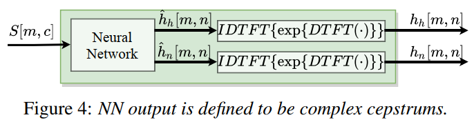

# 声码器

声码器（Vocoder），又称语音信号分析合成系统，负责对声音进行分析和合成，主要用于合成人类的语音。声码器主要由以下功能：

1. 分析Analysis

2. 操纵Manipulation

3. 合成Synthesis

分析过程主要是从一段原始声音波形中提取声学特征，比如线性谱、MFCC；操纵过程是指对提取的原始声学特征进行压缩等降维处理，使其表征能力进一步提升；合成过程是指将此声学特征恢复至原始波形。人类发声机理可以用经典的源-滤波器模型建模，也就是输入的激励部分通过线性时不变进行操作，输出的声道谐振部分作为合成语音。输入部分被称为激励部分（Source Excitation Part），激励部分对应肺部气流与声带共同作用形成的激励，输出结果被称为声道谐振部分（Vocal Tract Resonance Part），对应人类发音结构，而声道谐振部分对应于声道的调音部分，对声音进行调制。

声码器的发展可以分为两个阶段，包括用于统计参数语音合成（Statistical Parameteric Speech Synthesis，SPSS）基于信号处理的声码器，和基于神经网络的声码器。常用基于信号处理的声码器包括Griffin-Lim，STRAIGHT和WORLD。早期神经声码器包括WaveNet、WaveRNN等，近年来神经声码器发展迅速，涌现出包括MelGAN、HiFiGAN、LPCNet、NHV等优秀的工作。

> Griffin D. and Lim J. (1984). "Signal Estimation from Modified Short-Time Fourier Transform\". IEEE Transactions on Acoustics, Speech and Signal Processing. 32 (2): 236--243. doi:10.1109/TASSP.1984.1164317

> Kawahara H. Speech representation and transformation using adaptive interpolation of weighted spectrum: vocoder revisited[C]. 1997 IEEE International Conference on Acoustics, Speech, and Signal Processing. IEEE, 1997, 2: 1303-1306.

> Morise M, Yokomori F, Ozawa K. World: a vocoder-based high-quality speech synthesis system for real-time applications[J]. IEICE TRANSACTIONS on Information and Systems, 2016, 99(7): 1877-1884.

## Griffin-Lim声码器

在早期的很多Tacotron开源语音合成模型中均采用Griffin-Lim声码器，同时也有一些专门的开源实现，比如[GriffinLim](https://github.com/bkvogel/griffin_lim)。

### 算法原理

原始的音频很难提取特征，需要进行傅里叶变换将时域信号转换到频域进行分析。音频进行傅里叶变换后，结果为复数，复数的绝对值就是幅度谱，而复数的实部与虚部之间形成的角度就是相位谱。经过傅里叶变换之后获得的幅度谱特征明显，可以清楚看到基频和对应的谐波。基频一般是声带的频率，而谐波则是声音经过声道、口腔、鼻腔等器官后产生的共振频率，且频率是基频的整数倍。

Griffin-Lim将幅度谱恢复为原始波形，但是相比原始波形，幅度谱缺失了原始相位谱信息。音频一般采用的是短时傅里叶变化，因此需要将音频分割成帧（每帧20ms~50ms），再进行傅里叶变换，帧与帧之间是有重叠的。Griffin-Lim算法利用两帧之间有重叠部分的这个约束重构信号，因此如果使用Griffin-Lim算法还原音频信号，就需要尽量保证两帧之间重叠越多越好，一般帧移为每一帧长度的25%左右，也就是帧之间重叠75%为宜。

Griffin-Lim在已知幅度谱，不知道相位谱的情况下重建语音，算法的实现较为简单，整体是一种迭代算法，迭代过程如下：

1. 随机初始化一个相位谱；

2. 用相位谱和已知的幅度谱经过逆短时傅里叶变换（ISTFT）合成新语音；

3. 对合成的语音做短时傅里叶变换，得到新的幅度谱和相位谱；

4. 丢弃新的幅度谱，用相位谱和已知的幅度谱合成语音，如此重复，直至达到设定的迭代轮数。

在迭代过程中，预测序列与真实序列幅度谱之间的距离在不断缩小，类似于EM算法。推导过程参见：[Griffin Lim算法的过程和证明](https://zhuanlan.zhihu.com/p/102539783)和[Griffin Lim声码器介绍](https://zhuanlan.zhihu.com/p/66809424)。

### 代码实现

摘抄自[Build End-To-End TTS Tacotron: Griffin Lim 信号估计算法](https://zhuanlan.zhihu.com/p/25002923)。

```python
def griffin_lim(stftm_matrix, shape, min_iter=20, max_iter=50, delta=20):
    y = np.random.random(shape)
    y_iter = []

    for i in range(max_iter):
        if i >= min_iter and (i - min_iter) % delta == 0:
            y_iter.append((y, i))
        stft_matrix = librosa.core.stft(y)
        stft_matrix = stftm_matrix * stft_matrix / np.abs(stft_matrix)
        y = librosa.core.istft(stft_matrix)
    y_iter.append((y, max_iter))

    return y_iter
```

具体使用：

```python
# assume 1 channel wav file
sr, data = scipy.io.wavfile.read(input_wav_path)

# 由 STFT -> STFT magnitude
stftm_matrix = np.abs(librosa.core.stft(data))
# + random 模拟 modification
stftm_matrix_modified = stftm_matrix + np.random.random(stftm_matrix.shape)

# Griffin-Lim 估计音频信号
y_iters = griffin_lim(stftm_matrix_modified, data.shape)
```

## STRAIGHT声码器

### 概述

STARIGHT（Speech Transformation and Representation using Adaptive Interpolation of weiGHTed spectrum），即利用自适应加权谱内插进行语音转换和表征。STRAIGHT将语音信号解析成相互独立的频谱参数（谱包络）和基频参数（激励部分），能够对语音信号的基频、时长、增益、语速等参数进行灵活的调整，该模型在分析阶段仅针对语音基音、平滑功率谱和非周期成分3个声学参数进行分析提取，在合成阶段利用上述3个声学参数进行语音重构。

STRAIGHT采用源-滤波器表征语音信号，可将语音信号看作激励信号通过时变线性滤波器的结果。

???+ note "对于能量信号和周期信号，其傅里叶变换收敛，因此可以用频谱（Spectrum）来描述；对于随机信号，傅里叶变换不收敛，因此不能用频谱进行描述，而应当使用功率谱（PSD），不严谨地说，功率谱可以看作是随机信号的频谱，参见[功率谱密度（PSD）](https://zhuanlan.zhihu.com/p/417454806)。"

### 特征提取

1. 平滑功率谱的提取，包括低频带补偿和清音帧处理等过程。STRAIGHT分析阶段的一个关键步骤是进行自适应频谱分析，获取无干扰且平滑的功率谱。自适应加权谱的提取关键在于对提取出来的功率谱进行一系列的平滑和补偿。对输入信号进行：语音信号预处理->功率谱提取->低频噪声补偿->过平滑补偿->静音帧谱图的处理，最后得到自适应功率谱。

2. 非周期成分提取。

3. 通过小波时频分析的方式，提取基频轨迹。首先通过对语音信号中的基频信息进行解析，然后计算出相应的瞬时基频值，最后在频域进行谐波解析，并在频率轴进行平滑处理，获得语音信号的各个基频参数。

### 语音合成

STARIGHT采用PSOLA技术和最小相位脉冲响应相结合的方式，在合成语音时输入待合成语音的基音频率轨迹和去除了周期性的二维短时谱包络。

开源的STRAIGHT声码器大多是MATLAB实现，比如[Legacy STRAIGHT](https://github.com/HidekiKawahara/legacy_STRAIGHT)，[StraightRepo](https://github.com/ashmanmode/StraightRepo)。在开源语音合成系统[merlin](https://github.com/CSTR-Edinburgh/merlin)中存在可用的STRAIGHT工具，参见[StraightCopySynthesis](https://github.com/CSTR-Edinburgh/merlin/blob/master/misc/scripts/vocoder/straight/copy_synthesis.sh)。

## WORLD声码器

### 声学特征

WORLD通过获取三个声学特征合成原始语音，这三个声学特征分别是：基频（fundamental frequency，F0），频谱包络（Spectrum Envelop，也称频谱参数Spectrum Parameter，SP）和非周期信号参数（Aperiodic Parameter，AP）。

1. 基频F0

    基频F0决定浊音，对应激励部分的周期脉冲序列，如果将声学信号分为周期和非周期信号，基频F0部分包含了语音的韵律信息和结构信息。对于一个由振动而发出的声音信号，这个信号可以看作是若干组频率不同的正弦波叠加而成，其中频率最低的正弦波即为`基频`，其它则为`泛音`。

    WORLD提取基频的流程：首先，利用低通滤波器对原始信号进行滤波；之后，对滤波之后的信号进行评估，由于滤波之后的信号应该恰好是一个正弦波，每个波段的长度应该恰好都是一个周期长度，因此通过计算这四个周期的标准差，可以评估此正弦波正确与否；最后选取标准差最小周期的倒数作为最终的基频。

2. 频谱包络SP

    频谱包络SP决定音色，对应声道谐振部分时不变系统的冲激响应，可以看作通过此线性时不变系统之后，声码器会对激励与系统响应进行卷积。将不同频率的振幅最高点通过平滑的曲线连接起来，就是频谱包络，求解方法有多种，在求解梅尔倒谱系数时，使用的是倒谱法。

    ???+note "倒频谱（Cepstrum）也称为倒谱、二次谱和对数功率谱等，倒频谱的工程定义为：信号功率谱对数值进行傅里叶逆变换的结果，也就是：信号->求功率谱->求对数->求傅里叶逆变换。参见[信号频域分析方法的理解（频谱、能量谱、功率谱、倒频谱、小波分析）](https://zhuanlan.zhihu.com/p/34989414)。"

3.  非周期信号参数AP

    非周期信号参数AP决定清音，对应混合激励部分的非周期脉冲序列，一般的语音都是由周期和非周期信号组成，因此除了上述的周期信号的声学参数，还需要非周期信号参数，才能够恢复出原始信号。混合激励可以通过AP来控制浊音段中周期激励和噪音（非周期）成分的相对比重。

### WORLD的分析功能

WORLD包含3个语音分析模块，语音分析模型包括DIO模块、CheapTrick模块，PLATINUM模块。


WORLD可以提取原始波形中的基频F0，基频包络SP和非周期信号AP，这三种声学特征对应三种提取算法：DIO输入波形提取基频，CheapTrick输入基频、波形提取频谱包络，D4C输入基频、频谱包络和波形提取非周期信号。最终，通过这三种声学特征通过最小相位谱与激励信号卷积后，输出恢复的原始波形。

### DIO算法提取基频F0

F0是周期信号最长持续时间的倒数，反过来，周期是基频的整数分之一。基频会产生二次谐波、三次谐波等，最长的周期理论上对应着频率最低的部分，也就是在语谱图上对应最下面的亮线，能量最高的部分。


有很多的算法估计基频F0，可以分为两类：一个是利用时域特征，比如自相关；一个利用频谱特征，比如倒谱cepstrum。WORLD使用DIO估计基频F0，比YIN、SWIPE要快，性能依然较好，DIO分为以下三步。

1. 低通滤波器对原始信号进行滤波。使用不同频带的低通滤波器：因为不知道基频的位置，因此这一步包含不同周期的sin低通滤波器。

2. 取4个周期计算置信度。计算获得的各个可能基频F0的置信度，因为由基频分量组成的sin信号包含4个间隔（2个顶点、2个过零点）。如果滤波器得到的间隔长度一致，则说明是一个基波，如下图所示。

    

3. 从某个时间点的正弦波中提取出四个周期信号，并计算置信度，也就是标准差。然后选择标准差最低，也就是置信度最高的基波。

### CheapTrick算法提取频谱包络SP

声音包含不同频率的信号，覆盖0到18000Hz，每个频率都有其振幅，定义每种频率中波的振幅最高点连线形成的图形为`包络`。频谱包络是个重要的参数，在频率-振幅图中，用平滑的曲线将所有共振峰连接起来，这个平滑的曲线就是频谱包络。


提取频谱包络SP的典型算法有线性预测编码（Linear Predictive Coding，LPC）和Cepstrum。线性预测编码LPC的原理是用若干个历史语音采样点的加权线性求和去不断逼近当前的语音采样点；Cepstrum则是基于复数倒谱拥有频谱幅度与相位信息的原理，通过对一个信号进行快速傅里叶变换FFT->取绝对值->取对数->相位展开->逆快速傅里叶变换IFFT的变换处理，从而得到对应的倒谱图。

WORLD采用CheapTrick做谱分析，思想来自于音高同步分析（pitch synchronous analysis），其过程是：先将不同基频进行自适应加窗操作，以及功率谱平滑操作，随后将信号在频域上进行同态滤波。

### PLANTINUM提取非周期信号

混合激励和非周期信号参数AP经常应用到合成中，在Legacy-STRAIGHT和TANDEM-STRAIGHT算法中，aperiodicity被用于合成周期和非周期的信号。WORLD直接通过PLANTINUM从波形、F0和谱包络中得到混合激励的非周期信号。

### WORLD的合成算法

TANDEM-STRAIGHT直接使用周期响应计算声带的振动，而Legacy-STRAIGHT则操纵组延迟（group delay）以避免嗡嗡声。在WORLD中，利用最小相位响应和激励信号的卷积来计算声带的振动，从下图所示，可以看到，WORLD的卷积比STAIGHT要少，因此计算量更少。


### 使用示例

WORLD声码器有较为成熟的[开源实现](https://github.com/mmorise/World)，并且有对应的Python封装：[PyWORLD: A Python wrapper of WORLD Vocoder](https://github.com/JeremyCCHsu/Python-Wrapper-for-World-Vocoder)，另有[官方实现](http://ml.cs.yamanashi.ac.jp/world/english)。以下示例包括了通过`PyWorld`提取声学参数，合成原始音频，修改部分声学参数，编辑原始音频。

```python
import pyworld as pw
from scipy.io import wavfile
import matplotlib.pyplot as plt
import numpy as np
import os
import soundfile as sf

# 提取语音特征
x, fs = sf.read(WAV_FILE_PATH)

# f0 : ndarray
#     F0 contour. 基频等高线
# sp : ndarray
#     Spectral envelope. 频谱包络
# ap : ndarray
#     Aperiodicity. 非周期性
f0, sp, ap = pw.wav2world(x, fs)    # use default options

# 分别提取声学参数
# 使用DIO算法计算音频的基频F0
_f0, t = pw.dio(x, fs, f0_floor= 50.0, f0_ceil= 600.0, channels_in_octave= 2, frame_period=pw.default_frame_period)

# 使用CheapTrick算法计算音频的频谱包络
_sp = pw.cheaptrick(x, _f0, t, fs)

# 计算aperiodic参数
_ap = pw.d4c(x, _f0, t, fs)

# 基于以上参数合成原始音频
_y = pw.synthesize(_f0, _sp, _ap, fs, pw.default_frame_period)

# 1.变高频-更类似女性
high_freq = pw.synthesize(f0*2.0, sp, ap, fs)

# 2.直接修改基频，变为机器人发声
robot_like_f0 = np.ones_like(f0)*100
robot_like = pw.synthesize(robot_like_f0, sp, ap, fs)

# 3.提高基频，同时频谱包络后移 -> 更温柔的女性？
female_like_sp = np.zeros_like(sp)
for f in range(female_like_sp.shape[1]):
    female_like_sp[:, f] = sp[:, int(f/1.2)]
female_like = pw.synthesize(f0*2, female_like_sp, ap, fs)

# 4.转换基频（不能直接转换）
x2, fs2 = sf.read(WAV_FILE_PATH2)
f02, sp2, ap2 = pw.wav2world(x2, fs2)
f02 = f02[:len(f0)]
print(len(f0),len(f02))
other_like = pw.synthesize(f02, sp, ap, fs)
```

## NHV

### 源滤波器合成原理

如下图所示，基于源-滤波器的参数合成中，合成器的工作流程主要可分为三步。

1. 根据待合成音节的声调特性构造相应的声门波激励源。

2. 再根据协同发音、速度变换（时长参数）等音变信息在原始声道的基础上构造出新的声道参数模型。

3. 最后将声门波激励源送入新的声道模型中，输出就是结合给定韵律特性的合成语音。

共振峰合成和LPC（线性预测分析）合成是上述源-滤波器结构的参数合成中最常用的两种方法，实现原理类似，只是使用的声道模型不同。同时针对声道模型的特性，在源的选取上也略有区别。


### 共振峰合成方法

与线性预测方法类似，共振峰合成方法也是对声源-声道模型的模拟，但它更侧重于对声道谐振特性的模拟。它把人的声道看作一个谐振腔，腔体的谐振特性决定所发出语音信号的频谱特性，也即共振峰特性。音色各异的语音有不同的共振峰模式，用每个共振峰以及其带宽作为参数可以构成一个共振峰滤波器，将多个共振峰滤波器组合起来模拟声道的传输特性，根据这个特性对声源发生器产生的激励信号进行调制，经过辐射模型后，就可以得到合成语音。

语音学的研究结果表明，决定语音感知的声学特征主要是语音的共振峰，因此如果合成器的结构和参数设置正确，则这种方法能够合成高音质、高可懂度的语音。

1. 激励源模型

    一般共振峰合成器的激励源有三种类型：合成浊音时用周期激励序列；合成清音时用伪随机噪音；合成浊擦音时用周期激励调制的噪音。发浊音时，声带不断地张开和关闭，产生间隙的脉冲波，开始时声门闭合幅度为零，接着声门逐渐打开，幅度缓慢上升，然后快速下降，当再次降低到零之后，有一个导数不连续点，相当于声门突然关闭。因此浊音时激励函数形式有三角波、多项式波和滤波器激励响应激励函数。

2. 共振峰声道模型

    对于声道模型，声学理论表明，语音信号谱中的谐振特性（对应声道传递函数中的极点）完全由声道的形状决定，与激励源的位置无关。

### NHV概述

许多神经声码器旨在提升源-滤波器（source-filter）模型中对源（source）的建模能力，包括LPCNet、GELP和GlotGAN通过神经网络仅建模源（比如建模线性预测的残差信号），而通过时变滤波器直接生成语音。不同于仅对源进行建模，神经源滤波器（Neural Source-Filter，NSF）框架将经典框架中的线性滤波器替换为卷积神经网络，其中DDSP通过神经网络控制谐波加性噪声（Harmonic plus Noise）生成音频。

> J. Engel, L. H. Hantrakul, C. Gu, and A. Roberts, "DDSP: Differentiable digital signal processing," in Proc. ICLR, 2020.

NHV论文地址：[Neural Homomorphic Vocoder](https://www.isca-speech.org/archive_v0/Interspeech_2020/pdfs/3188.pdf)。神经同态声码器（Neural Homomorphic Vocoder，NHV）通过线性时变滤波器对脉冲串和噪音进行滤波后生成语音。给定声学特征，神经网络通过估计时变脉冲响应的复数谱控制线性时变（Linear Time-Varying，LTV）滤波器，并利用多尺度STFT和对抗损失函数进行训练。

### 整体结构


源-滤波器示意图如上图所示， ${e[n]}$ 表示源（source）， $h[n]$ 为滤波器， $s[n]$ 则是重建的样本点。在NHV中，神经网络负责建模源-滤波器模型中的线性时变（Linear Time-Varying，LTV）滤波器。类似于谐波噪音加性模型（Harmonic plus Noise model），NHV分别生成谐波和噪音成分。谐波部分，主要是通过线性时变脉冲串（LTV filtered impulse trains）建模发音部分的周期性振动；噪音部分，包括背景噪音、不发音成分、以及发音部分中的随机成分，通过线性时变滤波噪音建模。将原始的语音信号 $x$ 和重建信号 $s$ 切分为若干个帧长 $L$ 的不重叠帧， $m$ 为帧索引， $n$ 为样本点索引， $c$ 为特征索引，因此总帧数和总样本点数满足：

$$
N=M\times L
$$

上式中， $N$ 表示样本点总数， $M$ 表示不重叠帧帧数， $L$ 表示每个帧中的样本点个数。

脉冲响应 $h$ 是因果的，谐波脉冲响应 $h_h$ 和噪音脉冲响应 $h_n$ 无限长， $n\in \mathbb{Z}$ 。


NHV的语音生成过程如上图所示，首先通过帧级别基频 $f_0[m]$ 生成脉冲串 $p[n]$ ，从高斯分布中采样得到噪音信号 $u[n]$ ；接着神经网络利用对数域梅尔谱 $S[m,c]$ 估计出每一帧的谐波脉冲响应 $h_h[m,n]$ 和噪音脉冲响应 $h_n[m,n]$ ；接着脉冲串 $p[n]$ 和噪音信号 $u[n]$ 通过LTV线性时变滤波器获得谐波成分 $s_h[n]$ 和噪音成分 $s_n[n]$ ；最后， $s_h[n]$ 和 $s_n[n]$ 加起来，并通过可训练的因果有限冲激响应滤波器 $h[n]$ 滤波，获得最终的语音样本点 $s[n]$ 。

### 脉冲串生成器

利用低通正弦波的和生成脉冲串：

$$
p(t)=\left\{\begin{array}{l}
    \sum_{k=1}^{2kf_0(t)<f_s}{\rm cos}(\int_{0}^{t}2\pi k f_0(\tau){\rm d}\tau),\quad if\ f_0(t)>0 \\ 
    0,\quad if\ f_0(t)=0
   \end{array}\right.
$$

其中，通过zero-order hold或者线性插值从 $f_0[m]$ 中重建 $f_0(t)$ ，且 $p[n]=p(n/f_s)$ ， $f_s$ 为采样率。

由于加性生成时，根据采样率和帧移需要加和200个正弦函数，计算量较大，因此可以采用近似算法：将基频周期四舍五入到采样周期的倍数，此时离散脉冲序列是稀疏的，然后可以按顺序生成，一次生成一个音高。

### 神经网络滤波估计器（Neural Network Filter Estimator）



使用复数谱 $\hat{h}_h$ 和 $\hat{h}_n$ 作为冲激响应 $h_h$ 和 $h_n$ 的中间表示，复数谱同时描述了幅度响应和滤波器的组延迟（group delay），滤波器的组延迟会影响语音的音色。不同于使用线性相位或最小相位滤波器，NHV使用符合相位滤波器，从数据中学习相位特性。限制复倒谱的长度相当于限制幅度和相位响应的分辨率，这提供了控制滤波器复杂性的简单方法------神经网络只预测低频带系数，高频带谱系数设置为零。实验中，每帧预测两个10ms复数谱。实现上，无限冲激响应IIR，比如 $h_h[m,n]$ 和 $h_n[m,n]$ 通过有限冲激响应FIR近似，离散傅里叶变换的窗长必须足够大，以避免混叠现象，实验中窗长设置为 $N=1024$ 。

### 线性时变（LTV）滤波器和可训练的有限冲激响应（FIRs）

FIR（有限冲激响应）常用于音频信号处理，FIR和IIR（无限冲激响应）最直观的区别就体现在结构形式上，IIR的方程中，当前的输出$y(n)$是由当前输入$x(n)$，过去输入$x(n-1),x(n-2)$和过去输出$y(n-2),y(n-1)$这三类值决定。而在FIR方程中，则没有过去输出这项。IIR的差分方程如下：

$$
y(n)=\sum_{k=1}^N a_ky(n-k)+\sum_{k=0}^M b_kx(n-k)
$$

而FIR的差分方程为：

$$
y(n)=\sum_{k=0}^M b_k x(n-k)
$$

由于IIR的当前输出受到以前输出值的影响，因此它是有反馈的，或者说输出值是递归的；而FIR就是无反馈，非递归的。

谐波部分的线性时变滤波器定义如下式所示：

$$
s_h[n]=\sum_{m=0}^{M}(w_L[n-mL]\cdot p[n])*h_h[m,n]
$$

卷积可以在时域和频域上应用，可训练的FIR滤波器 $h[n]$ 可以应用到语音生成的最后一步，谐波部分的卷积过程如下图所示。


### 神经网络的训练

1. 多尺度STFT损失

    因为要求原始信号 $x$ 和重建信号 $s$ 的声门激励（Glottal Closure Instants，GCIs）完全对齐，因此在重建信号 $x[n]$ 和原始信号 $s[n]$ 之间无法施加点级损失，而多尺度STFT计算损失时允许信号间相位错位。类似于多子带MelGAN，多尺度STFT损失定义为不同参数下原始和重建幅度谱之间的L1距离之和：

    $$
    {\rm L}_R=\frac{1}{C}\sum_{i=0}^{C-1}\frac{1}{K_i}(||X_i-S_i||_1+||{\rm log}X_i-{\rm log}S_i||_1)
    $$

    上式中， $X_i$ 和 $S_i$ 分别为原始信号 $x$ 和重建信号 $s$ 在参数 $i$ 设置下计算获得的幅度谱，每个幅度谱包括 $K_i$ 个值，共 $C$ 组STFT参数配置，组数越多，重建信号的混叠问题一般越少。

    > Yang G, Yang S, Liu K, et al. Multi-band MelGAN: Faster waveform generation for high-quality text-to-speech\[C\]. 2021 IEEE Spoken Language Technology Workshop (SLT). IEEE, 2021: 492-498.

2. 对抗损失函数

    NHV采取合页损失函数形式：

    $$
    {\rm L}_D=\mathbb{E}_{x,S}[{\rm max}(0,1-D(x,S))]+\mathbb{E}_{f_0,S}[{\rm max}(0,1+D(G(f_0,S),S))]
    $$

    $$
    {\rm G}=\mathbb{E}_{f_0,S}[-D(G(f_0,S),S)]
    $$

    上式中， $D(x,S)$ 表示判别器网络， $D$ 输入原始信号 $x$ 或重建信号 $s$ ，以及真实log域梅尔频谱 $S$ ， $f_0$ 表示基频，生成器 $G(f_0,S)$ 输出重建信号 $s$ 。

### 小结

NHV是基于源-滤波器的神经声码器，通过神经网络建模线性时变滤波器（LTV），对脉冲串和噪音进行滤波后生成语音，并结合多尺度STFT和对抗损失进行训练。

## HiFiGAN

### HiFiGAN概述

HiFiGAN是近年来在学术界和工业界都较为常用的声码器，能够将声学模型产生的频谱转换为高质量的音频，这种声码器采用生成对抗网络（Generative Adversial Networks，GAN）作为基础生成模型，相比于之前相近的MelGAN，改进点在于：

1. 引入了多周期判别器（Multi-Period Discriminator，MPD）。HiFiGAN同时拥有多尺度判别器（Multi-Scale Discriminator，MSD）和多周期判别器，尽可能增强GAN判别器甄别合成或真实音频的能力，从而提升合成音质。

2. 生成器中提出了多感受野融合模块。WaveNet为了增大感受野，叠加带洞卷积，音质虽然很好，但是也使得模型较大，推理速度较慢。HiFiGAN则提出了一种残差结构，交替使用带洞卷积和普通卷积增大感受野，保证合成音质的同时，提高推理速度。

### HiFiGAN生成器简介

HiFiGAN的生成器主要有两块，一个是上采样结构，具体由一维转置卷积组成；二是所谓的多感受野融合（Multi-Receptive Field Fusion，MRF）模块，主要负责对上采样获得的采样点进行优化，具体由残差网络组成。

### 上采样结构

作为声码器的生成器，不但需要负责将频谱从频域转换到时域，而且要进行上采样（upsampling）。以80维梅尔频谱合成16kHz的语音为例，假设帧移为10ms，则每个帧移内有160个语音样本点，需要通过80个梅尔频谱值获得，因此，需要利用卷积网络不断增加输出"长度"，降低输出"通道数"，直到上采样倍数达到160，通道数降低为1即可。

对于上采样操作，可以使用插值算法进行处理，比如最近邻插值（Nearest neighbor interpolation）、双线性插值（Bi-Linear interpolation）、双立方插值（Bi-Cubic interpolation）等，但是这些插值算法说到底是人工规则，而神经网络可以自动学习合适的变换，[转置卷积（ConvTransposed）](https://pytorch.org/docs/master/generated/torch.nn.ConvTranspose1d.html)，也称反卷积Deconvolution、微步卷积Fractionally-strided Convolution，则是合适的上采样结构。一般的卷积中，每次卷积操作都是对输入张量和卷积核的每个元素进行相乘再加和，卷积的输入和输出是`多对一`的映射关系，而转置卷积则反过来，是`一对多`的映射关系。从计算机的内部实现来看，定义：

1. $X$ 为输入张量，大小为 $X_{width}\times X_{height}$

2. $Y$ 为输出张量，大小为 $Y_{width}\times Y_{height}$

3. $C$ 为卷积核，大小为 $C_{width}\times C_{height}$

经过普通的卷积运算之后，将大张量 $X$ "下采样"到小张量 $Y$ 。具体来说，首先将输入张量展平为向量，也即是 $[X_{width}\times X_{height},1]$ ，同时也将卷积核展平成向量到输入张量 $X$ 的大小：由于卷积核小于输入张量，在行和列上都用0填充至输入张量大小，然后展平，则卷积核向量大小为 $[1,X_{width}\times X_{height}]$ ；同时按照步长，左侧填充0偏移该卷积核向量，最终，卷积核向量的个数为输出张量元素个数，则构成的卷积核张量大小为 $[Y_{width}\times Y_{height},X_{width}\times X_{height}]$ ，卷积核张量和输入张量矩阵乘，获得输出张量 $[Y_{width}\times Y_{height},1]$ ，重塑大小为 $C_{width},C_{height}$ 。

此时，如果使用卷积核张量的转置 $[X_{width}\times X_{height},Y_{width}\times Y_{height}]$ 矩阵乘展平的 $[Y_{width}\times Y_{height},1]$ ，得到的结果就是 $[X_{width}\times X_{height},1]$ ，和刚刚的输入张量大小相同，这就完成了一次`转置卷积`。但实际上，上述操作并非可逆关系，卷积将输入张量"下采样"到输出张量，本质是有损压缩的过程，由于在卷积中使用的`卷积核张量`并非可逆矩阵，转置卷积操作之后并不能恢复到原始的数值，仅仅是恢复到原始的形状。这其实也就是线性谱与梅尔频谱关系，加权求和得到梅尔频谱之后就回不来了，顶多求梅尔滤波器组的伪逆，近似恢复到线性谱。

此外，在使用转置卷积时需要注意棋盘效应（Checkboard artifacts）。棋盘效应主要是由于转置卷积的"不均匀重叠"（Uneven overlap）造成的，输出中每个像素接受的信息量与相邻像素不同，在输出上找不到连续且均匀重叠的区域，表现是图像中一些色块的颜色比周围色块要深，像棋盘上的方格，参见[Deconvolution and Checkerboard Artifacts](https://distill.pub/2016/deconv-checkerboard)。避免棋盘效应的方法主要有：kernel_size的大小尽可能被stride整除，尽可能使用stride=1的转置卷积；堆叠转置卷积减轻重叠；网络末尾使用 $1\times 1$ 的转置卷积等。

通过上述的原理部分，可以看出卷积和转置卷积是对偶运算，输入变输出，输出变输入，卷积的输入输出大小关系为：

$$
L_{out}=\frac{L_{in}+2\times padding-kernel\_size}{stride}+1
$$

那么转置卷积的输入输出大小则为：

$$
L_{out}=(L_{in}-1)\times stride+kernel\_size-2\times padding
$$

当然，加入dilation之后，大小计算稍复杂些，参见[Pytorch-ConvTranspose1d](https://pytorch.org/docs/master/generated/torch.nn.ConvTranspose1d.html)，[Pytorch-Conv1d](https://pytorch.org/docs/master/generated/torch.nn.Conv1d.html)。

该部分参考文献：

1. [怎样通俗易懂地解释反卷积？](https://www.zhihu.com/question/48279880/answer/1682194600)

2. [一文搞懂反卷积，转置卷积](https://zhuanlan.zhihu.com/p/158933003)

3. [Deconvolution and Checkerboard Artifacts](https://distill.pub/2016/deconv-checkerboard)

4. [如何去除生成图片产生的棋盘伪影？](https://www.zhihu.com/question/436832427/answer/1679396968)

5. [A guide to convolution arithmetic for deep learning](https://arxiv.org/abs/1603.07285)

6. [Pytorch-ConvTranspose1d](https://pytorch.org/docs/master/generated/torch.nn.ConvTranspose1d.html)

7. [Pytorch-Conv1d](https://pytorch.org/docs/master/generated/torch.nn.Conv1d.html)

转置卷积实现的上采样层定义为：

```python
self.ups = nn.ModuleList()
for i, (u, k) in enumerate(zip(h.upsample_rates, h.upsample_kernel_sizes)):
    self.ups.append(weight_norm(ConvTranspose1d(h.upsample_initial_channel//(2**i), 
    h.upsample_initial_channel//(2**(i+1)),kernel_size=k, 
    stride=u, padding=(k-u)//2)))
```

对于hop_size=256来说，h.upsample_rates和h.upsample_kernel_sizes分别为：

1. "upsample_rates": [8,8,2,2],

2. "upsample_kernel_sizes": [16,16,4,4],

根据转置卷积的输入输出大小关系：

$$
L_{out}=(L_{in}-1)\times stride-2\times padding+dilation\times (kernel\_size-1)+output\_padding+1
$$

用于上采样的转置卷积，通过设置合适的padding，配合卷积核大小（kernel_size）和步进（stride），就可以实现输出与输入大小呈"步进倍数"的关系，在这里，卷积核（upsample_kernel_sizes）设置为步进（upsample_rates）的2倍。设置参数时，必须保持帧移点数，是各个卷积层步进（或者代码中所谓的上采样率update_rates）的乘积，在上例中，也就是：

$$
hop\_length=256=8\times 8\times 2\times 2
$$

### 多感受野融合

转置卷积的上采样容易导致棋盘效应，因此每次转置卷积上采样之后，都会跟着一个多感受野融合（MRF）的残差网络，以进一步提升样本点的生成质量。多感受野融合模块是一种利用带洞卷积和普通卷积提高生成器感受野的结构，带洞卷积的扩张倍数逐步递增，如dilation=1,3,5，每个带洞卷积之后，跟着卷积核大于1的普通卷积，从而实现带洞卷积和普通卷积的交替使用。带洞卷积和普通卷积的输入输出大小保持不变，在一轮带洞和普通卷积完成之后，原始输入跳连到卷积的结果，从而实现一轮"多感受野融合"。多感受野融合的具体实现上，论文中提出了两种参数量不同的残差网络。一种是参数量较多，多组带洞卷积（dilation=1,3,5）和普通卷积交替使用，HiFiGAN v1 (config_v1.json)和HiFiGAN v2 (config_v2.json)均使用该种多感受野融合（MRF）模块。：

```python
class ResBlock1(torch.nn.Module):
    def __init__(self, h, channels, kernel_size=3, dilation=(1, 3, 5)):
        super(ResBlock1, self).__init__()
        self.h = h
        self.convs1 = nn.ModuleList([
            weight_norm(Conv1d(channels, channels, kernel_size, 1, 
                dilation=dilation[0],padding=get_padding(kernel_size, dilation[0]))),
            weight_norm(Conv1d(channels, channels, kernel_size, 1, 
                dilation=dilation[1], padding=get_padding(kernel_size, dilation[1]))),
            weight_norm(Conv1d(channels, channels, kernel_size, 1, 
                dilation=dilation[2], padding=get_padding(kernel_size, dilation[2]))),
        ])
        self.convs1.apply(init_weights)

        self.convs2 = nn.ModuleList([
            weight_norm(Conv1d(channels, channels, kernel_size, 1, dilation=1,
                                padding=get_padding(kernel_size, 1))),
            weight_norm(Conv1d(channels, channels, kernel_size, 1, dilation=1,
                                padding=get_padding(kernel_size, 1))),
            weight_norm(Conv1d(channels, channels, kernel_size, 1, dilation=1,
                                padding=get_padding(kernel_size, 1)))
        ])
        self.convs2.apply(init_weights)

    def forward(self, x):
        for c1, c2 in zip(self.convs1, self.convs2):
            xt = F.leaky_relu(x, LRELU_SLOPE)
            xt = c1(xt)
            xt = F.leaky_relu(xt, LRELU_SLOPE)
            xt = c2(xt)
            x = xt + x
        return x

    def remove_weight_norm(self):
        for l in self.convs1:
            remove_weight_norm(l)
        for l in self.convs2:
            remove_weight_norm(l)
```

另外一种MRF大大减少了参数量，仅由两层带洞卷积（dilation=1,3）组成，但依然保持了跳跃连接的结构:

```python
class ResBlock2(torch.nn.Module):
    def __init__(self, h, channels, kernel_size=3, dilation=(1, 3)):
        super(ResBlock2, self).__init__()
        self.h = h
        self.convs = nn.ModuleList([
            weight_norm(Conv1d(channels, channels, kernel_size, 1, 
                dilation=dilation[0], padding=get_padding(kernel_size, dilation[0]))),
            weight_norm(Conv1d(channels, channels, kernel_size, 1, 
                dilation=dilation[1], padding=get_padding(kernel_size, dilation[1]))),
        ])
        self.convs.apply(init_weights)

    def forward(self, x):
        for c in self.convs:
            xt = F.leaky_relu(x, LRELU_SLOPE)
            xt = c(xt)
            x = xt + x
        return x

    def remove_weight_norm(self):
        for l in self.convs:
            remove_weight_norm(l)
```

注意到两种MRF都使用了weight_norm对神经网络的权重进行规范化，相比于batch_norm，weight_norm不依赖mini-batch的数据，对噪音数据更为鲁棒；并且，可以应用于RNN等时序网络上；此外，weight_norm直接对神经网络的权重值进行规范化，前向和后向计算时，带来的额外计算和存储开销都较小。weight_norm本质是利用方向 $v$ 和幅度张量 $g$ 替代权重张量 $w$ ：

$$
w=g\frac{v}{||v||}
$$

方向张量 $v$ 和 $w$ 大小相同，幅度张量 $g$ 比 $w$ 少一维，使得 $w$ 能够比较容易地整体缩放。不直接优化 $w$ ，而是训练 $v$ 和 $g$ 。

同时注意到，在推理时需要remove_weight_norm，这是因为训练时需要计算权重矩阵的方向和幅度张量，而在推理时，参数已经优化完成，要恢复回去，所以在推理时就直接移除weight_norm机制。

每个卷积核的0填充个数都调用了get_padding函数，利用填充保证输入输出的长宽大小一致，该填充大小的计算方法：

$$
padding=(kernel\_size-1)*padding//2
$$

### HiFiGAN判别器简介

HiFiGAN的判别器有两个，分别是多尺度和多周期判别器，从两个不同角度分别鉴定语音。多尺度判别器源自MelGAN声码器的做法，不断平均池化语音序列，逐次将语音序列的长度减半，然后在语音的不同尺度上施加若干层卷积，最后展平，作为多尺度判别器的输出。多周期判别器则是以不同的序列长度将一维的音频序列折叠为二维平面，在二维平面上施加二维卷积。

### 多尺度判别器

多尺度判别器的核心是多次平均池化，缩短序列长度，每次序列长度池化至原来的一半，然后进行卷积。具体来说，多尺度判别器首先对原样本点进行一次"原尺寸判别"，其中"原尺寸判别"模块中一维卷积的参数规范化方法为谱归一化（spectral_norm）；接着对样本点序列进行平均池化，依次将序列长度减半，然后对"下采样"的样本点序列进行判别，该模块中一维卷积的参数规范化方法为权重归一化（weight_norm）。在每一个特定尺度的子判别器中，首先进行若干层分组卷积，并对卷积的参数进行规范化；接着利用leaky_relu进行激活；在经过多个卷积层之后，最后利用输出通道为1的卷积层进行后处理，展平后作为输出。

```python
class MultiScaleDiscriminator(torch.nn.Module):
    def __init__(self):
        super(MultiScaleDiscriminator, self).__init__()
        self.discriminators = nn.ModuleList([
            DiscriminatorS(use_spectral_norm=True),
            DiscriminatorS(),
            DiscriminatorS(),
        ])
        self.meanpools = nn.ModuleList([
            AvgPool1d(4, 2, padding=2),
            AvgPool1d(4, 2, padding=2)
        ])

    def forward(self, y, y_hat):
        y_d_rs = []
        y_d_gs = []
        fmap_rs = []
        fmap_gs = []
        for i, d in enumerate(self.discriminators):
            if i != 0:
                y = self.meanpools[i-1](y)
                y_hat = self.meanpools[i-1](y_hat)
            y_d_r, fmap_r = d(y)
            y_d_g, fmap_g = d(y_hat)
            y_d_rs.append(y_d_r)
            fmap_rs.append(fmap_r)
            y_d_gs.append(y_d_g)
            fmap_gs.append(fmap_g)

        return y_d_rs, y_d_gs, fmap_rs, fmap_gs
```

上述代码中y_d_rs和y_d_gs分别是真实和生成样本的多尺度判别器展平后的整体输出，fmap_rs和y_d_gs分别是真实和生成样本经过每一层卷积的特征图（feature map）。子判别器DiscriminatorS由若干层卷积组成，最后一层输出通道为1，之后对输出进行展平。注意到，与MelGAN不同，多尺度判别器的第一个子判别器DiscriminatorS使用谱归一化spectral_norm，之后两个子判别器则是正常使用权重归一化weight_norm规整可训练参数。谱归一化实际是在每次更新完可训练参数 $W$ 之后，都除以 $W$ 的奇异值，以保证整个网络满足利普希茨连续性，使得GAN的训练更稳定。参见[GAN 的谱归一化(Spectral Norm)和矩阵的奇异值分解(Singular Value Decompostion)](https://kaizhao.net/posts/spectral-norm)。DiscriminatorS的具体实现如下：

```python
class DiscriminatorS(torch.nn.Module):
    def __init__(self, use_spectral_norm=False):
        super(DiscriminatorS, self).__init__()
        norm_f = weight_norm if use_spectral_norm == False else spectral_norm
        self.convs = nn.ModuleList([
            norm_f(Conv1d(1, 128, 15, 1, padding=7)),
            norm_f(Conv1d(128, 128, 41, 2, groups=4, padding=20)),
            norm_f(Conv1d(128, 256, 41, 2, groups=16, padding=20)),
            norm_f(Conv1d(256, 512, 41, 4, groups=16, padding=20)),
            norm_f(Conv1d(512, 1024, 41, 4, groups=16, padding=20)),
            norm_f(Conv1d(1024, 1024, 41, 1, groups=16, padding=20)),
            norm_f(Conv1d(1024, 1024, 5, 1, padding=2)),
        ])
        self.conv_post = norm_f(Conv1d(1024, 1, 3, 1, padding=1))

    def forward(self, x):
        fmap = []
        for l in self.convs:
            x = l(x)
            x = F.leaky_relu(x, LRELU_SLOPE)
            fmap.append(x)
        x = self.conv_post(x)
        fmap.append(x)
        x = torch.flatten(x, 1, -1)

        return x, fmap
```

x是子判别器展平后的整体输出，大小为[B,l]；fmap是经过卷积后的特征图（feature map），类型为list，元素个数为卷积层数，上述代码中有8个卷积层，则fmap元素个数为8，每个元素均是大小为[B,C,l']的张量。

### 多周期判别器

多周期判别器的重点是将一维样本点序列以一定周期折叠为二维平面，例如一维样本点序列[1,2,3,4,5,6]，如果以3为周期，折叠成二维平面则是[[1,2,3],[4,5,6]]，然后对这个二维平面施加二维卷积。具体来说，每个特定周期的子判别器首先进行填充，保证样本点数是周期的整倍数，以方便"折叠"为二维平面；接下来进入多个卷积层，输出通道数分别为[32,128,512,1024]，卷积之后利用leaky_relu激活，卷积层参数规范化方法均为权重归一化（weight_norm）；然后经过多个卷积层之后，利用一个输入通道数为1024，输出通道为1的卷积层进行后处理；最后展平，作为多周期判别器的最终输出。多周期判别器包含多个周期不同的子判别器，在论文代码中周期数分别设置为[2,3,5,7,11]。

```python
class MultiPeriodDiscriminator(torch.nn.Module):
    def __init__(self):
        super(MultiPeriodDiscriminator, self).__init__()
        self.discriminators = nn.ModuleList([
            DiscriminatorP(2),
            DiscriminatorP(3),
            DiscriminatorP(5),
            DiscriminatorP(7),
            DiscriminatorP(11),
        ])

    def forward(self, y, y_hat):
        y_d_rs = []
        y_d_gs = []
        fmap_rs = []
        fmap_gs = []
        for i, d in enumerate(self.discriminators):
            y_d_r, fmap_r = d(y)
            y_d_g, fmap_g = d(y_hat)
            y_d_rs.append(y_d_r)
            fmap_rs.append(fmap_r)
            y_d_gs.append(y_d_g)
            fmap_gs.append(fmap_g)

        return y_d_rs, y_d_gs, fmap_rs, fmap_gs
```

上述代码中y_d_rs和y_d_gs分别是真实和生成样本的多周期判别器输出，fmap_rs和fmap_gs分别是真实和生成样本经过每一层卷积后输出的特征图（feature map）。子判别器DiscriminatorP由若干层二维卷积组成：

```python
class DiscriminatorP(torch.nn.Module):
    def __init__(self, period, kernel_size=5, stride=3, use_spectral_norm=False):
        super(DiscriminatorP, self).__init__()
        self.period = period
        norm_f = weight_norm if use_spectral_norm == False else spectral_norm
        self.convs = nn.ModuleList([
            norm_f(Conv2d(1, 32, (kernel_size, 1), (stride, 1), padding=(get_padding(5, 1), 0))),
            norm_f(Conv2d(32, 128, (kernel_size, 1), (stride, 1), padding=(get_padding(5, 1), 0))),
            norm_f(Conv2d(128, 512, (kernel_size, 1), (stride, 1), padding=(get_padding(5, 1), 0))),
            norm_f(Conv2d(512, 1024, (kernel_size, 1), (stride, 1), padding=(get_padding(5, 1), 0))),
            norm_f(Conv2d(1024, 1024, (kernel_size, 1), 1, padding=(2, 0))),
        ])
        self.conv_post = norm_f(Conv2d(1024, 1, (3, 1), 1, padding=(1, 0)))

    def forward(self, x):
        fmap = []

        # 1d to 2d
        b, c, t = x.shape
        if t % self.period != 0: # pad first
            n_pad = self.period - (t % self.period)
            x = F.pad(x, (0, n_pad), "reflect")
            t = t + n_pad
        x = x.view(b, c, t // self.period, self.period)

        for l in self.convs:
            x = l(x)
            x = F.leaky_relu(x, LRELU_SLOPE)
            fmap.append(x)
        x = self.conv_post(x)
        fmap.append(x)
        x = torch.flatten(x, 1, -1)

        return x, fmap
```

x是子判别器展平后的整体输出，大小为\[B,l\]；fmap是经过每一层卷积后的特征图（feature map），类型为list，元素个数为卷积层数，上述代码中有6个卷积层，则fmap元素个数为6，每个元素是大小为\[B,C,l',period\]的张量。

### 损失函数简介

HiFiGAN的损失函数主要包括三块，一个是GAN原始的生成对抗损失（GAN Loss）；第二是梅尔频谱损失（Mel-Spectrogram Loss），将生成音频转换回梅尔频谱之后，计算真实和生成音频对应梅尔频谱之间的L1距离；第三是特征匹配损失（Feature Match Loss），主要是对比真实和合成音频在中间卷积层上的差异。

### 生成对抗损失

HiFiGAN仍然是一个生成对抗网络，判别器计算输入是真实样本的概率，生成器生成以假乱真的样本，最终达到生成器合成接近真实的样本，以致于判别器无法区分真实和生成样本。HiFiGAN使用[最小二乘GAN（LS-GAN）](https://zhuanlan.zhihu.com/p/25768099)，将原始GAN中的二元交叉熵替换为最小二乘损失函数。判别器的生成对抗损失定义为：

$$
{\rm L}_{Adv}(D;G)=\mathbb{E}_{(x,s)}[(D(x)-1)^2+(D(G(s)))^2]
$$

对应的代码实现：

```python
def discriminator_loss(disc_real_outputs, disc_generated_outputs):
    loss = 0
    r_losses = []
    g_losses = []
    for dr, dg in zip(disc_real_outputs, disc_generated_outputs):
        r_loss = torch.mean((dr-1)**2)
        g_loss = torch.mean(dg**2)
        loss += (r_loss + g_loss)
        r_losses.append(r_loss.item())
        g_losses.append(g_loss.item())

    return loss, r_losses, g_losses
```

生成器的生成对抗损失定义为：

$$
{\rm L}_{Adv}(G;D)=\mathbb{E}_{s}[(D(G(s))-1)^2]
$$

其中， $x$ 表示真实音频， $s$ 表示梅尔频谱。

对应的生成器代码实现：

```python
def generator_loss(disc_outputs):
    loss = 0
    gen_losses = []
    for dg in disc_outputs:
        l = torch.mean((dg-1)**2)
        gen_losses.append(l)
        loss += l

    return loss, gen_losses
```

更详尽关于GAN的理论参见：[GAN万字长文综述](https://zhuanlan.zhihu.com/p/58812258)

### 梅尔频谱损失

借鉴Parallel WaveGAN等前人工作，向GAN中引入重建损失和梅尔频谱损失可以提高模型训练初期的稳定性、生成器的训练效率和合成语音的自然度。具体来说，梅尔频谱损失就是计算合成和真实语音对应频谱之间的L1距离：

$$
{\rm L}_{Mel}(G)=E_{(x,s)}[||\phi(x)-\phi(G(s))||_1]
$$

其中， $\phi$ 表示将语音转换为梅尔频谱的映射函数。

对应的损失函数实现：

```python
loss_mel = F.l1_loss(y_mel, y_g_hat_mel)
```

上述代码中，y_mel表示真实语音对应的梅尔频谱，y_g_hat_mel表示梅尔频谱合成语音之后，合成语音又转换回来得到的梅尔频谱。

### 特征匹配损失

特征匹配损失是用来度量神经网络从真实和合成语音中提取的特征差异，具体来说，就是计算真实和合成语音经过特征提取层之后输出之间的L1距离：

$$
{\rm L}_{FM}(G;D)=\mathbb{E}_{x,s}[\sum_{i=1}^T\frac{1}{N_i}||D^i(x)-D^i(G(s))||_1]
$$

其中， $T$ 表示判别器中特征提取层的层数， $D^i$ 表示提取的特征， $N_i$ 表示第 $i$ 层判别器网络提取的特征数量。对应的代码为：

```python
def feature_loss(fmap_r, fmap_g):
    loss = 0
    for dr, dg in zip(fmap_r, fmap_g):
        for rl, gl in zip(dr, dg):
            loss += torch.mean(torch.abs(rl - gl))

    return loss
```

### 整体损失

1. 生成器的整体损失为：

    $$
    {\rm L}_G={\rm L}_{Adv}(G;D)+\lambda_{fm}{\rm L}_{FM}(G;D)+\lambda_{mel}{\rm L}_{Mel}(G)
    $$

    其中， $\lambda_{fm}$ 和 $\lambda_{mel}$ 分别为特征匹配和梅尔频谱损失的加权系数，实验中 $\lambda_{fm}=2,\lambda_{mel}=45$。

    因为HiFiGAN的判别器是由多尺度判别器和多周期判别器组成，因此生成器的总体损失又可以写作：

    $$
    {\rm L}_G=\sum_{k=1}^K[{\rm L}_{Adv}(G;D_k)+\lambda_{fm}{\rm L}_{FM}(G;D_k)]+\lambda_{mel}{\rm L}_{Mel}(G)
    $$

    其中， $K$ 为多尺度判别器和多周期判别器的个数， $D_k$ 表示第 $k$ 个MPD和MSD的子判别器。

    对应的代码为：
    ```python
    # L1 Mel-Spectrogram Loss
    loss_mel = F.l1_loss(y_mel, y_g_hat_mel) * 45
    
    y_df_hat_r, y_df_hat_g, fmap_f_r, fmap_f_g = mpd(y, y_g_hat)
    y_ds_hat_r, y_ds_hat_g, fmap_s_r, fmap_s_g = msd(y, y_g_hat)
    loss_fm_f = feature_loss(fmap_f_r, fmap_f_g)
    loss_fm_s = feature_loss(fmap_s_r, fmap_s_g)
    loss_gen_f, losses_gen_f = generator_loss(y_df_hat_g)
    loss_gen_s, losses_gen_s = generator_loss(y_ds_hat_g)
    loss_gen_all = loss_gen_s + loss_gen_f + loss_fm_s + loss_fm_f + loss_mel
    ```

2. 判别器的整体损失为：

    $$
    {\rm L}_D={\rm L}_{Adv}(D;G)
    $$

    类似于生成器，由于HiFiGAN拥有多个判别器，因此判别器的整体损失可以写作：

    $$
    {\rm L}_D=\sum_{k=1}^K{\rm L}_{Adv}(D_k;G)
    $$

    其中， $K$ 为多尺度判别器和多周期判别器的个数， $D_k$ 表示第 $k$ 个MPD和MSD的子判别器。

    对应的代码为：
    ```python
    # MPD
    y_df_hat_r, y_df_hat_g, _, _ = mpd(y, y_g_hat.detach())
    loss_disc_f, losses_disc_f_r, losses_disc_f_g = discriminator_loss(y_df_hat_r, y_df_hat_g)

    # MSD
    y_ds_hat_r, y_ds_hat_g, _, _ = msd(y, y_g_hat.detach())
    loss_disc_s, losses_disc_s_r, losses_disc_s_g = discriminator_loss(y_ds_hat_r, y_ds_hat_g)

    loss_disc_all = loss_disc_s + loss_disc_f
    ```