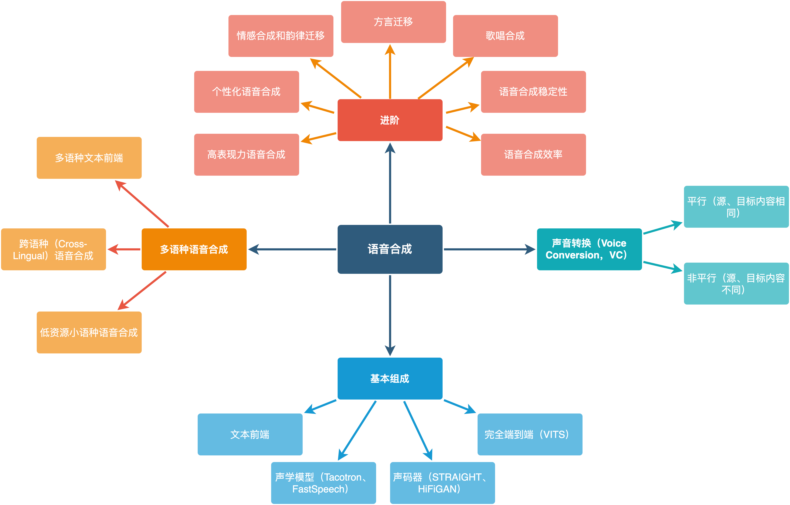

# 语音合成的总体知识体系

语音合成知识结构如下。

## 基本组成

语音合成（Speech Synthesis）将文本转换为可听的声音信息，它赋予了像人一样说话的能力，是人机交互的重要接口。一般来说，语音合成的概念比文语转换（Text-to-Speech，TTS）的涵盖范围更广，语音合成包括TTS、歌唱合成等领域，但大多数情况下可以混用。[awesome-tts-samples](https://github.com/seungwonpark/awesome-tts-samples)提供了一些端到端语音合成模型的样例，可以简单感受下目前语音合成的发展。

人类可以通过一整套发音器官合成语音，具体来说，肺相当于动力源，喉相当于调制器，声道相当于滤波器，口唇相当于扩音器。研究人员提出了以源-滤波器（source-filter）模型为代表的多种模型建模该过程，语音中存在清音和浊音，分别由声带周期性振动对应的周期声源和声带不振动时紊乱气流对应的非周期声源产生。

当代工业界主流语音合成系统包括文本前端和声学后端两个部分。文本前端将输入文本转换为层次化的语音学表征，主要包括文本规范化、韵律分析和文本转音素等模块。声学后端基于文本前端给出的层次化语言学表征（linguistics feature）来生成语音，主要技术路线包括单元挑选波形拼接、统计参数和端到端语音合成方法，当代主要采用端到端声学后端。端到端声学后端一般包括声学模型和声码器两部分，同时也出现了直接从音素映射为波形的完全端到端语音合成系统。声学模型负责将语言学特征转换为中间声学特征，比如梅尔频谱，直接决定合成语音的韵律；声码器将中间声学特征转换为语音波形，直接决定合成语音的音质。

语音合成与语音识别、机器翻译等问题类似，本质是序列到序列的建模问题，另一方面，语音合成是生成类问题，因此自回归生成、VAE、GAN、Flow、扩散模型等生成模型在语音合成上均有应用。

## 声音转换

狭义上说，将一个说话人（source speaker）的语音转换到另一个目标说话人（target speaker）的语音，这种语音处理技术称之为声音转换（Voice Conversion，VC）。声音转换包括平行和非平行两种，平行语音转换指的是源、目标语音的内容相同，相对应地，非平行语音转换只改变语音的音色，而对语音内容没有要求。声音转换可以借鉴图像中风格转换的成果，比如StarGAN-VC等模型。更有效的方法是利用语音识别模型提取说话人无关的中间表征，将该中间表征和说话人信息输入生成模型中，生成具有目标说话人音色的语音，可以借鉴TTS的研究成果，将VITS等作为高质量合成模型。在声音转换中，基频是一个重要特征。参见：[An Overview of Voice Conversion and its Challenges: From Statistical Modeling to Deep Learning](https://arxiv.org/abs/2008.03648)

## 多语种语音合成

多语种语音合成的难点主要有五点：

1. 音库制作和构建。

2. 文本前端的构建。需要制定适用于一个语种语音合成的音素体系，构建该语种的文本规范化规则等，特别地，比如俄语、波斯语、阿拉伯语等语种有性数格的变化，提高了文本前端的复杂性。不同语种间文本前端模块也会有所不同，比如中泰越日等语种需要添加分词模块。

3. 语种中特殊发音现象。西班牙语、俄语等语种的升降调对合成语音自然度影响显著，具体来说，在标点处发音会产生较为明显的上扬、下降、先升后降、先降后升和平调现象。因此文本前端最好给出该升降调信息，声学后端需要将该升降调信息作为重要特征，输入到模型的多个模块中，以协助模型产生准确自然的升降调语音。与此同时，由于升降调是一个语块整体的表现，而非仅仅一个字母或者单词的发音变化，比如西班牙语可以将升降调信息标注到整个L3块上，而俄语更适合于仅仅标注到中心词上。

4. 跨语种语音合成。当代语种混杂的语言现象愈发明显，比如中文中夹杂英语单词，这就需要实现语种切换（code-switch）和跨语种（cross-lingual）语音合成。如果语料中存在单说话人跨语种语料，一般来说，直接训练就可以产生跨语种合成效果。实践中，如果跨语种语料较少，比如仅有200句跨语种语料，多个语种混训时共享语种间的音素能够获得更好的合成效果；如果跨语种语料较多，可以仅采用主要语种和跨语种语料进行训练，加入其它语种进行混训相反可能会产生较差的效果。如果没有跨语种语料，可以尝试数据增强方法伪造跨语种语料，比如对单语种语料进行拼接，构造跨语种语料；利用跨语种语音合成大模型伪造训练语料，训练跨语种语音合成模型。

5. 低资源语音合成。语料数量的增加可显著提升合成语音的效果，但世界上的语种数量较多，大部分语种并不存在大量高质量语音合成语料。主要的解决方案有跨语种迁移、跨说话人迁移、语音识别和合成对偶学习，以及无监督训练。参见[论文速览：低资源语音合成](https://zhuanlan.zhihu.com/p/413274637)。

    > Latorre J, Bailleul C, Morrill T, et al. Combining Speakers of Multiple Languages to Improve Quality of Neural Voices[J]. arXiv preprint arXiv:2108.07737, 2021.

## 进阶

语音合成存在比较多的扩展应用，比如：

1. 高表现力语音合成。

2. 个性化语音合成。

3. 情感合成和韵律迁移。

4. 方言迁移。

5. 歌唱合成。

6. 有声人脸合成（talking face synthesis）。

7. 语音合成的稳定性。

8. 语音合成的效率优化。

本部分可参考相关论文和[A Survey on Neural Speech Synthesis](https://arxiv.org/abs/2106.15561)了解具体技术方案。

### 高表现力语音合成

在交互、小说阅读等应用场景中，对合成语音的表现力要求较高，而表现力由内容、说话人音色、韵律、情感和风格等多个因素决定，因此高表现力语音合成实际涵盖了内容、音色、韵律、情感和风格的建模、分离和控制。

语音中包含的信息可以分为如下四类：

1. 字符或音素，也就是语音的内容。可以通过预训练词嵌入增强合成语音的表现力和质量，或者加入一些额外的信息，比如升降调信息、采用fulllab能够增强模型表现力和稳定性。fulllab及传统语音合成采用的文本、声学特征参见：[jsut lab](https://github.com/r9y9/jsut-lab)、[HTS Data README](https://github.com/feelins/HTS-Project/blob/master/data/README)。

2. 说话人或音色。多说话人语音合成模型可以通过说话人嵌入向量或单独的说话人编码器（speaker
    encoder）对音色特征进行建模。

3. 韵律、风格和情感。这些特征表示"如何说出文本"，表征语音中的语调、重音和说话节奏，韵律、风格和情感是高表现力语音合成的建模重点。

4. 录音设备和环境噪音。这些倒是与语音内容、韵律无关，但会显著影响语音质量，因此可以尝试对语音中的噪音等进行控制和分离。对训练语料本身可以提前进行去噪处理，在模型中可以标识带噪语料，以便在合成语音中去除噪音部分。

利用模型建模这些信息的方法很多，有语种、说话人、风格嵌入向量以及音高、时长、能量编码器等显式建模方法，也有reference encoder、VAE、GAN/Flow/Diffusion、文本预训练等隐式建模方法。

### 个性化语音合成

个性化语音合成是语音合成中较为热门的方向，主要应用于定制化场景中，利用任意用户的音色合成语音，又称为语音自适应（Voice Adaptation）、语音克隆（Voice Cloning）、定制化语音（Custom Voice）等，通常要求利用1分钟以内甚至几秒钟的语料，就可以实现合成目标说话人的任意语音。目前个性化语音合成的难点如下：

1. 相似度。仅利用少量语料，很难覆盖完全目标说话人一个语种的所有音素发音，因此要求模型需要拥有一定的泛化能力。实践中，利用目标语料微调整个模型或者声学模型的解码器往往能够大幅提升合成语音的相似度，也有一些工作尝试不进行微调，但相似度一般较低。

2. 稳定性。个性化语音合成在推断时，目标音色一般不在训练集中，因此会让原本脆弱的端到端后端模型合成失败，如果采用微调方案，则尤甚。因此一些带有先验的注意力机制，或者直接利用时长模型替代注意力机制的模型，在这种场景下拥有一定优势。

3. 微调效率。如上所述，整体或解码器微调往往能够提升相似度，但模型微调会带来一定的模型训练时间。

### 方言迁移

方言迁移一般是指跨方言迁移目标说话人的音色，比如利用普通话发音人说上海话、四川话或粤语，与说话人迁移有些类似，但任务难度比跨语种说话人迁移要简单一些。可以采用"多方言编码器+说话人梯度反转+共享解码器+VAE+多方言混训"的方案解决，也可以尝试类似声音转换的方案：利用语音识别声学模型提取说话人无关的发音内容，然后利用语音合成模型输入该说话人无关的发音内容特征，并加入目标音色，从而实现方言迁移。

### 歌唱合成

音乐是一个复杂的学科，而音乐合成几乎是另一个领域。

旋律、和声、节奏是音乐的三要素。旋律是音乐的主线，它决定了音乐的调性、曲式和进程，是音乐的灵魂。但如果只有主旋律的话，音乐就显得单调。和声用来哄托主旋律，丰富乐曲的"厚度"，节奏强化风格。音乐的创作过程包括：作词作曲（Lyric/Melody），伴奏/谱曲，歌唱合成/乐音合成，混音四个基本步骤，而歌唱合成仅仅探讨第三步，利用已有的乐谱合成人类歌唱的声音。

1. 歌唱合成的任务定义：

    1. 输入：歌词、音高（基频）、节拍（时长）

    2. 输出：歌唱声音

2. 和TTS相比：

    1. 增加了额外的输入：音高、节拍（时长），输出更广范围的声调，更多变化的音素

    2. 更加侧重于感情和表达，而非语音本身的内容

3. 困难点：

    1. 数据

        1. 数据量少

        2. 质量要求高（歌唱与指定音高、时长的符合程度要求高），标注困难

        3. 难以全面覆盖所有的音高，歌手的声音范围有限，无法覆盖所有的音高

    2. 容错率低

        1. 音调准确率要求高，简谱基本决定了基频，先验比较强，"跑调"容易听出来

        2. 卡拍子

    3. 歌唱额外的特点：比如颤音，转调等

歌唱合成实际和语音合成十分类似，只是文本输入信息更为丰富，因此可以引入单独的模块建模音高和时长，实际上语音合成中FastSpeech 2这些显式建模语音中音高、时长特征的声学模型，可以直接拿来作为歌唱合成的基线，当然也出现了更好的歌唱合成技术方案，参见[歌唱合成：数据集的构建，以Opencpop为例](https://zhuanlan.zhihu.com/p/481137047)、[歌唱合成：基于VITS的歌唱合成声学模型VISinger](https://zhuanlan.zhihu.com/p/481154682)、[歌唱合成：高品质歌唱合成声码器SingGAN](https://zhuanlan.zhihu.com/p/481158408)、[muzic](https://github.com/microsoft/muzic)等。

### 语音合成的稳定性

端到端语音合成自然度优势明显，但容易出现合成无法停止、调字、重复等合成缺陷，这在生产上是致命的。可以尝试从如下三个方面入手：

1. 训练数据。训练语料中的音频尽量降低背景噪音；控制前后静音段和句中静音，每个句子的前后静音段尽可能一致，句中L1/L3的停顿时长尽可能裁剪统一；确保文本标注和实际音频一一对应。

2. 模型。合成语音的正确性是语音合成的基本要求，因此语音合成的稳定性有较多的研究工作。主要思路有：

    1. 增强注意力机制。由于语音合成任务具有单调性的特点，也就是输入音素一定是从左到右合成，因此可以利用该特点加入先验知识进行合成。

    2. 利用时长模型取代注意力机制。

    3. 增强自回归过程。比如减少训练、推断时的不匹配，知识蒸馏，教师强制等方法。

    4. 采用非自回归合成方法。输入序列进来之后一把出，防止自回归生成带来的累积误差。

3. 后处理。比如统计音库中平均音素时长，合成时统计输入音素个数，计算该句子"平均时长"，合成语音的时长超过"平均时长"的30%则认为合成没有正常停止，裁剪该合成语音。

### 语音合成的效率优化

语音合成在投入使用时，除了纯工程的优化之外，模型侧也可以进行效率优化。主要的思路有：

1. 并行生成。该方法对于利用GPU推断的云端模型效果较好，但是对于CPU推断的端侧模型效果一般。

2. 轻量化模型。删除模型中不必要的模块，缩减网络节点数，进行模型裁剪、量化和剪枝。

3. 引入领域知识。利用沉淀已久的信号处理方法加速语音合成过程，比如线性预测、多子带建模、多帧并行预测、小尺度预测（subscale prediction）。